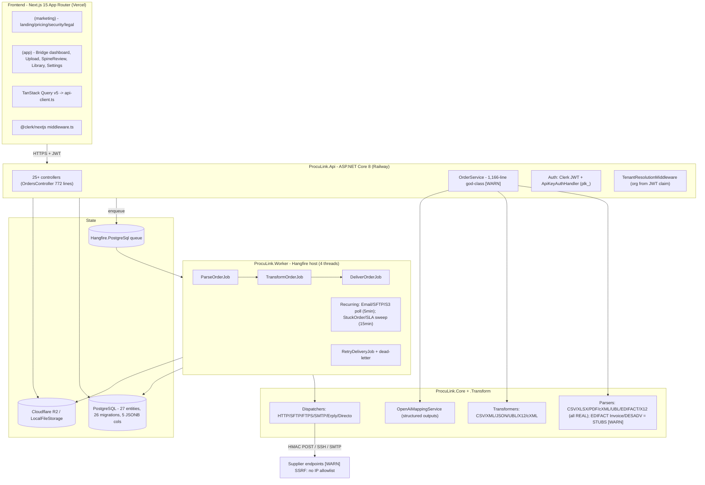

# ProcuLink - Four-Lens Product Analysis (2026-05-30)

Lenses: VC, Senior Software Architect, Startup Advisor, UX/UI Senior Engineer.

> **Method:** Both repos (`ProcuLink` backend, `project-proculink` frontend) were read
> with parallel audit agents and claims were verified against actual code (file:line),
> not against `STATUS.md`/`CLAUDE.md`. Where the docs say "implemented," this memo records
> whether the code is **real**, **real-but-unproven**, or a **stub**. State reflects `main`
> at ~`9a71163` (2026-05-30). This is an internal, deliberately blunt assessment.

---

## Verdict in one paragraph

ProcuLink has a **genuinely real, genuinely differentiated core product** that has been
**buried under ~5x the scope it needed, never shown to a single human, and shipped with two
critical security holes that were never caught because nothing has ever been QA'd against a
live deployment.** The core loop — CSV/XLSX/PDF → parse → AI-assisted map → transform →
HTTP/email/ERP deliver, with audit trail and AES-GCM-encrypted credentials — is real, tested,
and sellable. But in ~8 days the project accumulated 26 DB migrations, 427 tests, 8 input
formats, EDIFACT/X12/cXML/UBL parsers, an invoice/ASN subsystem, a Zapier layer, and SLA/
dead-letter reliability infrastructure **for a product with zero customers, zero pilots, and
zero live end-to-end runs.** This is build-as-procrastination. The single most important fact:
the #1 named prospect ("Markit") appears to be the founder's own employer/network — the warmest
possible design partner — yet effort went into speculative EDIFACT invoice parsers that throw
`NotImplementedException` instead of one real PO sent to one real supplier. **The product is not
the problem. The absence of a customer is.**

## Contents

1. [Lens 1 — Architecture & Engineering](#lens-1--architecture--engineering)
2. [Lens 2 — UX & Conversion](#lens-2--ux--conversion)
3. [Lens 3 — Business (VC / advisor)](#lens-3--business-vc--advisor)
4. [Lens 4 — Launch readiness (brutal)](#lens-4--launch-readiness-brutal)
5. [Consolidated priority stack](#consolidated-priority-stack)
6. [Appendix A — Claude Code prompts for top fixes](#appendix-a--claude-code-prompts-for-top-fixes)
7. [Appendix B — Evidence index (key file:line findings)](#appendix-b--evidence-index)

---

## Lens 1 — Architecture & Engineering

### Architecture diagram



### Real data flow (verified)

`POST /api/orders/upload` → `OrderService.CreateStubAsync` (buffers file, stores to R2, inserts
`purchase_orders` status=`parsing`, fires `order.created`) → enqueues `ParseOrderJob` → **Worker**
runs `ParseStoredFileAsync` (download, detect format, per-supplier mapping template, parse,
resolve each line, AI-suggest unresolved) → `TransformOrderJob` → `DeliverOrderJob` →
`DeliveryService` dispatches via protocol dispatcher → persists `delivery_attempts`, fires
`order.delivered`/`order.failed`. Retry/dead-letter + SLA timers wrap it. The pipeline is
correctly architected: API enqueues, Worker executes (no duplicate Hangfire server), jobs are
idempotent.

### Tech-stack verdict

| Choice | Verdict |
|---|---|
| .NET 8 + EF Core + Postgres | Excellent for a typed transform engine. |
| Next.js 15 App Router + Clerk + TanStack Query | Correct, modern, conventional. |
| Hangfire on Postgres | Pragmatic; one fewer moving part. Fine to thousands of jobs/min. |
| Cloudflare R2 + Railway + Vercel | Cheap, EU-resident, sensible for a solo founder. |
| Hand-rolled EDIFACT/X12 (no EdiFabric) | Correct given the no-licence call — but not needed yet. |
| OpenAI mapping (provider-neutral) | Right pattern. |

The stack is not the problem. It is well chosen and conventionally implemented. The problem is
the volume of speculative work built on top of it.

### Scalability (can it handle 10k+ users?)

The architecture can; the current code can't — and won't need to for a long time (current load = 0 orgs).
Real bottlenecks:

- **HIGH — N+1 + per-line AI in a serial loop.** `OrderService.BuildLineEntityAsync` runs one DB
  query (`ItemMappingService.ResolveAsync`) and a synchronous OpenAI call **per line**. 100-line
  PO = 100 queries + N network round-trips inside one Hangfire thread. Fix later: batch `WHERE IN`
  + batch AI.
- **HIGH — recurring pollers are one serial loop over all orgs** (`EmailPollingJob`/`SftpPollingJob`/
  `S3PollingJob`). One slow IMAP server blocks every org. Caps ~20-30 email orgs. Fix later: one
  child job per org.
- **HIGH — cross-tenant sweeps do unbounded `ToListAsync()`** with no `(status, updated_at)` index →
  sequential scans every 15 min.
- **MED — `GET /api/orders` has no pagination**; `ListAsync` loads an org's full order history.
- **MED — `IMemoryCache` for HMAC nonce replay** is process-local (breaks at 2+ API instances);
  no Npgsql pool tuning.

None of this matters below ~50-100 active orgs. These are good problems not yet held.

### Critical engineering issues

1. **`OrderService.cs` = 1,166-line god-class**, 10 injected deps, 13 responsibilities. Lives in
   the Api project only to dodge a circular reference — architecture driven by build mechanics.
2. **Four duplicate migrations are a latent bomb.** `20260528120215`→`120235` each recreate the
   same 7 tables + `slug`. The "fix" is a startup runner that swallows `42701: column already
   exists`. **Never tested on a fresh production DB** → can silently skip migrations, leaving
   undefined schema state.
3. **Zero integration tests.** 427 tests, all InMemory-EF on isolated methods. No
   `WebApplicationFactory`/TestServer test. Stripe Checkout, billing quota enforcement, real
   tenancy-under-middleware, and AI response parsing are completely untested.

### Database design

Good. 27 entities, normalised core (Organisation → Supplier → PurchaseOrder → Line → Artifact →
DeliveryAttempt), JSONB used appropriately for variable config, composite unique
`(org_id, supplier_id, buyer_item_code)`. Weak spot: `purchase_orders.canonical_json` is a
provenance bag and `buyerName` is sniffed from JSON at runtime. Missing `(org_id, status)` index.
No "missing backend pieces" — the backend is the opposite of frontend-heavy; it is **bloated**.

### Critical security findings (highest-impact items in the whole codebase)

| Sev | Finding | Location |
|---|---|---|
| **CRITICAL** | **Cross-tenant supplier injection.** `DbSet.FindAsync(supplierId)` has no org scope; an authenticated user in org A can pass org B's supplier UUID into order creation and reach that supplier's delivery credentials / mapping / AI candidates. | `ProcuLink.Api/Services/OrderService.cs:220` and `:282` |
| **CRITICAL** | **All-zero AES-256 key committed to git.** `Delivery:EncryptionKey` = 32 zero bytes, tracked in git history. Any prod env that fails to override it encrypts all supplier credentials with a publicly known key. Startup validator requires the key in prod but does **not** reject the all-zero value. | `ProcuLink.Api/appsettings.Development.json:36`, `ProcuLink.Worker/appsettings.Development.json:33` |
| **HIGH** | **SSRF in HTTP delivery dispatcher.** User-configured URLs sent as-is — no block on loopback / RFC-1918 / `169.254.169.254` cloud metadata. Any org member can point a supplier config at internal infra. Same class in SMTP/SFTP/FTPS. | `ProcuLink.Infrastructure/Services/Dispatchers/HttpDeliveryDispatcher.cs:45-55` |
| **HIGH** | **JWT audience validation disabled** (`ValidateAudience = false`) — any Clerk token from the same backend key is accepted regardless of app. | `ProcuLink.Api/Program.cs:94` |
| **MED** | **Self-HMAC API-key hashing** — HMAC "secret" derived from the key itself, so DB-read access enables offline brute force. | `ProcuLink.Core/Security/ApiKeyHasher.cs:17-19` |

Verified-safe (audited, no action): the `PROCULINK_QA_BYPASS_AUTH` flag is frontend-only and
hard-gated on `NODE_ENV !== 'production'`; Hangfire dashboard and Scalar are dev-only;
`DeliveryEncryptionService` (random 12-byte nonce, AES-256-GCM) and `HmacWebhookVerifier`
(constant-time compare, nonce+timestamp replay window) are cryptographically sound. Most service
queries **are** correctly org-scoped — the `FindAsync` path is the exception, which is what makes
it dangerous.

### Claims vs reality (integration surface)

| Feature | Status | Note |
|---|---|---|
| CSV/XLSX/PDF → parse → transform → HTTP deliver | **Real + tested** | The actual product. Deployable. |
| UBL / EDIFACT ORDERS / X12 850 / cXML order parsers | **Real** | Hand-rolled, non-trivial (358 / 609 / 447 / 215 lines), round-trip tested. |
| OpenAI mapping | **Real, thinly tested** | Structured outputs + token cap; tests only cover no-op paths. |
| ERP connectors (Erply/Directo) | **Real + tested** | But they POST a pre-built artifact, not ERP-native API calls. |
| Email/IMAP, SFTP/S3 ingress | **Real, untested** | SFTP/S3 pass `Guid.Empty` as supplierId → can't route. Not safely deployable. |
| Zapier/Make layer | **Real webhook scaffolding** | HMAC POST + retry real; **no published Zapier/Make app exists.** |
| UBL invoice parser | **Real** | Wave 3. |
| EDIFACT INVOIC / DESADV | **STUB** | Throw `NotImplementedException`; controller 202-accepts and silently drops the file. |

---

## Lens 2 — UX & Conversion

**First impression — marginal.** Homepage hero is *"The bridge between your buyers and
suppliers"* (describes what it *is*). The killer line sits unused on the `one-pager` page:
**"Stop reformatting purchase orders. Start delivering them."** Best copy is on the wrong page.

**Value-prop clarity — undermined by jargon.** Internal metaphors leak into user-facing nouns:
sidebar "Bridge / Supplier docks / Buyer docks / Crossings log"; upload button "↑ Upload &
bridge" / "Bridging…"; how-it-works "Wire Topology … buyer-supplier wires." A procurement
operator who lives in SAP/Coupa cannot map any of this to procurement vocabulary. **#1 in-app
comprehension killer.**

**Conversion flow — friction at the worst moments.** Full wizard = 8-10 clicks; its Step 2 (the
make-or-break first upload) is a **raw unstyled `<input type=file>`** while the real
`UploadWorkbench` has a polished dropzone. The best path ("Try with sample order" → instant
parsed PO, no quota cost) is hidden as a secondary card. Pricing CTAs route to `/sign-up`, not
Stripe Checkout (3 wasted steps on an impulse-buy tool).

### Top 10 UX issues

| # | Issue | Evidence |
|---|---|---|
| 1 | Wrong hero headline; killer copy on wrong page | `app/page.tsx:141` vs `one-pager/page.tsx:31` |
| 2 | ROI calc shows wrong prices (Growth €199, ghost "Distributor €1,499") vs pricing (€149) | `ROICalculator.tsx:40,61` vs `pricing/page.tsx:26` |
| 3 | Onboarding Step 2 = raw file input at highest-stakes moment | `OnboardingWizard.tsx:284` |
| 4 | Customers page advertises emptiness ("case studies will appear here…") | `customers/page.tsx:24-45` |
| 5 | Internal jargon leaks everywhere (Bridge/Dock/Wire/Spine/Crossing) | `BridgeSidebar.tsx:33-44`, `UploadWorkbench.tsx` |
| 6 | No product screenshots anywhere — only an SVG cartoon | `app/page.tsx`, `how-it-works` |
| 7 | Welcome page may never fire (depends on unconfigured Clerk redirect) | `sign-up/...page.tsx:33` |
| 8 | Pricing CTAs → sign-up, not Stripe Checkout | `pricing/page.tsx:187-205` |
| 9 | Wizard Step 3 ejects user out of the wizard | `OnboardingWizard.tsx:323-365` |
| 10 | Weak "4+ formats" stat reads as uncertainty (real number is 8) | `app/page.tsx:46-51` |

**Conversion killers (worst 3):** (1) wrong headline = no comprehension in 3s; (2) €199-vs-€149
mismatch at peak intent = "can't keep prices straight," tab closed; (3) empty customers page =
pre-launch company publicly admitting zero customers.

**Simplify:** kill the multi-step wizard; make "Try with sample order" the post-signup hero
action (one click to an "aha"). **Remove:** customers page (until a real quote exists), the ghost
"Distributor" tier, the "4+" hedging. **Add for trust:** one real/anonymised pilot quote, 2-3
product screenshots, a "test-fire to your own endpoint in 60 seconds" guarantee, and the
Diip Solutions OÜ as the operator of ProcuLink + EU-residency badge **above the fold** (currently buried in `/security` — it's the
single best trust asset for EU procurement).

**Mobile:** App shell is genuinely responsive (mobile-card/desktop-table patterns). But
`how-it-works` uses inline `style={}` grids that don't stack. More importantly: **procurement is
95% desktop** — 15 mobile-polish passes was misallocated effort. Stop.

**Branding (a real strength):** The "Bridge Layer" design system is distinctive — navy chrome,
blue buyer-rail / green supplier-rail, animated `BridgeIllustration` SVG, JetBrains Mono for
codes. Not generic shadcn. The failure is that the metaphor escaped the design system and
colonised the product's user-facing nouns.

---

## Lens 3 — Business (VC / advisor)

**Problem (real):** buyers with 3-20 suppliers maintain a spreadsheet/email-per-supplier because
each supplier demands a different format/column/item-code/channel, and mappings break whenever a
supplier changes anything. A true, expensive, boring, recurring pain — the kind B2B SaaS wins on.

**Audience (real, narrow, a strength):** procurement/purchasing lead at a Baltic B2B company; the
named target list is all Estonian/Baltic IT distributors and manufacturers on Erply/Directo/SAP
B1, 80-1,500 orders/mo.

**Market size:** no external TAM/SAM — only bottom-up "Baltic + Finland ≈ 200 customers × €399 ≈
€1M ARR." Honest but thin. The €3M ARR / 3-yr target is a back-of-envelope account-mix table, not
a model. Fine for a bootstrap; **not fundable as-is.**

**Competitors:** SPS Commerce, TrueCommerce, Babelway, Pagero (enterprise EDI/B2B gateways) +
Boomi/MuleSoft (iPaaS). The wedge vs them is legitimate (self-serve, flat €149+, <15-min setup,
standards-visible, honest scope). **But the "order of magnitude cheaper, same coverage" claim is
unsourced and the "same coverage" part is false** — no AS2, no full X12/EDIFACT sets, no retail
compliance. Don't claim parity you don't have.

**Monetization:** ladder is reasonable (Pilot 14d → €149 → €399 → €999 → Enterprise €2,500+) but
has converted €0. CAC ≤€600 / payback ≤4mo are guesses. Biggest risk: a €149/mo tool sold via a
hands-on founder motion at €600 CAC has **brutal unit economics** — Growth would lose money. Sell
Operations (€399) as the floor or the model doesn't close.

**Business model & revenue streams:**
- *Short-term:* Operations/Integration subscriptions to Baltic distributors; optional €500 setup
  fee (waive for first 5 in exchange for logo + quote).
- *Long-term:* (a) supplier-mapping library network effect, (b) P2P loop closure (invoice/ASN/
  3-way match), (c) PEPPOL via a hosted partner. **The data moats (Learn loop, schema-fingerprint)
  are real ideas but worthless until there is order volume to learn from — no data, no moat.**

**Biggest risks (ranked):** (1) **never talking to a customer** — all 50 prospects cold, GTM
self-described as "on hold"; this dwarfs everything else. (2) Security/diligence failure kills a
pilot (live cross-tenant bug). (3) Small, slow-moving market; procurement changes tools
reluctantly. (4) iPaaS template or incumbent eats the wedge first.

**What makes it fail:** continued building — six months on, AS4 + i18n + supplier catalog shipped,
still zero customers. **What makes it succeed:** Markit (or one warm Baltic distributor) live this
month sending real POs, paying €399, giving a logo + quote — then repeat by hand 9 times.
Everything needed to do that already exists in the code.

---

## Lens 4 — Launch readiness (brutal)

**Genuinely strong:** the core engine is real and tested (not vaporware); the design identity is
distinctive; the trust/legal stack (Diip Solutions OÜ as ProcuLink's operator, GDPR doc, DPA, subprocessors, EU residency) is
ahead of most pre-launch peers; the GTM docs (scripted demo, outreach templates, pilot checklist,
tripwires) are excellent; and the founder's own docs are refreshingly honest about gaps.

**Weak:** never deployed end-to-end — Stripe, Clerk, CORS, IMAP, ERP all unverified live.
**Amateur:** the price mismatch, ghost tier, raw onboarding file input, fabricated landing stats
(since removed), all-zero AES key in git. **Unclear:** the "international standard" positioning —
a 7-year vision cosplaying as a product description, and the direct cause of the overbuild.
**Overthought:** invoice/ASN, EDIFACT/X12/cXML, Zapier, SLA timers, dead-letter, schema
fingerprint, 15 mobile passes — all with zero users. **Missing completely:** one conversation with
one prospect; one live transaction.

**Overbuilt (zero users today):** EDIFACT Invoice/DESADV (stubs), the Invoice/ASN model + 3
transformers, X12 850, EDIFACT ORDERS, cXML, S3/SFTP ingress (broken — `Guid.Empty` supplierId),
the Zapier/Make layer (no published app), the reliability infra. Not wasted forever — wrong work
*now*.

**MVP checklist (to put it in front of Markit):**
- [ ] Fix CRITICAL cross-tenant supplier injection (`OrderService.cs:220,282`).
- [ ] Rotate AES key out of git; make validator reject all-zero in prod.
- [ ] SSRF allowlist in HTTP/SMTP/SFTP dispatchers.
- [ ] Verify the 4 duplicate migrations apply cleanly on a fresh DB; consolidate if not.
- [ ] Live Stripe Checkout + webhook QA with a real test card on Railway.
- [ ] One real end-to-end run on deployed infra (upload → review → deliver to own endpoint).
- [ ] Fix €199/€149 mismatch; remove ghost tier + customers page.
- [ ] Swap hero headline to "Stop reformatting purchase orders. Start delivering them."

**Launch plan:**
- *Next 7 days (FREEZE features):* D1-2 fix 3 security P0s + migration cleanliness check;
  D3 live Stripe/Clerk/CORS QA on Railway/Vercel; D4 one full live upload→deliver run (screenshot
  it = first product screenshot); D5 headline + price + remove customers page + promote sample
  order; D6-7 write to Markit ("can I show you 15 min with your own PO file?").
- *Weeks 2-4:* founder-led pilots against 3 warm Baltic distributors using *their* real files;
  convert one to paid Operations; fix only what blocks that customer; finish the jargon purge;
  wire one real testimonial into the site.

**Growth loops / SEO / first-100:**
- PO routing has weak intrinsic virality. Realistic loops: (a) **supplier-side pull** — a supplier
  receiving a perfectly-formatted PO wants their other buyers on ProcuLink (best loop; instrument
  it); (b) referral credit; (c) ERP-consultant channel (Erply/Directo partners). This is sales-led,
  not viral.
- SEO foundation is fine (App Router + `generateMetadata`, robots, legal pages) but there is
  near-zero content. Convert on Baltic long-tail ("Erply purchase order export integration",
  "Directo PO import format") — write 5 posts.
- First-100 / Estonia: the existing GTM doc nails it (warm Baltic network, founder hand-delivers
  pilots, stay Baltic until customer #50). The plan is done; execution is at zero.

**The core pathology:** scoring points in the game the founder is good at (building) to avoid the
game that's scary (selling). Freeze the code, fix the 5 P0s, then call Markit. The product has
been pilot-ready for weeks; the missing component is a human conversation.

---

## Consolidated priority stack

**P0 — before ANY external user (this week):**
1. Cross-tenant supplier-injection fix (`OrderService.cs:220,282`).
2. AES key out of git + reject all-zero in prod validator.
3. SSRF allowlist in HTTP/SMTP/SFTP dispatchers.
4. Fresh-DB migration apply test (duplicate-migration bomb).
5. Live Stripe + Clerk + CORS QA on deployed infra.

**P1 — before customer #2 (next 2 weeks):**
6. Enable JWT audience validation (`Program.cs:94`).
7. One `WebApplicationFactory` integration test: upload→deliver + a tenancy-isolation assertion.
8. Fix `Guid.Empty` supplierId in SFTP/S3 ingress (or disable those endpoints).
9. Pagination on `GET /api/orders`.
10. Finish the jargon purge in user-facing copy.

**P2 — after launch / at load (do NOT touch now):** N+1 + AI batching, poller fan-out, composite
indexes, Npgsql pool tuning, OrderService decomposition, Redis nonce store. Good problems for
~50+ paying orgs.

---

## Appendix A — Claude Code prompts for top fixes

> Note: `CLAUDE.md` bans Lovable for this project ("ProcuLink UI is Claude Code + /frontend-design
> only"). These are Claude Code prompts; do not pipe Lovable output into this repo.

**P0-1 — Cross-tenant isolation:**
```
Use /superpowers:debug then fix. In ProcuLink.Api/Services/OrderService.cs, CreateStubAsync
(~line 220) and CreateStubFromParsedOrderAsync (~line 282) resolve the supplier with
_db.Suppliers.FindAsync(supplierId), which has NO tenant scope. Replace both with
FirstOrDefaultAsync(s => s.Id == supplierId && s.OrgId == organisationId, ct). Then grep the
whole solution for `.FindAsync(`/`.Find(` on any DbSet and audit each for missing org scope.
Add an xUnit test in ProcuLink.Api.Tests asserting a cross-org supplierId returns "Supplier not
found", not a created order. Run dotnet test and show the new test passing.
```

**P0-2 — Encryption key:**
```
ProcuLink.Api/appsettings.Development.json:36 has Delivery:EncryptionKey = 32 all-zero bytes,
committed to git. (1) Blank the value; document it must come from user-secrets/env. (2) In
StartupConfigurationValidator, in Production, reject the key if missing OR all-zero — throw a
clear startup exception. Same for ProcuLink.Worker. Add a unit test for the all-zero rejection.
Don't rewrite git history yet — explain what a key rotation requires for already-encrypted creds.
```

**P0-3 — SSRF allowlist:**
```
In ProcuLink.Infrastructure/Services/Dispatchers/HttpDeliveryDispatcher.cs (~line 45), before
sending to a user-configured URL, resolve the host and reject loopback (127/8, ::1), RFC-1918
(10/8, 172.16/12, 192.168/16), link-local (169.254/16 incl. 169.254.169.254), and non-http(s)
schemes. Add an optional per-supplier allowInternalEndpoint flag (default false) mirroring the
FTPS allowInvalidCertificate pattern. Apply the same guard to SMTP and SFTP dispatchers.
Unit-test the blocklist. Secure-by-default.
```

**P1 — Conversion quick wins (frontend):**
```
Use /frontend-design guidance. In project-proculink: (1) app/page.tsx:141 — replace hero headline
with "Stop reformatting purchase orders. Start delivering them." (2) Make ROICalculator.tsx read
the SAME plan constants as pricing/page.tsx (Growth €149) and remove the non-existent
"Distributor €1,499" tier. (3) Remove the (marketing)/customers page from all nav/footer links
until a real quote exists. (4) Replace OnboardingWizard.tsx:284 raw <input type=file> with the
FileUploadZone dropzone used by the main UploadWorkbench. (5) Promote "Try with sample order" to
the primary CTA on /upload. Run bun run build and verify with the preview tools.
```

---

## Appendix B — Evidence index

| Claim | Where verified |
|---|---|
| Cross-tenant supplier injection (CRITICAL) | `ProcuLink.Api/Services/OrderService.cs:220, :282` |
| All-zero AES key in git (CRITICAL) | `ProcuLink.Api/appsettings.Development.json:36`; `ProcuLink.Worker/appsettings.Development.json:33` |
| SSRF, no IP allowlist (HIGH) | `ProcuLink.Infrastructure/Services/Dispatchers/HttpDeliveryDispatcher.cs:45-55` |
| JWT audience validation off (HIGH) | `ProcuLink.Api/Program.cs:94` |
| Self-HMAC API-key hashing (MED) | `ProcuLink.Core/Security/ApiKeyHasher.cs:17-19` |
| OrderService god-class (1,166 lines) | `ProcuLink.Api/Services/OrderService.cs` |
| 4 duplicate migrations | `Migrations/20260528120215..120235_*.cs` |
| N+1 + per-line AI in serial loop | `OrderService.BuildLineEntityAsync` (~`:997`); `ItemMappingService.ResolveAsync:22` |
| Serial per-org pollers | `EmailPollingJob.cs:67-98`, `SftpPollingJob.cs:48-65` |
| No pagination on order list | `OrderService.cs:609-625`; `OrdersController.cs:202` |
| EDIFACT invoice/DESADV stubs | `EdifactInvoiceParser.cs:15`, `EdifactDesadvParser.cs:13`, `DesadvController.cs:39` |
| SFTP/S3 ingress `Guid.Empty` supplierId | `SftpIngressService.cs:149-156` |
| QA bypass safe (frontend, non-prod) | `project-proculink/src/middleware.ts:19-21` |
| Hero headline vs killer copy | `app/page.tsx:141` vs `(marketing)/one-pager/page.tsx:31` |
| ROI price mismatch + ghost tier | `ROICalculator.tsx:40,61` vs `pricing/page.tsx:26` |
| Onboarding raw file input | `OnboardingWizard.tsx:284` |
| Empty customers page | `(marketing)/customers/page.tsx:24-45` |
| Test count (427 [Fact]/[Theory]) | Transform + Infrastructure + Api.Tests projects |
| All 50 GTM prospects cold | `docs/gtm/icp-target-list-template.md` |
