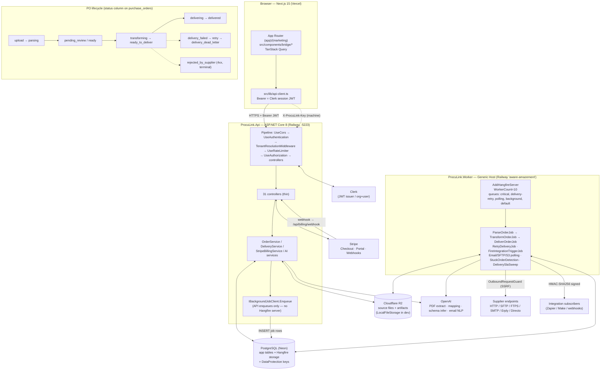

# ProcuLink — Production-Launch + Strategy Audit

_Date: 2026-06-06 · Method: code-grounded (the **current repo is the source of truth**, not STATUS.md/CLAUDE.md — every claim verified in code with file:line) · Produced by a 7-agent parallel investigation (strategy, architecture, tech-stack, scalability+DB, security, code-quality+gaps, UI/UX) + lead synthesis._

> **Bottom line:** ProcuLink is a genuinely clean, secure, idempotent **outbound PO engine** — the code is *better than the docs claim and better than the business needs*. It sits on a **€1–3M ARR Baltic-bootstrap** opportunity (lifestyle-profitable at €300–500k), **not** a €30M venture outcome. **0 production security P0s.** The launch blockers are ~6 removals/hardening fixes (≈1 week of work), not features. The single highest-EV action is not a fix in this document: **stop building, deliver one real PO to one real supplier endpoint, and sell.**

> **Verified corrections to stale docs (checked live this session):** the **Distributor Stripe product exists and is self-serve** (retrieved live from the Stripe API: €1,499/mo + €14,928/yr, both active); **Clerk production is live** on the deployed site (drove it logged-in); **backend tests = 887** (not 211/213); the **cross-tenant `FindAsync`, all-zero AES key, and SSRF guard are genuinely fixed in code**.

## ✅ Audit completion tracker (live — last updated 2026-06-07)

Per-item status against the current code. Legend: `[x]` done+verified · `[~]` partial · `[ ]` in progress · `[—]` deliberately deferred/flagged (reason). Wave commits in `()`. Full plans for in-progress items: `WAVE_D_BACKEND_REMAINING.md`; wave-level view: `LAUNCH_EXECUTION_PLAN.md` tracker.

**Part B (g) — refactor vs can-wait**
- [x] R1 unify tenant resolution (`3c789b6`) · [x] R2 stuck-order requeue (`0da39cf`) · [x] R3 billing on `IBillingService` (`3c789b6`)
- [ ] W1 decompose OrderService (behind `IOrderService` facade) — building · [ ] W2 status transition table — building · [x] W3 R2/DB per-order GDPR erase (`IDataErasureService` + admin endpoint; FK-safe confirmations + R2; adversarial-reviewed)
- [x] W4 Redis-ready nonce (config flag) + API HSTS/nosniff (`0b34ff7`)
- [—] W5 consolidate retry schedulers (refactors correct code) · [—] W6 split api-client.ts (collides w/ active FE chips; DX-only)

**Part 22 B — drift items** — [x] B1 model pin · [x] B2 Distributor key · [x] B3 Stripe AppInfo/version · [x] B4 next pin+engines · [~] B5 Resend wired/docs honest · [~] B6 single-instance documented (runbook) · [x] B7 Worker-down alert · [x] B8 Npgsql pool ceiling

**Part 24 §1.1 bottlenecks** — [x] A pool ceiling · [x] B ListAsync retired→ListPaged · [x] C ingress idempotency · [x] D AI chunking · [~] E retention sweep (DB done; R2-file delete = W3) · [x] F email-poller indexed flag (`eb24aa6`) · [—] G heavy-parse queue (marginal at pilot)
**§1.4** — [x] redis nonce (`0b34ff7`) · [—] partition audit/passport (redesign-later) · [—] denormalize line_count/total_value (redesign-later, drift risk)

**Part 24 §2 DB** — [x] §2.3.2 AI-candidates sort index (`eb24aa6`) · [x] §2.3.3 email-flag index · [—] §2.3.4 invoices/ASN composite (frozen tables, no query) · [x] §2.4 canonical_json/ListAsync (retired) · [~] §2.4.2 BuyerName split (read-column-first pattern) · [—] §2.4.4 jsonb converter (deliberate) · [ ] §2.5 Postgres RLS — building · [—] §2.7.1 SchemaFingerprints rename (cosmetic/risky) · [x] §2.7.2 migrate-fail-loud (`5013fd8`); [—] phantom-migration cleanup (dangerous pre-launch)

**Part 26 security** — [x] P1-1 SSRF · [x] P1-2 exception handler · [x] P1-3 azp+Clerk cutover · [x] P1-4 CORS · [x] P1-5 provision throttle · [~/—] P1-6 Postmark (token const-time + Warning logs; signature needs CF Worker) · [x] P2-1 path-traversal · [x] P2-2 LastUsedAt await · [x] P2-3 nonce Redis-ready (`0b34ff7`) · [x] P2-4 rate limits broadened

**Part 28 code-quality** — [x] A1 dead/misleading CTAs (Wave 1 + DESADV→501 `d6c44ac`) · [ ] B1 OrderService split (=W1) · [~] B5 stale docs (latest=correct; historical=labeled) · [—] B3/D5 typed-DTO layer (post-launch)

**UI/UX top-10** — [x] 1 pricing 6→3 · [x] 2 Distributor in-app path · [x] 3 .x12 import · [x] 4 wizard blue→green · [x] 5 wizard a11y · [ ] 6 Admin-nav gating (needs isAdmin signal) · [~] 7 Document-Anatomy confidences · [x] 8 LimitBanner · [~] 9 mobile lineage · [~] 10/C1 landing claims · [—] C2 social proof (needs real data)

---

## Table of contents
**Part A — Strategy & business**
1. Market sizing · 2. Competitive mapping · 3. Customer economics · 4. Failure modes · 5. Value bundle · 6. Year-1 plan · 7. Seed-investor verdict

**Part B — Technical audit (code-grounded)**
8. Architecture (+ Mermaid + lifecycles) · 9. Tech stack · 10. Scalability + database design · 11. Security · 12. Code quality + frontend↔backend gaps · 13. UI/UX

**Part C — Launch readiness & checklists** (MVP · production · Stripe go-live · support · monitoring · 7-day · 30-day)
**Part D — Brutally honest assessment**
**Part E — Claude Code fix prompts (10)**
**Consolidated summary** — top-10 P0/P1 · top-10 UX · top-10 product · before-prod vs can-wait

---

# PART A — STRATEGY & BUSINESS

# ProcuLink — Strategy & Business Analysis (2026-06-06)

> **Method.** Written as a B2B-SaaS strategist + seed VC. The founder's own two memos
> (`2026-05-30-investor-analysis.md`, `2026-05-30-four-lens-product-analysis.md`) are
> unusually rigorous and code-verified — this analysis aligns where they're right and
> sharpens/dissents where the *intervening 7 days of code* contradict them. **Code is the
> source of truth.** Verified at `HEAD = 55fa09a` (2026-06-06).
>
> **The single most damning fact, verified in git, not docs:** the founder issued a
> "FREEZE features until paying customers" order on 2026-05-30. Since that order there have
> been **185 commits** (`git log --since=2026-05-30 | wc -l = 185`), migrations grew
> **26 → 40** (`ls Migrations/*.cs | grep -v Designer = 40`), and `OrderService.cs` grew
> **1,166 → 1,720 lines**. The build-as-procrastination pattern the founder correctly
> diagnosed has *accelerated since the diagnosis*. That is the headline business risk — not
> market, not competition.

---

## 0. What is actually true in the code (so the analysis is grounded, not echoing docs)

| Claim | Verified state @ `55fa09a` | Evidence |
|---|---|---|
| Core loop CSV/XLSX/PDF → parse → map → transform → HTTP/SMTP/SFTP/FTPS/Erply/Directo deliver | **Real, 5 dispatchers present** | `Infrastructure/Services/Dispatchers/` (Http, Ftps, Sftp, Smtp, Erp) |
| Security P0s (cross-tenant, SSRF) | **Genuinely FIXED** (contra both memos which list them open) | `OrderService.cs:245,316` org-scoped `FirstOrDefaultAsync(s => s.Id==supplierId && s.OrgId==organisationId)`; `Infrastructure/Services/Security/OutboundRequestGuard.cs` exists |
| AI mapping cost pattern | **Batched, not per-line-in-loop** (margin-safe) | `OrderService.cs:1532` single `SuggestSupplierItemCodesAsync(...)` over unresolved lines |
| EDIFACT/X12/cXML/UBL **order** parsers | **Real** (EDIFACT ORDERS 609 lines, X12 850 447 lines) | `EdifactOrderParser.cs`, `X12OrderParser.cs` |
| EDIFACT **invoice/DESADV** | **Still live stubs** | `EdifactInvoiceParser.cs:16` + `EdifactDesadvParser.cs:14` throw `NotImplementedException` |
| Value-bundle "next features" | **Most already shipped** — exception dashboard (`(app)/operations/exceptions`), SLA (`DeliverySlaService`), dead-letter/retry (`RetryDeliveryJob`), mapping memory (`ItemMappingService`), output templates (`OutputTemplateService`), **PO Passport** (`PassportService.cs`), **supplier ACK** (`OrderConfirmationController.cs`) | filesystem |
| Pricing ladder | Matches prompt; **Distributor now self-serve** (`isCheckout:true, hidden:false`) | `plans.ts:194-229` |
| Paying customers | **Zero referenced anywhere in code or status** | — |

**Implication for this whole report:** the product is *more* finished than the founder's
own freeze memo assumed. The constraint is 100% commercial. Every "build X next"
recommendation below is therefore deliberately small, because **the right next build is
almost nothing.**

---

## 1. Market sizing — honest

### Estonia bottom-up (concrete assumptions)

| Assumption | Value | Basis |
|---|---|---|
| Active enterprises, Estonia | ~120,000 | HitHorizons / Statistics Estonia (per founder memo, plausible) |
| ... that *regularly* process outbound POs to multiple suppliers | ~9,000–13,000 | Strip micro-firms with 1 informal supplier; keep small+medium trading/distribution/manufacturing |
| ... with *real, recurring* manual-PO pain (3–20 suppliers, Excel today) | ~2,500–4,500 | ~35% of small + ~55% of medium bands |
| ... a 2-founder team can realistically *reach and convert* in 3 yrs | **~100–350** | SAM→SOM collapse; cold market, founder-led sales |

**WTP by band (the number that breaks the headline TAM):**

| Band | Count w/ pain | Monthly WTP (labor-ROI ceiling) | Pays the ladder? |
|---|---|---|---|
| Micro 0–9 | ~2,640 | **€0–15/mo** | No — 10× below €149 entry |
| Small 10–49 | ~1,890 | €60–250/mo | Marginally; only the busier ones clear €149 |
| Medium 50–249 | ~825 | **€250–900/mo** | **Yes — this is the customer** |
| Large 250+ | ~300 | €1,500–4,000/mo (but owned by SPS/Pagero/SAP) | Rarely winnable |

**TAM range (honest, two numbers — never quote the top one to an investor):**
- *Headline Estonia SAM* (everyone-with-pain × blended €300 ARPU): **€9–18M/yr.** Misleading.
- *Serviceable-obtainable* (strip non-payers → ~700–900 medium-volume distributors × ~€5–8k ARR): **€4–7M/yr.** Real.

### Extrapolation + penetration math

| Geography | Addressable payers (est.) | Blended ARR | Market at stated penetration |
|---|---|---|---|
| Estonia | ~900 | ~€6k | **@20% → 180 cust → €1.1M ARR** |
| Baltics (EE+LV+LT) | ~3,000 | ~€6k | **@10% → 300 cust → €1.8M ARR** |
| Nordics + Baltics | ~10,000 | ~€7k | @5% → 500 → €3.5M |
| EU mid-market | ~250,000 | ~€7k | **@1% → 2,500 → €17.5M ARR (blue-sky)** |

### Verdict

- **Estonian revenue ceiling @20% penetration: ~€1.0–1.3M ARR.**
- **Baltic @10%: ~€1.5–2.0M ARR.**
- **EU @1% (blue-sky, requires a channel + 6–8 yrs): ~€15–20M ARR.**
- **Realistic year-3: €0.4–1.2M ARR (base ~€0.7M)** — and that *already assumes* selling
  starts now and pilot→paid lands at 35–40%.
- **Lifestyle floor: €300–500k ARR** (≈60–90 paying mediums). Reachable in 18–30 months.
- **Venture floor: €5M ARR in Y3 on a €50M path** — needs 1,000+ customers or an up-market
  + Nordic-channel move that a solo/duo founder cannot execute in the window. EU
  B2B-integration multiples are **4–8×, not US 15–20×**, which caps the prize even if reached.

**HONEST ANSWER: this is most likely a €1–3M ARR business (base case ~€1M), profitable and
lifestyle-grade at €300–500k. It is NOT a €30M business, and the €3M is the optimistic edge,
not the median.** This agrees with the founder's own bottom line — and the code-verified
fact that the product is over-built for this market *reinforces* it (the addressable spend
can't absorb the feature surface already shipped).

---

## 2. Competitive mapping

| Category | Concrete players | Model / who they serve | ProcuLink **differentiated** | ProcuLink **loses** | ProcuLink **could win** |
|---|---|---|---|---|---|
| Enterprise EDI networks | SPS Commerce ($638M rev, ~$14k ARPU, US retail), TrueCommerce ($500–5k/mo + €5–50k impl.), Orderful ($189–399/mo/partner) | Per-trading-partner doc network; long implementation projects; retail compliance | 5–10× cheaper, self-serve, live in a day, no per-doc fee | No AS2, no full X12/EDIFACT compliance sets, no retail certification | Buyers who need *outbound fan-out to many small suppliers* who can't do EDI |
| Compliance / e-invoice networks | **Pagero/Thomson Reuters**, Basware, OpusCapita, Omniva | Peppol + e-invoice mandate rails; bundle PO routing at ~zero marginal cost | Buyer-side PO-out focus, simpler, cheaper | They own the *compliance* purchase reason (LV mandate Jan 2026, EE 2025) and bundle PO for free | Only if ProcuLink becomes the cheap Peppol on-ramp *before* they reach SME — narrow window |
| Procurement suites | Coupa, SAP Ariba, Basware, Precoro, Procurify | Source-to-pay platforms; mid/large enterprise | Lighter, no suite lock-in, no 6-month rollout | Anyone already on a suite has PO-out solved | Sub-suite SMEs (the ICP) who'll never buy Coupa |
| PO automation / AP | Tipalti, Rillion, Tradeshift | Inbound AP / payables automation | Opposite direction (outbound PO, not inbound invoice) | If buyer's pain is reframed as AP, these win the budget | Adjacent — but a *different* buyer (finance, not procurement) |
| iPaaS | Boomi, MuleSoft ($55k median), Celigo ($20k/yr), **Make / Zapier / n8n** | Generic glue; developer/ops buyer | Domain model (canonical PO, item-code resolution, supplier rules) Zapier has no concept of | Make.com + a freelancer (~€800 once + €10.59/mo) works for 2–3 simple suppliers | Buyers who outgrow the brittle Make scenario at 5+ suppliers |
| ERP-native | NetSuite, Odoo, **Directo, Erply** | The system the ICP already lives in | Multi-supplier fan-out + per-supplier output that ERPs don't do | The ERP/its partner can add a basic export | Be the *certified* PO-out layer on top — partner, don't fight |
| Doc/OCR | (commodity) | Extraction only | Full loop past extraction (map→validate→deliver→audit) | Extraction alone is not the product | n/a — it's a feature, already built |
| **Local mirror-incumbent** | **Docura (EE)** — €0.10/doc, free ≤20/mo, 200+ customers, **native Erply** | Supplier→retailer doc exchange (opposite direction) | Different direction *today* | **Already owns the Erply relationship ProcuLink is betting on** | Only if ProcuLink moves faster on buyer-side PO-out than Docura extends |

**Competitor to fear in YEAR 1:** **(a) "Make.com + a freelancer"** for the first 10 deals
(it's good-enough and 15× cheaper), and **(b) Fitek/OpusCapita** by adjacency — already
inside the finance+procurement dept of the exact ICP. Neither is beaten by features; both
are beaten by *time-to-value* and a human relationship.

**Competitor to fear in YEAR 3:** **Pagero/Thomson Reuters** (and the e-invoice mandate
cycle generally). When the Baltic/Nordic SME *must* buy a compliance rail, the vendor that
sells it can bundle PO routing for free. ProcuLink must either be acquired into that cycle
or carve a defensible buyer-side niche before it arrives.

**Positioning decision — pick one and only one:**
> **"Lighter and cheaper than enterprise EDI"** — NOT "smarter than generic automation."
> The buyer (a procurement coordinator) has never heard of Zapier and doesn't benchmark
> against it; they benchmark against the EDI quote they were once scared by and the Excel
> file they hate. One-liner: *"Send purchase orders to any supplier in their required
> format — no EDI consultants, no per-document fees, live in a day."* The "same coverage,
> 10× cheaper" claim must die: coverage is **not** at parity (no AS2, stub invoices), and
> claiming it fails the founder's own "offer ⇔ works" rule.

**Moat honesty:** "smarter than Zapier" is a 12–18-month head start, not a moat. The only
durable defensibility is (1) accumulated per-customer mapping/validation config = switching
cost, (2) Erply/Directo connector depth, (3) a *cross-org* mapping library — which is the
one network-effect feature **not** yet built and the one worth building if venture-scale is
ever the goal.

---

## 3. Customer economics — stress-tested (exact math)

Formula: problematic POs/mo × minutes × (€/hr ÷ 60) = monthly manual cost. Rational WTP =
**35% of automation savings** (standard B2B "share of value created" anchor; buyers don't
pay for 100% of savings).

### Small — 200 PO/mo, 20% problematic, 8 min, €18/hr
- Problematic: 40/mo → 320 min → **5.33 hr → €96/mo manual cost.**
- Savings @50% = €48 · @70% = €67 · @90% = €86.
- **Max rational WTP ≈ €24/mo** (35% of €67).
- Ladder match: smallest tier is **Growth €149.**
- **Payback: NEGATIVE at €149 — the labor savings (€67/mo) never cover €149.**
- → **A 200-PO customer does NOT rationally clear €149 on labor ROI. This segment is
  mispriced ~6× and must NOT be a paid target.** Use only as a *mandated/viral channel*
  (a big buyer requires ProcuLink delivery; the buyer pays).

### Mid — 1,000 PO/mo, 25% problematic, 10 min, €22/hr
- Problematic: 250/mo → 2,500 min → **41.7 hr → €917/mo manual cost.**
- Savings @50% = €458 · @70% = €642 · @90% = €825.
- **Max rational WTP ≈ €225/mo** (35% of €642) — up to ~€290 if they value error-avoidance.
- Ladder match: **Operations €399** (covers 500/mo allowance; needs overage or Distributor at 1,000).
- **Payback: ~3 weeks** if they value the savings at face; **but €399 sits ABOVE the
  35%-of-savings anchor (€225).** Sell on *error/stockout avoidance + headcount-avoidance*,
  not pure minutes — at 70% the gross savings is €642, so €399 is "spend €399 to save €642,"
  a real but not slam-dunk pitch. **This is the sweet spot and the floor plan.**

### Upper-mid — 5,000 PO/mo, 15% problematic, 12 min, €28/hr
- Problematic: 750/mo → 9,000 min → **150 hr → €4,200/mo manual cost.**
- Savings @50% = €2,100 · @70% = €2,940 · @90% = €3,780.
- **Max rational WTP ≈ €1,030/mo** (35% of €2,940); easily €1,400+ at 90%.
- Ladder match: **Distributor €1,499** (2,500/mo) is too small on volume; this is **Enterprise.**
- **Payback: < 2 weeks.** This tier is **underpriced** — at €1,499 you leave €500–1,500/mo
  on the table vs. their savings. **Raise the ceiling; route 5k+ PO buyers to Enterprise €2,500+.**

### Pricing-model evaluation

| Model | Strength | Weakness | Verdict |
|---|---|---|---|
| Starter €49 | Captures small segment | Their WTP is €24; €49 still loses, and it cannibalizes Growth | **Don't add** |
| Flat tiers (Growth/Ops/Integ/Distrib) | Predictable, self-serve | Mis-prices both ends (small can't pay, large under-pays) | Keep as spine, fix ends |
| Enterprise €2,500+ | Captures the underpriced top | Manual sales | **Keep; make it the real top** |
| **Per-supplier setup fee €500×3 then €150** | **Captures the true cost driver (mapping config), cash at close, sunk-cost stickiness, filters non-payers** | Friction at sale; must be waived for design partners | **STRONGEST single lever** |
| Per-order €0.50 overage (never-block) | Aligns price to value, no hard cap | Unpredictable for buyer | **Keep as overage only, not primary** |
| Hybrid: flat tier + setup fee + overage | Best of all | Complexity | **This is what's shipped — correct** |

**STRONGEST model: the hybrid already in code — flat tier (anchor Operations €399) + a
per-supplier setup fee that captures the real mapping-config cost + €0.50 never-block
overage.** The setup fee is the most under-rated lever: it produces cash on day one, makes
the customer sunk-cost-committed, and self-selects out the unprofitable small segment.

**Where the ladder mis-prices (call it out):**
1. **Growth €149 is a trap** — no rational customer between ~150 and ~600 PO/mo with real
   pain clears it on labor alone; it exists mostly to look cheap. Keep it as the *advertised
   floor* but expect ~0 of your revenue from it; sell Operations.
2. **Distributor €1,499 vs Enterprise €2,500 has a gap** — a 3,000–5,000 PO buyer falls
   between tiers; the €0.50 overage bridges it but the headline tier should flex.
3. **The top is still under-priced** for true high-volume distributors (5k+ POs save
   €3–4k/mo). Don't be shy at Enterprise.

---

## 4. Failure modes (ranked 1 = most likely to kill it)

| Rank | Risk | Why dangerous (ProcuLink-specific) | Concrete mitigation | KPI that proves it's controlled |
|---|---|---|---|---|
| **1** | **Too much breadth before the core loop is stable / proven with a customer** | **VERIFIED: 185 commits + 14 migrations AFTER a self-issued freeze, 1,720-line OrderService, EDIFACT-invoice stubs — building is substituting for selling. This is the actual cause of death.** | Hard code-freeze enforced by the founder's calendar, not by intent; one real PO to one real supplier this week | Days since last *non-doc, non-sales* commit ≥ 14 |
| **2** | **Market too fragmented for repeatable productization** | Each Baltic distributor has bespoke suppliers/formats; if every deal is a snowflake, it's consulting | Pre-built Erply/Directo starter templates (largely shipped); measure config reuse | Onboarding ≤ 2h/customer; ≥70% suppliers self-configured by customer #5 |
| **3** | **Every customer needs too much custom mapping** | Mapping is the true cost driver; if it's unbounded, margin and time die | Setup fee captures it; mapping-memory (`ItemMappingService`) + cross-org library amortizes it | Avg mappings reused per new supplier ↑; AI-suggest acceptance rate ≥ 60% |
| **4** | **Product becomes a consultancy not SaaS** | Founder-led concierge onboarding can ossify into bespoke services | Cap concierge at 4h/customer/mo; turn each manual step into UI | Gross margin > 75%; 2nd supplier flows with zero founder involvement |
| **5** | **Customers don't trust AI corrections** | Procurement is risk-averse; a wrong qty = a stockout | Deterministic-first, AI suggest-only, human-confirmed, never auto-deliver (already the pattern) | % AI suggestions accepted without edit; zero auto-delivered AI-only lines |
| **6** | **Parsing accuracy insufficient** | A wrong PO destroys trust instantly | Lead with CSV/XLSX (deterministic); PDF text→LLM w/ verbatim-number validation (shipped) | Text-PDF line accuracy ≥ 90%; exception rate trending down |
| **7** | **ERP/EDI vendors own the relationship** | Docura already owns Erply; Pagero owns compliance | Win on outbound multi-supplier fan-out + audit; partner with ERP consultants | ≥30% of pipeline via Erply/Directo partner intros |
| **8** | **Integration complexity destroys margins** | Per-line AI + per-org pollers can blow up cost/latency at scale | Batch AI (already done, `:1532`); token cap; poller fan-out later | AI cost ≤ 8% of per-customer MRR |
| **9** | **Security/compliance blocks adoption** | A live cross-tenant bug in diligence kills a pilot | **Already mitigated** — cross-tenant + SSRF fixed (`:245/:316`, `OutboundRequestGuard`); sign DPA | DPA signed pre-prod; pen-test before customer #5 |
| **10** | **Stripe/billing/prod setup unreliable** | A failed first charge looks amateur | Live Stripe test-card QA on Railway before first paid | First real charge succeeds; webhook reconciles plan |

**The ranking dissents from the founder's memo on one point:** the founder ranked "runway
out before sales" #1. The *mechanism* of that death is risk #1 above — **continuing to
build.** They are the same failure; naming it precisely (over-building) makes it actionable.

---

## 5. Value bundle — what to build next (most candidates already exist)

**Critical finding: stop recommending features — they're built.** Verified shipped:
exception dashboard, SLA service, dead-letter/retry, mapping memory, output templates,
**PO Passport**, **supplier ACK/confirmation**, Erply/Directo connectors + starter
templates, PDF text→LLM + vision + no-egress OCR. The value-bundle question is now
**"what to *finish/sell*," not "what to build."**

| Rank | Item | Impact | Effort | WTP-lift | Defensibility | 2-founder fit | Status |
|---|---|---|---|---|---|---|---|
| **1** | **NOTHING NEW — sell the existing loop to one real supplier** | Highest | ~0 build | n/a | n/a | Perfect | The actual #1 |
| **2** | **Cross-org mapping library (anonymized, opt-in)** | High | High | Medium | **The ONLY real long-term moat** | Needs customers first | **NOT built — the one to build *after* ~10 customers** |
| **3** | **Reusable mapping templates per industry (extend Erply/Directo)** | High | Low | Medium | Medium | Good | Partially shipped |
| **4** | **Supplier confirmation/ACK round-trip (close the loop, prove delivery)** | Medium-High | Low (controller exists) | Medium | Medium | Good | Backend exists; finish UX |
| **5** | **Delivery reliability hardening (the existing SLA/retry, proven live)** | Medium | Low | Low | Low | Good | Built; needs live proof not more code |

**BUILD FIRST: nothing.** The highest-EV "feature" is one live PO to one real supplier and
one paying customer. The *only* net-new feature worth queuing — and only after ~8–10
customers exist to seed it — is the **cross-org mapping library**, because it's the single
thing that converts switching-cost stickiness into a real network effect (and is the one
lever that could move this from €1M to €5M+).

---

## 6. Year-1 plan (pessimistic, month-by-month)

Assumptions: 5% cold→demo, 33% demo→pilot, **40% pilot→paid**, **€450 blended ARPU**
(Operations-anchored), founder-led sales, Baltic-only.

| Mo | Cum. paying | MRR | PO vol/mo processed | Product milestone | Reliability milestone | Founder main activity |
|---|---|---|---|---|---|---|
| 1 | 0 | €0 | ~50 (pilots) | **Live happy-path on Railway+Vercel** | First real e2e delivery to own endpoint | **Call Markit + 5 prospects** |
| 2 | 1 | €450 | ~600 | First real supplier delivery | First `delivery_failed`→fixed loop | Pilot #1 live; demo #2–4 |
| 3 | 2 | €900 | ~1,500 | SFTP delivery proven live | 2nd order delivers w/o founder debug | First testimonial captured |
| 4 | 3 | €1,350 | ~2,500 | Format auto-detect surfaced in UI | Exception dashboard used by a real op | Convert pilot #2 |
| 6 | 6 | €2,700 | ~5,000 | Erply/Directo consultant intro lands | <5%/mo churn holds | First channel partner conversation |
| 9 | 11 | €4,950 | ~9,000 | First case study published | Rejection-capture round-trip proven | Repeatable demo script; hire #1 (PT) |
| 12 | **15–18** | **€6,750–8,100** | **~12,000** | 3 case studies; cross-org library *spec'd* | Churn ≤5%/mo, CAC ≤€600 | ≥1 Integration/Distributor in pipeline |

**Must be true after:**
- **3 months:** ≥2 paying (Operations tier), a 2nd order delivered with zero founder
  debugging, ≥1 testimonial. *If 0 paying at month 3, the thesis is wrong — pivot the motion.*
- **6 months:** ≥6 paying, MRR ≥€2,500, an Erply/Directo consultant relationship started,
  onboarding ≤2h/customer.
- **12 months:** ≥15 paying, MRR ≥€6.5k (≈€80k ARR), churn ≤5%/mo, CAC payback <6mo, gross
  margin >75%, ≥70% suppliers self-configured.

This is **slower and smaller than the founder's own Y1 (€86k ARR / 18 customers)** by a
hair — I've held it to 15–18 paying because the *start date keeps slipping* while code
ships, and every month of build is a month of zero pipeline.

---

## 7. Seed-investor verdict (brutal)

**Would I wire €250k today? No.** And the founder shouldn't want me to. At a €1–3M ARR
ceiling on EU B2B-integration multiples (4–8×), the best realistic exit is €5–20M in 6–8
years — that cannot return a seed fund. This is the *right business* financed by the *wrong*
capital. Correct capital: **angel + Estonian EAS / EU SME grants, keep the equity.**

**3 things that WOULD make me wire €250k (none true yet):**
1. **Evidence the cross-org mapping library is a real network effect** — customer #8
   onboards in <20 min off customers #1–7's anonymized mappings. (Not built; verified absent.)
2. **A wedge into the e-invoice compliance mandate** — be the cheap Peppol/e-invoice on-ramp
   for Baltic+Nordic SMEs *ahead of Pagero* (LV mandate Jan 2026 is a real, dated catalyst).
3. **A repeatable channel motion** — ≥30% of pipeline from Erply/Directo partner intros,
   <2%/mo churn, CAC payback <6mo. Proof the growth isn't 1:1 founder hustle.

**3 things that make me say "come back in 6 months":**
1. **Zero customers / zero live runs** — exactly today's state. (Live e2e to *own* endpoint
   proven; to a *real supplier* not.)
2. **A 5×-overbuilt product with a self-issued freeze that was then violated by 185 commits**
   — this is the single biggest *founder*-risk signal: avoids selling by building.
3. **No model** — TAM is a back-of-envelope account-mix table, not a cohort model; CAC/payback are guesses.

**Traction thresholds:**
- *Pre-seed (€100–300k angel/grant):* 3–5 paying, €2–3k MRR, ≥40% pilot→paid, <30-day cycle.
- *Seed (€1–2M):* €15–30k MRR, <2%/mo churn, CAC payback <6mo, a working partner channel.

**Numbers that prove this is NOT consulting:** (1) 2nd supplier flows with zero founder
involvement; (2) gross margin >75%; (3) onboarding ≤2h/customer; (4) ≥70% suppliers
self-configured by customer #5; (5) AI cost ≤8% of MRR. None proven yet — all *provable* with
the existing code the moment a customer exists.

**Fundable vs unfundable:** *Unfundable as venture* (ceiling too low, EU multiples too thin).
*Highly fundable as a bootstrap/angel/grant* (real product, real pain, distinctive design,
GTM docs better than most funded seeds). The mismatch isn't quality — it's *category of capital*.

**The blunt truth:**
- **Weak:** zero customers, zero real-supplier runs, Growth €149 mis-priced ~6× for the
  segment it targets, top tier under-priced ~1.5×.
- **Unclear:** *still* unresolved whether this is a Baltic bootstrap (real, €1–2M ARR) or
  "the international standard" (a slide). The 185 post-freeze commits suggest the founder
  is *behaviorally* still building the €30M case while *verbally* committing to the €1M one.
  **Pick. They require opposite behaviors.**
- **Amateur:** EDIFACT invoice/DESADV parsers that throw `NotImplementedException` shipped
  to "production"; a value-bundle of features built *for no users*; a freeze order ignored.
- **Strong:** the engine is genuinely real and tested; security P0s are *actually fixed* in
  current code (most teams claim this falsely — here it's verified); the design system is
  distinctive; trust/legal stack (OÜ, DPA, EU-residency) is ahead of peers; the GTM docs are
  excellent; **the founder is one phone call from the ideal first customer.**
- **Over-thought:** standards breadth, invoice/ASN, Zapier layer, no-egress OCR, SLA/dead-letter,
  15 mobile passes, PO Passport, supplier ACK — all real, all built, all for zero users.
- **Missing entirely:** one customer conversation; one real-supplier transaction; a cohort
  revenue model; and the *one* feature that could change the funding verdict — the cross-org
  mapping-library network effect.

**Highest-EV action in this entire document:** freeze the codebase *for real this time*
(the calendar, not the intent), and put one real Markit PO in front of one real supplier
**before writing another line of feature code.** Everything required to do that is already
in the repo at `55fa09a`.

---

## Lifestyle-vs-venture verdict (one line)

**A €1–3M ARR Baltic bootstrap (base ~€1M, lifestyle-profitable at €300–500k) — NOT
venture-scale; fund it with angels/grants and keep the equity; the only thing that could
move it to €5M+ is the un-built cross-org mapping library, and the only thing standing
between it and €300k today is the founder choosing selling over building.**

---

# PART B — TECHNICAL AUDIT (code-grounded)

# ProcuLink — Architecture Audit (code-grounded)

> Source of truth: the current code. Every claim below is cited `file:line`. Where
> STATUS.md / CLAUDE.md disagree with code, the code wins and the divergence is flagged.
> Verified against: API + Worker `Program.cs`, all 31 API controllers, `OrderService`,
> `DeliveryService`, `StripeBillingService`, `TenantResolutionMiddleware`, the AI
> extractor/mapping, `ProcuLinkDbContext`, the Hangfire jobs in
> `ProcuLink.Api/Jobs` + `ProcuLink.Infrastructure/Jobs` + `ProcuLink.Worker/Jobs`,
> and the Next.js frontend shape.

---

## (a) Architecture diagram

---

## (b) Current-architecture summary

Four-project .NET 8 solution plus a separate Next.js 15 repo.

- **`ProcuLink.Api`** — ASP.NET Core 8, the only HTTP surface. Hosts controllers,
  the domain orchestrator `OrderService` (deliberately in the API project so it can
  reach both Infrastructure/`DbContext` and Transform/parsers without a circular ref —
  `OrderService.cs:20-24`), billing, and AI services. **Enqueues Hangfire jobs but
  runs no Hangfire server** (`Program.cs:187-189`).
- **`ProcuLink.Worker`** — Generic Host that *is* the sole Hangfire executor
  (`Worker/Program.cs:87-94`), `WorkerCount=10`, five named priority queues
  (`critical, delivery-retry, polling, background, default`). Registers recurring
  jobs in `Worker.cs:21-46`.
- **`ProcuLink.Infrastructure`** — EF Core 8 + Npgsql, one `DbContext` with ~35
  entities (`ProcuLinkDbContext.cs:13-52`), delivery/dispatch services, AI services,
  ingress, security. Also hosts two Hangfire jobs (`Infrastructure/Jobs/`).
- **`ProcuLink.Transform`** — pure parse/transform library (CSV/XLSX/PDF/cXML/UBL/
  EDIFACT/X12 parsers; XML/CSV/cXML/JSON/UBL/X12 transforms), wired as
  `IEnumerable<>` + factory (`Program.cs:344-370`).
- **Frontend** — Next.js App Router, route groups `(app)` (workbench: inbox, upload,
  library, operations, settings, admin, inbound) and `(marketing)` (landing, pricing,
  help, legal). One fat API client (`api-client.ts`, 2,777 lines) that attaches the
  Clerk session JWT as Bearer (`api-client.ts:80-84`). Bespoke "bridge" design-system
  components in `src/components/bridge/*` (40 components).

**Persistence topology:** Postgres holds app data, Hangfire job storage
(`Program.cs:182-186`), and the DataProtection key ring (`Program.cs:68-70`) — one
database, three concerns. R2 holds source files and generated artifacts; dev falls
back to `LocalFileStorageService` when `Storage:R2AccessKeyId` is absent
(`Program.cs:247-250`).

**Auth:** two schemes side by side — Clerk JWT Bearer (default) and an `ApiKey`
scheme (`Program.cs:116-143`). A dev-only `PROCULINK_QA_BYPASS_AUTH` swaps the
default scheme for a bypass handler (`Program.cs:93-113`).

**Multi-tenancy:** every table carries `OrgId`/`OrganisationId`; every service method
takes `Guid organisationId` and every query is `.Where(x => x.OrgId == organisationId)`
(spot-checked across `OrderService`, `DeliveryService`, `StripeBillingService`). Tenant
is resolved in middleware from the Clerk `org_id` claim (fallback to `sub`) and stored
in `HttpContext.Items` (`TenantResolutionMiddleware.cs:42-102`).

---

## (c) Lifecycles — spelled out and verified

### 1. Order lifecycle (status string on `purchase_orders.status`)
Verified end-to-end across `OrdersController`, `OrderService`, `DeliveryService`:

1. `POST /api/orders/upload` (`OrdersController.cs:76-184`): validates extension
   whitelist (`:98-101`), 10 MB cap (`:92-94`, `RequestSizeLimit` `:79`), checks
   billing (`:142`), runs idempotency-key short-circuit (`:112-139`), then
   `OrderService.CreateStubAsync` writes a stub with **status `parsing`** + audit
   `Created` + fires `order.created` trigger (`OrderService.cs:249-292`), and
   `ParseOrderJob.Enqueue` (`:173`).
2. **Worker** runs `ParseOrderJob` on the `critical` queue
   (`ParseOrderJob.cs:39-45`) → `OrderService.ParseStoredFileAsync`
   (`OrderService.cs:449-691`): downloads from R2, detects format, routes PDF→LLM
   else parser-by-extension, auto-resolves lines against `item_mappings`, batch
   AI-suggests leftovers, persists via `ExecuteUpdateAsync` to dodge a stale-tracker
   `DbUpdateConcurrencyException` on Neon (`:585-631`). Status becomes
   **`pending_review`** (any line `NeedsReview` or doc classified `invoice`) or
   **`ready`** (`:605`).
3. `POST /api/orders/{id}/resolve` (`OrdersController.cs:335`) →
   `OrderService.ResolveAsync` (`:1070-1194`): applies line resolutions in a
   transaction, optionally persists mappings, recomputes status `pending_review`/`ready`.
4. `POST /api/orders/{id}/transform` (`OrdersController.cs:413-486`): billing check,
   then `TransformOrderJob.Enqueue`. The job (`TransformOrderJob.cs`) calls
   `OrderService.TransformAsync` (`:953-1040`): pre-flight "all lines resolved"
   guard (`:970-973`), status `transforming` → generate doc → upload artifact to R2 →
   status **`ready_to_deliver`** (`:1023`), then `DeliverOrderJob.Enqueue` (`:96`).
5. `DeliverOrderJob` (`DeliverOrderJob.cs:43-100`): billing re-check, then
   `DeliveryService.DispatchArtifactAsync`. Status `delivering` (SLA timer armed,
   `DeliveryService.cs:117-122`) → dispatcher → **`delivered`** (success),
   **`rejected_by_supplier`** (4xx, terminal — `:279-287`), or **`delivery_failed`**
   (5xx/network). On transient failure it schedules `RetryDeliveryJob` with backoff
   (`DeliverOrderJob.cs:82-99`).
6. Retry/dead-letter: `RetryDeliveryAsync` (`DeliveryService.cs:440-499`) caps at
   `MaxAttempts` (default 3) → `delivery_dead_letter` (`:504-545`).

**Status constants are stringly-typed** (`OrderStatusConstants`), set in ~10 sites; the
list/filter layer maps five failure statuses into one "Failed" bucket
(`OrderService.cs:840-844`). Verified consistent, but see risk (d-2).

### 2. Hangfire job lifecycle
- **Split host:** API enqueues (`Program.cs:182-189`), Worker executes
  (`Worker/Program.cs:87-94`). This is deliberate and documented
  (`Program.cs:187-189`): an API-side server would try to deserialize Worker-only job
  types (e.g. `EmailPollingJob`) it can't load.
- **Storage = Postgres** (`UsePostgreSqlStorage`, both `Program.cs`).
- **Retries:** `ParseOrderJob` 3× (5/30/120 s, `:40`), `TransformOrderJob` 3×
  (10/60/300 s), `DeliverOrderJob` 3× (30/120/600 s) — but `DeliverOrderJob` only
  *throws* (triggering Hangfire retry) when delivery throws; a returned failed result
  drives the **custom** `RetryDeliveryJob` queue instead (`AutomaticRetry(Attempts=0)`,
  `RetryDeliveryJob.cs:49`) to avoid double-counting attempts (`:45-47`). This dual
  retry model is subtle but internally consistent.
- **Idempotency:** "first-*" analytics use org-scoped `AnyAsync` excluding the current
  id (`ParseOrderJob.cs:67-73`, `TransformOrderJob.cs:74-80`,
  `DeliveryService.cs:337-341`); parse is guarded by `status != "parsing"`
  (`OrderService.cs:464-470`); transform by status checks.
- **Recurring (Worker.cs:21-46):** email/sftp/s3 polling every 5 min;
  stuck-order-detection + delivery-sla-sweep every 15 min. Stuck sweep **fails** orders
  parked >30 min in `parsing`/`transforming` (`StuckOrderDetectionJob.cs:16,33`) — it
  does **not** requeue them (see risk d-4).

### 3. R2 file lifecycle
- Source key: `{orgId}/{orderId}/{safeFilename}` (`OrderService.cs:123`,`:235`).
- Artifact key: `{orgId}/{orderId}/artifacts/{artifactId}{ext}` (`:1002`).
- Download for parse (`:479`) and delivery (`DeliveryService.cs:129-134`).
- User downloads use **pre-signed URLs, 15-min expiry** (`OrderService.cs:1061-1062`).
- Worker applies a startup **R2 clock-skew correction** because R2 returns
  `SignatureDoesNotMatch` (not `RequestTimeTooSkewed`) on drift, defeating the AWS SDK's
  auto-correction (`Worker/Program.cs:30-62`) — a real prod scar, well documented.
- **No lifecycle/TTL/retention or deletion** of source files or artifacts anywhere in
  code (no `DeleteAsync` call path for order data). Files accumulate forever (see d-5).

### 4. Stripe billing lifecycle
- Checkout: `CreateCheckoutSessionAsync` maps (plan, interval) → priceId, monthly/yearly
  (`StripeBillingService.cs:207-269`). Pilot is internal, never Stripe (`:537-546`).
- Webhook `/api/billing/webhook` verifies signature via `EventUtility.ConstructEvent`
  (`BillingController.cs:181`) and handles `checkout.session.completed` (`:209`),
  `customer.subscription.updated` (`:213`), `.deleted` (`:217`), `invoice.created`
  (`:221`). Account status transitions live in the handlers (`:263`,`:303`,`:339`).
- **Emit hooks are bolted on via a runtime cast**, not the interface: `BillingController`
  casts `IBillingService` to call `EmitBilling*`/`BillOverage*` ("lets webhook handlers
  call EmitBilling* without a Program.cs change", `BillingController.cs:40`). These
  methods are concrete-only on `StripeBillingService` (`:44-101`,`:413-511`) — a real
  coupling smell (see f-3).
- Overage billing is idempotent via an `OverageBillingRecord` ledger keyed
  `(orgId, billingKey)` with a unique index, plus Stripe `Idempotency-Key`
  (`StripeBillingService.cs:413-511`; index `ProcuLinkDbContext.cs:485`). Solid.
- Quota counting excludes sample orders (`!o.IsSample`) on both Pilot-cumulative and
  paid-monthly branches (`:593-604`).
- **Key product-correctness rule encoded in code:** a paid plan is *never* blocked by
  volume — only by account status; only Pilot-expired is a hard block
  (`:123-141`). This matches the strategy memo and is worth preserving.

### 5. Clerk auth lifecycle
- JWT Bearer with `Authority = Clerk:Authority`, `MapInboundClaims=false` (so `sub`
  survives, `Program.cs:122`), **`ValidateAudience=false`** because Clerk session tokens
  carry `azp` not `aud` (`:127`). The binding is enforced in `OnTokenValidated` by
  checking `azp` against an authorized-parties allowlist
  (`Program.cs:130-139`, `ClerkTokenValidation.IsAuthorizedParty`). This is correct
  Clerk design, not a hole — confirmed in code.
- Frontend attaches `window.Clerk.session.getToken()` as Bearer
  (`api-client.ts:80-84`).

### 6. Tenant provisioning + isolation
- **Provisioning:** lazy, in middleware. First authenticated request with an unknown
  `org_id` (or `sub` fallback) **auto-creates** an Organisation (plan `pilot`, status
  `trialing`, 14-day trial) inline and emits `org_created`
  (`TenantResolutionMiddleware.cs:61-97`). No signup webhook needed.
- **Isolation:** org id is read from `HttpContext.Items` via `CurrentTenantService`
  (`CurrentTenantService.cs:21-25`, throws if unresolved). Every service query is
  org-scoped; cross-tenant `FindAsync` was deliberately replaced with
  `FirstOrDefaultAsync(... && OrgId == organisationId)` for supplier lookups
  (`OrderService.cs:244-247`,`:315-318`) — the documented P0 fix, verified present.
- **Two tenant-resolution paths exist** (see d-1/f-1): JWT requests go through the
  middleware; **API-key requests bypass it** — `ApiKeyAuthHandler` sets `org_id` =
  internal UUID (`ApiKeyAuthHandler.cs:63-69`) and `IngressController` reads the claim
  directly + a slug guard (`IngressController.cs:24-28,54`), never touching
  `CurrentTenantService`. For an API-key request the middleware would even mis-query
  (`ClerkOrgId == <uuid>`), but it no-ops harmlessly because Ingress doesn't use the
  middleware's value.

### 7. AI mapping / extraction flow
- **PDF (primary):** `OpenAiPdfOrderExtractor` (`OpenAiPdfOrderExtractor.cs:36`) —
  PdfPig text → OpenAI strict-JSON schema (`:54-90`), anti-hallucination: emitted
  numbers must appear in source + qty×price reconciliation, suspect lines flagged for
  review (`:27-33`). Singleton, org id is a method param, scoped `IAiUsageTracker`
  resolved per-call via `IServiceScopeFactory` so the *same* instance is valid in API
  and Worker (`:18-23`). No-op (Success=false) without `Ai:OpenAI:ApiKey` → falls back
  to deterministic `PdfOrderParser`.
- **Line SKU mapping:** `IAiMappingService`/`OpenAiMappingService`, called after
  deterministic `item_mappings` lookup for unresolved lines; results stored as
  *suggestions* on lines (`ai_suggested_*` columns, `ProcuLinkDbContext.cs:349-352`),
  never auto-applied (`OrderService.ResolveAsync` clears them on manual resolve,
  `:1114-1117`).
- **No-egress org gating:** when `Organisation.SelfHostedOcr=true` the pipeline routes
  to deterministic parse + self-hosted RapidOcr; AI touchpoints are gated. OCR seam
  resolves `RapidOcr` vs `NoOp` by global `NoEgressOcr:Enabled` (`Program.cs:307-310`,
  `Worker/Program.cs:184-187`).

### 8. Delivery / retry flow
- Dispatcher registry: `IEnumerable<IDeliveryDispatcher>` → dictionary keyed by
  `Protocol` (`DeliveryService.cs:38`); six dispatchers (http/sftp/ftps/smtp/erply/
  directo, `Program.cs:334-339`).
- Credentials are AES-GCM encrypted at rest, decrypted per dispatch
  (`DeliveryService.cs:107-112`).
- Outbound SSRF guard runs before webhook fire (`FireIntegrationTriggerJob.cs:71-81`)
  and is wired into dispatchers (per CLAUDE.md; `OutboundRequestGuard.cs:37-57`).
- Failure taxonomy: 4xx = `rejected_by_supplier` (terminal), else `delivery_failed`
  (retryable) → backoff queue → dead-letter at cap (`DeliveryService.cs:279-287`,
  `440-545`). SLA window armed on `delivering`, cleared on success/dead-letter; a
  15-min sweep flags breaches.

---

## (d) Main architectural risks

1. **Two divergent tenant-resolution mechanisms.** JWT path = middleware →
   `HttpContext.Items` → `CurrentTenantService`; API-key path = claim read directly in
   the controller (`IngressController.cs:26-28,54`). They use the *same* claim name
   `org_id` for *different* value spaces (Clerk org id vs internal UUID,
   `ApiKeyAuthHandler.cs:65`). Any future controller that assumes
   `CurrentTenantService` works for API-key requests will throw or, worse, resolve the
   wrong tenant. **This is the single most dangerous coupling for isolation.** Centralize
   tenant resolution so both schemes populate `HttpContext.Items` identically.

2. **Stringly-typed order status as the core state machine.** Status is a free-form
   string set in ~10 places; transitions are enforced by ad-hoc `if` checks
   (`DeliveryService.cs:455-464`, `OrderService.cs:464`). There is no single transition
   table, so an illegal transition (e.g. `delivered` → `transforming`) is only
   prevented where someone remembered to guard it. The five-status "Failed" bucket
   (`OrderService.cs:840-844`) shows how easily a new status silently breaks list
   filters. Bug-prone as states grow.

3. **God-class `OrderService` (1,721 lines).** It owns upload, stub creation,
   parse-from-stored, PDF-vs-template routing, AI orchestration, transform, download,
   resolve, reject, AI-accept, canonical-JSON merging, and audit/passport emission.
   This is the highest-churn, highest-risk file in the backend; every new ingest path
   adds another `CreateStub*` overload (`:87`,`:202`,`:303`). Hard to test in isolation,
   easy to introduce a cross-cutting regression.

4. **Stuck-order sweep fails but never retries.** `StuckOrderDetectionJob` marks orders
   parked >30 min as failed (`:16,33`) but does not re-enqueue parse/transform. A
   transient Worker outage that outlives Hangfire's 3 retries turns into permanent
   user-visible failures requiring manual re-upload. For "boringly reliable PO loop"
   this is the reliability gap most likely to bite a pilot.

5. **No retention / deletion lifecycle for R2 or DB order data.** Source files and
   artifacts are written, never cleaned (no delete path in `IFileStorageService`
   consumers). Combined with a DPA/EU-residency posture (customer PO text), unbounded
   retention is both a cost creep and a privacy/GDPR-erasure liability. There is no
   "delete my data" path.

6. **Single Postgres for app data + Hangfire + DataProtection keys, single-instance
   caches.** `AddDistributedMemoryCache` backs the HMAC nonce replay store
   (`Program.cs:392`) and is explicitly single-instance — horizontal scaling of the API
   silently breaks replay protection until Redis is added (comment at `:390-391`).
   Hangfire on Neon serverless also means job throughput is bounded by the same DB
   that serves user requests.

7. **`IDeliveryService.RetryDeliveryAsync` + `DeliverOrderJob` both schedule retries.**
   Two backoff schedulers (`DeliverOrderJob.cs:95-96` and `RetryDeliveryJob.cs:88-89`)
   feed the same attempt counter. It is currently reconciled by the attempt-count guard
   in `RetryDeliveryAsync` (`DeliveryService.cs:466-473`), but the logic is split across
   three files — a fragile invariant.

---

## (e) What is clean

- **Disciplined org-scoping.** Every read/write is `.Where(OrgId == organisationId)`;
  the cross-tenant `FindAsync` P0 is genuinely fixed (`OrderService.cs:244-247`,
  `:315-318`). Composite indexes lead with `OrgId` for tenant-then-filter access
  (`ProcuLinkDbContext.cs:308-324`).
- **Clerk JWT binding is correct, not a hole.** `ValidateAudience=false` is compensated
  by `azp` allowlist validation (`Program.cs:127-139`) — the most commonly
  mis-flagged "vulnerability" here is actually right.
- **Idempotency is taken seriously and done at the right layer:** upload
  Idempotency-Key (`OrdersController.cs:112-170`), overage billing ledger with unique
  index + Stripe idempotency key (`StripeBillingService.cs:430-495`), schema-fingerprint
  unique index (`ProcuLinkDbContext.cs:919-921`), "first-*" analytics via `AnyAsync`.
- **Shared-DbContext discipline.** Integration triggers are `await`ed, not
  fire-and-forget, with an explicit comment on why a detached task would race the scoped
  context (`OrderService.cs:278-292`, `DeliveryService.cs:249-256`) — a real bug class,
  consciously avoided.
- **Delivery failure taxonomy** (4xx terminal vs 5xx retryable vs dead-letter) is
  precise and audited, with NACK body capture + ACK timestamp
  (`DeliveryService.cs:266-384`).
- **Parser/transform/dispatcher plug-in pattern** via `IEnumerable<>` + factory /
  `CanTransform` (`Program.cs:344-370`) — adding a format/channel is additive.
- **Clean config-degradation:** R2→Local, AI no-op without key, Stripe-unconfigured
  paths never throw 500 (`StripeBillingService.cs:469-470`,
  `BillingNotConfiguredException`), self-hosted OCR ships dormant. The app boots and
  runs with almost no secrets.
- **Operational realism baked in:** R2 clock-skew correction, phantom-migration
  reconciliation before `MigrateAsync` (`Program.cs:572-681`), post-listen async
  migration so Railway health checks pass (`:508-561`), startup config validator. These
  are scars from real incidents, not speculative.

---

## (f) What is too coupled

1. **Tenant resolution split across middleware + per-controller claim reads** (see d-1).
   `IngressController`/`WebhookIngressController` reimplement tenant resolution rather
   than reuse `CurrentTenantService`. Two sources of truth for "who is the caller's org".

2. **`OrderService` lives in `ProcuLink.Api`** to bridge Infrastructure + Transform
   (`OrderService.cs:20-24`). The domain orchestrator is therefore un-reusable by the
   Worker except through the same DI graph, and the Worker has to re-register a large
   slice of API services (`Worker/Program.cs:106-219`) to run jobs that call it. The two
   `Program.cs` DI registrations are ~80% duplicated and must be kept in lock-step by
   hand — a comment even says "Mirrors API/Program.cs lines …" (`Worker/Program.cs:113`).
   This duplication is a standing source of "works in API, NRE in Worker" drift.

3. **Billing emit/overage methods are off-interface, reached via runtime cast.**
   `BillingController` casts `IBillingService` → `StripeBillingService` to call
   `EmitBilling*`/`BillOverageForInvoiceAsync` (`BillingController.cs:40`,
   methods at `StripeBillingService.cs:44-101,413-511`). The interface lies about the
   real contract; a second `IBillingService` implementation would crash the webhook.

4. **`OrderService` ↔ `IIntegrationTriggerService` ↔ `IAnalyticsService` ↔
   `IOrderExceptionService`** are all invoked inline inside the core write paths
   (parse/resolve/transform/deliver). Each is best-effort/awaited, but the orchestrator
   knows about analytics, webhooks, and exception reconciliation directly rather than via
   domain events — every lifecycle method re-implements the same emit choreography.

5. **Frontend `api-client.ts` is a 2,777-line monolith** mapping every endpoint +
   mock fixtures + DTO shaping in one file. Mock mode logic is interleaved with live
   calls (`api-client.ts:45-65`). High merge-conflict surface (a comment notes chips
   deliberately landing at top/bottom to avoid collisions, `:53-55`).

6. **Postgres is the coupling point for three unrelated subsystems** (app data,
   Hangfire, DataProtection keys) — operationally convenient, but it means a Neon
   cold-start or contention event degrades user requests, background jobs, and auth
   token decryption simultaneously.

---

## (g) Refactor before launch vs can-wait

### Refactor BEFORE first paid pilot
- **R1 — Unify tenant resolution (d-1/f-1).** Make both JWT and API-key schemes populate
  `HttpContext.Items[OrganisationId]` so `CurrentTenantService` is the *single* tenant
  source. This is an isolation-correctness issue, the most expensive class of bug to
  discover in production. *(Small, high-leverage.)*
- **R2 — Stuck-order sweep should requeue, not just fail (d-4).** For a product whose
  one promise is "boringly reliable PO loop," a transient Worker blip must not become a
  permanent failure the customer has to notice and re-upload. Add bounded re-enqueue.
- **R3 — Put billing emit/overage on `IBillingService` (f-3).** Delete the runtime cast
  in `BillingController.cs:40`. Cheap; removes a webhook-crash landmine.

### Can wait (track as debt, do not block launch)
- **W1 — Decompose `OrderService` (d-3/f-2)** into ingest / parse / transform / deliver
  services and move the shared orchestrator into a `Core`/`Application` project so the
  Worker stops mirroring API DI. Large; do it once a second ingest path forces it.
- **W2 — Introduce an explicit order-status state machine (d-2).** Centralize transition
  validation; replaces scattered `if (status is not ...)` guards.
- **W3 — Data retention / deletion lifecycle for R2 + DB (d-5).** Needed for GDPR
  erasure and cost, but not a day-1 blocker at pilot volume.
- **W4 — Redis-back the distributed cache + reconsider Hangfire DB before horizontal
  scale (d-6).** Single-instance is fine for one API + one Worker today
  (`Program.cs:390-391` already flags the swap point).
- **W5 — Consolidate the dual delivery-retry schedulers (d-7/f-4)** behind one
  retry coordinator. Currently correct but fragile.
- **W6 — Split `api-client.ts` (f-5)** into per-domain modules. DX/merge-pain, not
  correctness.

# 22 — Tech-Stack Review

**Scope:** Every named layer in the stack, judged against *how this repo actually uses it* (code, not docs).
Source of truth = current code; version numbers verified in `package.json` and the eight `.csproj` manifests.
Backend: `.NET 8` API + Worker, EF Core 8, Postgres, Hangfire. Frontend: Next.js 15 App Router, bun.

**Verdict in one line:** the stack choices are conventional and defensible for a Baltic-bootstrap B2B SaaS — there
are **no exotic or wrong-tier bets**. The risk is not the *choices*; it's a handful of **version pins, a model
mismatch, single-instance assumptions, and ~16 required prod secrets** that must all be correct on first deploy.

---

## A. Per-technology verdicts

### 1. Next.js 15 (App Router) — `next: "15"` (frontend `package.json:65`)
- **Good choice.** App Router + Server Components fits a marketing-site + authed-app split, and Vercel is the
  native host. CLAUDE.md's "App Router only, no Pages Router" rule is upheld.
- **RISK — floating major-version pin.** `"next": "15"` (not `15.x.y`) resolves to *whatever 15.* bun's lockfile last
  saw. `next.config.ts:27` even documents a concrete dev-mode break against **15.5.18** + Sentry. A `bun install` on a
  fresh CI box can pull a different 15.x and silently change behaviour. **Pin an exact version.**
- **Operational:** `redirects()` in `next.config.ts` are `permanent: true` (308) — `/dashboard→/bridge`,
  `/orders→/inbox`, etc. 308s are cached hard by browsers; if the route map ever changes again, users hold stale
  redirects. Acceptable, but know it's sticky.
- **Must-configure for prod:** `NEXT_PUBLIC_API_BASE_URL`, `NEXT_PUBLIC_USE_MOCK=false` (the `.env` default is
  already false — verify it stays false on Vercel), `NEXT_PUBLIC_CLERK_PUBLISHABLE_KEY`, Sentry env. Sentry only wraps
  the build `process.env.NODE_ENV === "production"` (`next.config.ts:29`) — source-map upload needs `SENTRY_AUTH_TOKEN`.

### 2. React 18 — `react: "^18.3.1"` (`package.json:68`)
- **Good, conservative choice.** Next 15 supports React 18; staying off React 19 avoids the churn. Fine.
- **RISK (low):** Next 15's defaults assume newer React in some codepaths; the `^18.3.1` caret is fine, but pairs with
  the floating `next` pin to widen the untested surface. Pin both.

### 3. TypeScript — `typescript: "^5.8.3"` (`package.json:101`)
- **Good.** Current, no concern. ESLint 9 flat-config + `typescript-eslint 8` is modern and consistent.

### 4. Tailwind + shadcn/ui (Radix) — `tailwindcss: "^3.4.17"`, ~30 `@radix-ui/*` packages
- **Good choice and well-executed.** Tailwind 3.4 (not the still-young v4) is the safe pick. The full Radix primitive
  set + `class-variance-authority` + `tailwind-merge` is the canonical shadcn stack. No bespoke CSS framework risk.
- **Operational nit:** ~30 Radix packages = a large dependency surface to keep patched, but each is tiny and stable.
- **Must-configure for prod:** nothing beyond the build. Design tokens are code, not config.

### 5. Clerk — `@clerk/nextjs: "^7.4.1"` (`package.json:22`); backend validates via JWT Bearer
- **Good choice** for a small team — outsources auth/session/org management. Correct package (`@clerk/nextjs`, not
  `@clerk/clerk-react`).
- **Backend integration is the interesting part and it is *correctly* done** (`ProcuLink.Api/Program.cs:116-140`):
  - `ValidateAudience = false` is **intentional and correct** — Clerk session tokens carry `azp`, not `aud`. The
    binding is compensated by an explicit `azp` check in `OnTokenValidated` against an authorized-party allowlist
    (`Program.cs:132-138`). This is the right Clerk pattern; do not "fix" it.
  - `MapInboundClaims = false` + `NameClaimType = "sub"` is deliberate so `TenantResolutionMiddleware` can read `sub`.
- **RISK — DEV Clerk instance in prod.** Per the deployment-topology memo, Clerk is still on the **dev** instance
  (`golden-alpaca-43.clerk.accounts.dev`). Dev instances have lower rate limits, no custom domain, and shared keys.
  **Cutting over to a Clerk *production* instance (new keys + `Clerk:Authority` + `azp`/`Frontend:Url` origins) is a
  hard go-live gate.** This is the single most likely "works in staging, breaks at launch" item.
- **Must-configure for prod:** `Clerk:Authority` (backend, **required** — `StartupConfigurationValidator.cs:23`),
  `NEXT_PUBLIC_CLERK_PUBLISHABLE_KEY` + secret key (frontend), and `Frontend:Url` must list every real origin or the
  `azp` check fails closed and **all** API calls 401.

### 6. TanStack Query v5 — `@tanstack/react-query: "^5.83.0"` (`package.json:55`)
- **Good choice**, and CLAUDE.md's "Client Components only / no `useEffect` fetching" rule matches the library's model.
- **RISK (documented in memory, verify it stays fixed):** queries gated on `clerkReady` starve in mock mode and a
  disabled-query `undefined` can read as error not loading. Pattern is `isApiMockMode || clerkReady`. Tech choice is
  sound; the gotcha is integration discipline, not the library.

### 7. ASP.NET Core 8 — `net8.0` across all projects
- **Good choice.** LTS (support through Nov 2026), fast, first-class on Railway via Docker. Consistent `net8.0` target
  everywhere — no mixed-framework drift.
- **OPERATIONAL — the API hosts NO Hangfire server (`Program.cs:187`); the Worker is the sole executor**
  (`Worker/Program.cs:87`). This is a real architectural constraint, not a footnote: **if the Worker is down, uploads
  succeed but nothing parses, transforms, or delivers — silently.** Parse/transform/deliver all run as enqueued jobs.
  There is a stuck-order sweep (`StuckOrderDetectionJob`) but **no alert wired to "Worker heartbeat missing."** The
  R2-secret/zombie-worker incident in memory is exactly this failure mode. Add a Worker liveness alert before launch.
- **Operational nit — HTTPS redirect is disabled in all environments by design** (`Program.cs:479-491`, Railway
  terminates TLS). Correct for Railway, but means the container must never be exposed without the Railway proxy.

### 8. EF Core 8 + Npgsql — `Microsoft.EntityFrameworkCore 8.0.16`, `Npgsql.EntityFrameworkCore.PostgreSQL 8.0.11`
- **Good choice.** Mainstream, matches the "no raw SQL, org-scoped queries" rules.
- **RISK — migrations auto-apply on API startup** (`Program.cs:508-561`), in a background `Task.Run` after the server
  is listening, with a **bespoke "phantom-migration reconciliation" that hand-INSERTs rows into
  `__EFMigrationsHistory`** (`Program.cs:600-681`). This is a smell: it exists because migration SQL was applied
  out-of-band in prod. Auto-migrate-on-boot + a hand-rolled history fixer is **fragile under concurrent deploys**
  (two API instances racing `MigrateAsync`). For a single Railway instance it's tolerable; the moment you scale the
  API to 2+ replicas this can corrupt the history table. **Move migrations to a deliberate release step.**
- **Operational:** the 6-attempt backoff loop is a sensible concession to **Neon cold-start** latency.
- **Must-configure:** `ConnectionStrings:DefaultConnection` (required, both API + Worker). Neon pooling/connection
  limits matter once the 10-worker Hangfire server (below) plus the API share a Postgres.

### 9. PostgreSQL (Neon) — single DB for app data **and** Hangfire **and** DataProtection keys
- **Good choice** as the primary store. **One concern: Postgres is doing three jobs.**
  - App data (EF), job queue (`Hangfire.PostgreSql 1.20.10`), and the DataProtection key ring
    (`PersistKeysToDbContext`, `Program.cs:68-70`). Convenient (no Redis), but **the job queue polls Postgres**, and
    the Worker runs **10 concurrent workers across 5 named queues** (`Worker/Program.cs:92-93`).
- **SCALABILITY — Hangfire on Postgres is fine to low-thousands of jobs/day but is poll-based**; at higher PO volume
  the polling load and queue-table contention land on the same DB serving the app. The Distributor tier targets 2,500
  orders/mo — comfortably within range. Beyond ~10–20k jobs/day, consider a dedicated queue (Redis) or a separate
  Postgres for Hangfire.
- **Must-configure:** Neon connection limit must cover (API pool + Worker pool + 10 Hangfire workers). Set Npgsql
  `Maximum Pool Size` deliberately; Neon free/launch tiers cap connections low.

### 10. Hangfire — `Hangfire.* 1.8.18`, `Hangfire.PostgreSql 1.20.10`
- **Good choice** for in-process .NET background jobs without standing up Celery/queues.
- **Good operational design:** named priority queues `critical → delivery-retry → polling → background → default`
  (`Worker/Program.cs:93`) prevent 5-min IMAP/SFTP/S3 polling bursts from starving parse/delivery. Retry queue + SLA
  sweep + stuck-order detection are all registered (`Worker/Program.cs:206-211`). This is more mature than typical.
- **RISK — the API↔Worker type split is brittle.** The API enqueues jobs but must NOT run a Hangfire server because it
  can't deserialize Worker-only types like `EmailPollingJob` (`Program.cs:187-189`). Conversely the Worker references
  `ProcuLink.Api` *just* to get `ParseOrderJob` (`Worker.csproj:31`). Job classes are split across assemblies by
  accident of history; a careless `using` can reintroduce a type the other process can't load. Keep job types in a
  shared assembly long-term.
- **OPERATIONAL — Hangfire dashboard is dev-only** (`Program.cs:476`, inside `IsDevelopment()`). In prod there is **no
  dashboard** — the memory note confirms the prod Hangfire dashboard 404s and you diagnose via the `hangfire.job`
  table in Neon directly. That's a real observability gap for a job-critical system.
- **Must-configure:** the Worker must have the same `ConnectionStrings:DefaultConnection`, `Storage:*`, and
  `Delivery:EncryptionKey` as the API (`WorkerRequiredKeys`, `StartupConfigurationValidator.cs:46-56`). If the Worker's
  R2 secret drifts from the API's, you get intermittent `SignatureDoesNotMatch` — the exact prod incident in memory.

### 11. Cloudflare R2 — `AWSSDK.S3 4.0.23.3`, S3-compatible via `R2StorageService`
- **Good choice** (zero egress fees vs S3, S3 API compatibility). Implementation is R2-aware and shows scar tissue:
  - Uploads set `DisablePayloadSigning=true` + `UseChunkEncoding=false` (`R2StorageService.cs:49-53`) because R2
    rejects `STREAMING-AWS4-...` payloads. Correct.
  - **`DownloadAsync` uses a live `GetObjectAsync`, NOT a pre-signed URL** (`R2StorageService.cs:78-100`). Note: this
    *contradicts* the "R2 GET signing gotcha" memory note which says download must use a pre-signed URL + HttpClient.
    **Current code is the source of truth** — it reverted to direct signed GET specifically to let the SDK auto-correct
    clock skew from R2's `Date` header. The Worker *also* probes R2 at startup and applies
    `Amazon.AWSConfigs.ManualClockCorrection` (`Worker/Program.cs:38-62`). Both exist to fight the same
    SignatureDoesNotMatch / clock-drift class of bug. This is fragile and worth a watch, but it's a deliberate,
    documented fix, not a regression.
- **RISK — bucket privacy.** Memory: `proculink` (order data) must stay **private**; `proculink-public` is for
  marketing assets. Order PDFs/POs are customer-confidential. A misconfigured public bucket here is a data breach.
  **Verify the order bucket has no public access policy in prod.**
- **Must-configure (all required in prod):** `Storage:R2AccountId`, `R2AccessKeyId`, `R2SecretAccessKey`,
  `R2Endpoint`, `R2BucketName` (`StartupConfigurationValidator.cs:24-28`). **Same values on API and Worker.**

### 12. Railway (API + Worker) — Docker, two services
- **Good choice** for a small team (Heroku-like DX, EU region available). Two Dockerfiles, two services
  (`ProcuLink` API + `aware-amazement` Worker per memory).
- **Good:** the **API image is deliberately slimmed** — no RapidOcrNet models, no `libgomp1`/`libfontconfig1` apt
  layer (`Dockerfile:18-26`), because OCR runs only in the Worker (`Dockerfile.worker:24-26` installs the natives).
  Sensible image hygiene. The risk it calls out is real: if the API ever gains a synchronous parse path it will
  `dlopen` a missing `.so` and crash at runtime, not build time.
- **OPERATIONAL — single-instance assumptions baked in:** `MemoryDistributedCache` for HMAC nonce replay
  (`Program.cs:392`, comment explicitly says "single-instance; swap for Redis when horizontal scaling is needed"), and
  the auto-migrate-on-boot above. **Both break if you run >1 API replica.** Stay single-instance, or fix these first.
- **RISK — duplicate Worker.** Memory records a past incident where two Worker services ran with mismatched R2 secrets.
  Confirm exactly **one** Worker runs in prod.
- **Must-configure:** every `*RequiredKeys` entry as Railway env (`__` delimiter), on **both** services as applicable;
  Railway injects `PORT` (API reads it, `Dockerfile:33`).

### 13. Vercel (frontend) — native Next.js host
- **Good choice**, nothing to second-guess. `redirects()` run at the edge.
- **Operational:** no `engines`/Node pin in `package.json` — Vercel picks a default Node. Combined with the floating
  `next` pin, two moving parts decide your runtime. Pin both for reproducible deploys.
- **Must-configure:** all `NEXT_PUBLIC_*` vars in Vercel project settings; CORS — `Frontend:Url` on the API must
  include the exact Vercel/`proculink.eu` origin(s) or every call 401s on `azp` *and* fails CORS.

### 14. Stripe — `Stripe.net 51.1.0` (`ProcuLink.Api.csproj:24`)
- **Good choice.** Mainstream billing. SDK is current.
- **RISK — no API version pinned in code.** `StripeConfiguration.ApiKey` is set (`Program.cs:51`) but there is **no
  `StripeConfiguration.ApiVersion` / `AppInfo`**. The effective API version is then whatever the *account default* is
  in the Stripe dashboard. Webhook payload shapes can shift when Stripe rolls the account default. **Pin the API
  version explicitly** so webhook parsing is deterministic.
- **RISK — billing/webhook path is the least live-tested surface** (per STATUS + go-live checklist). Webhook secret
  mismatch or a missing price ID fails *closed at startup* now (good — see below) but the runtime checkout→webhook→plan
  state loop still wants real Stripe-test-event QA before launch.
- **Must-configure (all required in prod — API fails to boot otherwise):** `Stripe:SecretKey`, `Stripe:WebhookSecret`,
  `Stripe:GrowthPriceId`, `Stripe:OperationsPriceId`, `Stripe:IntegrationPriceId`, **and `Stripe:DistributorPriceId`**
  (`StartupConfigurationValidator.cs:29-36`). ⚠️ **This is a live contradiction:** the validator hard-requires
  `DistributorPriceId`, but `docs/superpowers/launch/pricing-matrix.md:89-93` AND CLAUDE.md say the Distributor Stripe
  product **does not exist yet** ("Still TODO: create the Stripe Distributor product + `DistributorPriceId`"). **As
  written, the API will fail-fast at boot in Production until a Distributor price ID exists.** Either create the Stripe
  product or move `Stripe:DistributorPriceId` back to `OptionalKeys`. Yearly variants are correctly optional
  (`StartupConfigurationValidator.cs:66-69`).

### 15. OpenAI / AI abstraction — `OpenAI 2.10.0` (`ProcuLink.Infrastructure.csproj:21`), provider-neutral `IAiMappingService`
- **Good architecture.** Provider-neutral interface (`IAiMappingService`, `IStructuredOrderExtractor`,
  `ISchemaInferencer`, `IEmailBodyOrderExtractor`) with OpenAI as first impl, and **every AI service is a no-op when no
  key is set** (registered unconditionally, safe default). Anti-hallucination validation (verbatim-number +
  qty×price reconcile) flags suspect lines for review. This is genuinely well-designed and matches CLAUDE.md's
  "don't hardwire Anthropic, OpenAI structured outputs first" rule.
- **⚠️ FINDING — model-config mismatch.** Code default is **`gpt-5-mini`** (`OpenAiMappingService.cs:13`,
  `OpenAiPdfOrderExtractor.cs:38`, `OpenAiSchemaInferencer.cs:34`, `OpenAiEmailBodyOrderExtractor.cs:23`), but
  **`appsettings.Production.json:39` sets `MappingModel: "gpt-4o-mini"`**. So:
  - In prod, mapping + schema-inference run on **gpt-4o-mini** (config wins over the `gpt-5-mini` default).
  - PDF/email extraction resolve `ExtractionModel ?? MappingModel ?? "gpt-5-mini"`
    (`OpenAiPdfOrderExtractor.cs:140-141`) → since `ExtractionModel` is unset and `MappingModel=gpt-4o-mini`, **PDF
    extraction also runs gpt-4o-mini** in prod, never the `gpt-5-mini` default.
  - The `gpt-5-mini` constant is effectively dead in prod. **Pick one model story.** Either the team wants gpt-4o-mini
    everywhere (then the `gpt-5-mini` defaults are misleading) or they want gpt-5-mini (then prod config is wrong).
    This is the kind of drift that quietly changes extraction quality and cost. Decide and make code+config agree.
- **RISK — data residency / DPA.** Real customer PO text → OpenAI requires an EU-residency project + DPA +
  zero-retention (CLAUDE.md acknowledges this). The no-egress path (RapidOcrNet, below) is the answer for
  privacy-sensitive orgs, but **the default path sends PO content to OpenAI.** Must be contractually covered before
  onboarding a customer who cares.
- **OPERATIONAL — cost cap exists:** `Ai:OpenAI:MonthlyTokenLimitPerOrg = 100000` (`appsettings.json:15`) via
  `IAiUsageTracker`. Good guardrail; 100k tokens/org/mo is *small* — confirm it won't throttle a real distributor's
  mapping/extraction in week one.
- **Must-configure:** `Ai:OpenAI:ApiKey` (optional key — features no-op without it, `OptionalKeys` line 61). For
  production AI you also want `Ai:OpenAI:ExtractionModel` set explicitly to end the mismatch above.

### 16. Self-hosted OCR (no-egress) — `RapidOcrNet 2.0.0`, `PdfPig 0.1.14`, `PDFtoImage 5.2.1`
- **Good, pragmatic choice.** RapidOcrNet (Apache-2.0 code **and** weights) gives a genuine "no data leaves your
  environment" story without a paid OCR vendor — a real enterprise differentiator. Behind a global flag
  (`NoEgressOcr:Enabled`) + per-org flag, ships **dormant by default** so the standard deploy is unchanged.
- **OPERATIONAL — native deps are a deployment landmine.** Requires `libgomp1` + `libfontconfig1` in the Worker image
  (`Dockerfile.worker:24-26`). The whole point is "no Dockerfile change for the default path," but the no-egress path
  *does* need those apt packages and ~12MB ONNX models — **verified only on the `aspnet:8.0` Debian base.** Any base
  image change re-opens this. `PDFtoImage` carries `[SupportedOSPlatform]` (CA1416 suppressed,
  `Infrastructure.csproj:9`) — it's a server-only assumption.
- **Must-configure (only if selling no-egress):** `NoEgressOcr__Enabled=true` on **both** API and Worker, per-org
  `Organisation.SelfHostedOcr=true`. Honest caveat in code/docs: scanned lines are always review-flagged.

### 17. Resend / SMTP — **Resend is NOT used in product code**; SMTP via `MailKit 4.17.0`
- **⚠️ FINDING — claim vs reality.** "Resend" appears only in `STATUS.md`, `CHANGELOG.md`, and two strategy/playbook
  docs — **never in `.cs` source.** Email is **SMTP via MailKit** (`MailKitEmailSender` for the support form,
  `Program.cs:268-271`; `SmtpDeliveryDispatcher` for PO-to-supplier email delivery). If anyone is planning around
  "we use Resend," that's a doc artifact, not the code. The actual choice is generic SMTP.
- **Good choice** (generic SMTP is portable, no vendor lock). The support sender falls back to `ConsoleEmailSender`
  when `Smtp:Host` is unset, so the support endpoint always 200s even unconfigured (`Program.cs:268-271`).
- **RISK — deliverability.** Raw SMTP from a Railway IP without SPF/DKIM/DMARC on `proculink.eu` will land POs in spam.
  This is a *business-critical* path (the product literally delivers POs by email). **A real transactional sender
  (Resend/Postmark/SES) with authenticated domain is strongly advisable for the supplier-delivery channel** — generic
  SMTP from a cloud IP is the weakest link in the whole delivery story.
- **Must-configure (support form, optional):** `Smtp:Host/Port/Username/Password/From/SupportTo`
  (`appsettings.Production.json:55-62`). For SMTP *delivery to suppliers*, settings are per-supplier in encrypted
  `ConfigJson` — no global key.

### 18. Delivery channels — HTTP / SFTP / FTPS / SMTP / email / ERP (Erply, Directo)
- **Good — all six dispatchers are REAL, not stubs:** `HttpDeliveryDispatcher`, `SftpDeliveryDispatcher`
  (`SSH.NET 2024.2.0`), `FtpsDeliveryDispatcher` (`FluentFTP 54.2.0`), `SmtpDeliveryDispatcher` (MailKit), plus
  `ErplyDeliveryDispatcher` / `DirectoDeliveryDispatcher`. All registered in both API and Worker DI.
- **Good security — SSRF guard is wired into the dispatchers.** `OutboundRequestGuard.ValidateAsync` runs before any
  outbound request in `HttpDeliveryDispatcher.cs:53-60` and is injected into `SmtpDeliveryDispatcher` (ctor line 38).
  This blocks loopback/RFC-1918/link-local/metadata targets — the right control for a product that fires HTTP at
  user-supplied URLs.
- **RISK — only HTTP delivery is production-proven** (CLAUDE.md/STATUS). SFTP/FTPS/SMTP/ERP dispatchers exist and are
  unit-tested but were never run against a real supplier endpoint. **"Offer ⇔ works" rule (founder, memory):** don't
  market channels not yet proven against a real counterpart. Code-complete ≠ proven.
- **Credentials:** per-supplier creds are AES-GCM encrypted (`Delivery:EncryptionKey`). **That key is required in prod
  on both API and Worker** and must be a real 32-byte base64 value (the all-zero dev key P0 is fixed per memory —
  confirm the prod key is a freshly generated secret, not the committed dev key).

### 19. Sentry — backend `Sentry.AspNetCore 6.5.0`, frontend `@sentry/nextjs 10.53.1`
- **Good choice.** Backend traces at 10% (`Program.cs:46`), frontend wrapped prod-only. No-ops without DSN.
- **Operational:** Sentry is the *only* error-tracking; given no prod Hangfire dashboard, Sentry + the `hangfire.job`
  table are your entire prod observability. **Wire job-failure + Worker-down alerts** through it.
- **Must-configure:** `Sentry:Dsn` (optional, `OptionalKeys`), frontend `NEXT_PUBLIC_SENTRY_DSN` + `SENTRY_AUTH_TOKEN`.

### 20. Analytics — `PostHog 2.7.1` (backend), `posthog-js 1.376.3` (frontend)
- **Good, low-risk choice.** EU host configured (`appsettings.Production.json:66`), no-op without key, graceful flush
  on shutdown (`Program.cs:564-568`, `Worker/Program.cs:226-230`). Fine. Must-configure: `Analytics:PostHog:ApiKey`
  (optional) + frontend keys.

---

## B. Questionable / drift items (the things to actually fix)

1. **Model mismatch (§15):** code defaults `gpt-5-mini`, prod config forces `gpt-4o-mini`; `gpt-5-mini` is dead in
   prod and `ExtractionModel` is unset so PDF extraction silently runs gpt-4o-mini. Make code + config agree and pin
   `ExtractionModel` explicitly.
2. **Stripe `DistributorPriceId` boot contradiction (§14):** it's in `ApiRequiredKeys` (fail-fast in Production) but
   the Stripe product is documented as **not yet created**. The API will refuse to boot in prod until it exists, or
   the key must move to `OptionalKeys`. Pick one — this can block the entire deploy.
3. **No Stripe API version pin (§14):** webhook parsing depends on the account-default API version. Pin it.
4. **Floating `next: "15"` + no Node `engines` pin (§1, §13):** non-reproducible frontend builds. Pin both.
5. **Resend is fiction in code (§17):** email is MailKit/SMTP. Reconcile docs, and put a real authenticated
   transactional sender behind the supplier *email-delivery* channel before relying on it.
6. **Single-instance assumptions (§8, §9, §12):** auto-migrate-on-boot + hand-rolled `__EFMigrationsHistory` fixer +
   `MemoryDistributedCache` for HMAC nonces all break at 2+ API replicas. Fine today; document the ceiling.
7. **No prod Hangfire dashboard + no Worker-down alert (§7, §10):** the system is job-critical and the Worker failing
   is silent. This is the highest-probability prod outage class (memory has two prior incidents). Alert on it.
8. **Postgres triple-duty + 10 Hangfire workers on the app DB (§9, §10):** fine for Distributor-tier volume; know the
   ceiling and set Npgsql pool sizes against Neon's connection cap.

---

## C. Must-configure-for-production checklist (verified against `StartupConfigurationValidator`)

**API — `ApiRequiredKeys` (boot fails in Production if any are missing):**
`ConnectionStrings:DefaultConnection`, `Clerk:Authority`, `Storage:R2AccountId`, `Storage:R2AccessKeyId`,
`Storage:R2SecretAccessKey`, `Storage:R2Endpoint`, `Storage:R2BucketName`, `Stripe:SecretKey`,
`Stripe:WebhookSecret`, `Stripe:GrowthPriceId`, `Stripe:OperationsPriceId`, `Stripe:IntegrationPriceId`,
`Stripe:DistributorPriceId` (⚠️ product not yet created — see B2), `Delivery:EncryptionKey`,
`Security:ApiKeyHashSecret`, `Frontend:Url`. *(16 keys.)*

**Worker — `WorkerRequiredKeys` (must match the API's values):**
`ConnectionStrings:DefaultConnection`, `Clerk:Authority`, `Storage:R2AccountId`, `Storage:R2AccessKeyId`,
`Storage:R2SecretAccessKey`, `Storage:R2Endpoint`, `Storage:R2BucketName`, `Delivery:EncryptionKey`.
**→ R2 creds + `Delivery:EncryptionKey` MUST be byte-identical to the API's, or you get intermittent R2
`SignatureDoesNotMatch` and undecryptable delivery credentials (both are prior prod incidents).**

**Strongly recommended (in code but `OptionalKeys` / not validated):**
- `DataProtection:EncryptionKey` — without it the DataProtection key ring persists as **clear XML in Postgres**
  (`Program.cs:72`, "acceptable for dev" only). Set it in prod.
- `Ai:OpenAI:ApiKey` (+ `Ai:OpenAI:ExtractionModel`, `Ai:OpenAI:MappingModel`) — AI silently no-ops without the key.
- `Sentry:Dsn` — otherwise zero error visibility on a job-critical system.
- `Analytics:PostHog:ApiKey`, `Smtp:*` (support form), `Frontend:Url` must enumerate every real origin (CORS + Clerk `azp`).

**Cross-cutting go-live gates (not env vars but stack-correctness):**
- Clerk **production** instance cutover (currently DEV instance) — see §5.
- Exactly **one** Worker service running; R2 secret matches API — see §12.
- Order bucket (`proculink`) confirmed **private**; marketing assets in `proculink-public` — see §11.
- Real transactional email sender + SPF/DKIM/DMARC on `proculink.eu` for the email-delivery channel — see §17.
- Stripe webhook + checkout flow QA'd with real test events; API version pinned — see §14.

# Audit Part 24 — Scalability & Database Design

**Scope:** Postgres schema, EF mappings, indexes, hot-path queries, Hangfire job
throughput, polling fan-out, delivery retries, connection pooling, idempotency,
stuck-job detection, multi-tenant isolation at scale.

**Method:** every claim below is grounded in current code. Citations are
`file:line`. STATUS.md / CLAUDE.md claims were NOT trusted unless verified.

**Headline:** the schema is genuinely well-indexed for the hot read paths — the
PO-list query (`org_id, created_at`), exceptions (`org_id, state, severity,
created_at`), and `delivery_attempts (org_id, order_id, attempted_at)` all have
covering composite indexes (`ProcuLinkDbContext.cs:308-324, 435-436, 611-612`).
This is better than typical pre-launch code. The real risks are **(1)** no
Postgres connection-pool ceiling against a 10-worker Hangfire process on Neon,
**(2)** unbounded append-only tables with zero retention, **(3)** the inbound
REST/Zapier path has no idempotency (duplicate orders on retry), and **(4)** the
PO-list endpoint returns the entire org history with no server-side pagination on
the primary `ListAsync` path.

---

## 1. SCALABILITY

### 1.1 Current bottlenecks (verifiable today)

#### A. No connection-pool ceiling — the single biggest risk at any scale
The connection string is bare: `Host=localhost;Port=5435;Database=proculink_dev;Username=postgres;Password=postgres`
(`appsettings.Development.json`) with **no `Maximum Pool Size`, `Minimum Pool
Size`, `Timeout`, or `Multiplexing`**. Npgsql default `Maximum Pool Size` is
**100 per process**.

- API and Worker are **separate processes**, each with `AddDbContext` +
  Hangfire on the same connection string (`Api/Program.cs:54-55, 182-186`;
  `Worker/Program.cs:79-86`). That is **2 × 100 = 200 app pool connections**
  plus Hangfire's own internal connections.
- The Worker runs **`WorkerCount = 10`** (`Worker/Program.cs:92`). Each
  concurrently-executing job opens a scoped `DbContext` (1 connection) and many
  jobs also call `BackgroundJob.Schedule/Enqueue` (Hangfire connection) — so a
  saturated worker holds ~20+ live connections, and Hangfire itself polls
  storage continuously.
- Neon's default pooler / Postgres `max_connections` is small (Neon free/launch
  tiers cap around **100–112 direct connections**, less on the pooled endpoint).
  With two unbounded 100-cap Npgsql pools you can exhaust Postgres before you
  exhaust the app. **Symptom at ~20-50 concurrent customers:** intermittent
  `connection pool exhausted` / `too many clients already`, surfacing as random
  500s and stuck jobs.
- **Fix before launch (cheap):** set `Maximum Pool Size=20` on the API and
  `Maximum Pool Size=15` on the Worker (or enable Npgsql multiplexing), and use
  Neon's **pooled** connection string. This is a config-only change.

#### B. `ListAsync` returns the entire org order history, unpaginated
`OrderService.ListAsync` (`OrderService.cs:714-812`) does
`.Where(OrgId == org).OrderByDescending(CreatedAt).ToListAsync()` with **no
`Skip`/`Take`** — it materialises every order the org has ever created, then
runs a second `GroupBy` over all their lines (`:748-759`). A paginated variant
`ListPagedAsync` exists and is correct (`:816-949`, SQL-side count + skip/take +
page-scoped line aggregation), but `ListAsync` is still a live code path. For a
distributor doing 2,500 orders/mo (the Distributor-tier target per CLAUDE.md),
within a year `ListAsync` pulls 30k rows + a full line-table GroupBy on every
inbox load. **Verify which endpoint the frontend inbox calls; if it's
`ListAsync`, that's an O(all-history) query on a hot path.** The index
`IX_purchase_orders_org_id_created_at` makes it *ordered* cheaply but does not
bound the row count.

#### C. Inbound REST / Zapier path has NO idempotency → duplicate orders
Idempotency is implemented and wired **only** into the browser upload endpoint:
`OrdersController` reads `Idempotency-Key`, calls `TryGetExistingOrderIdAsync` /
`BindAsync` (`OrdersController.cs:108-170`). The machine-to-machine ingress —
`IngressController.ReceiveOrder` (`IngressController.cs:41-111`) — calls
`CreateStubFromParsedOrderAsync` directly with **no idempotency check at all**.
Zapier/Make.com retry failed webhooks aggressively; a 200 that the caller
times out on, or any at-least-once delivery, produces a **duplicate purchase
order that can be transformed and delivered to the supplier twice**. This is a
correctness bug that becomes a customer-trust incident at volume, not just a
scale concern. The `idempotency_keys` table + composite PK `(OrgId, Key)` are
ready (`ProcuLinkDbContext.cs:442-452`) — the ingress path just doesn't use them.

#### D. AI mapping sends the whole order in one un-chunked call
`BuildLineEntitiesAsync` makes **one batched AI call per order** for all
unresolved lines (`OrderService.cs:1530-1538`) — good, that avoids N+1 LLM
calls. But `SuggestSupplierItemCodesAsync` does **no chunking**: it sends every
unresolved line in a single request with
`maxTokens = Clamp(payloadLines.Count * 120, 350, 4000)`
(`OpenAiMappingService.cs:436`). A 500–1000-line PO (realistic for a
distributor) sends all lines in one prompt → either truncated output (cap 4000
tokens can't return 1000 line suggestions) or a very large/expensive input. No
per-line cost guard beyond the monthly token cap (`MonthlyTokenLimitPerOrg:
100000`, `appsettings.json`). **At 100k tokens/mo, a handful of large POs
exhausts the org's AI budget** and silently degrades all subsequent lines to
manual review. Chunk to ~50 lines/call and bill per chunk.

#### E. Unbounded append-only tables, zero retention
No pruning/retention exists anywhere in Infrastructure (grep for
`ExecuteDelete|RemoveRange|retention|prune` → none). These all grow forever:
- `audit_events` — written on every Created/Parsed/Transformed/Resolved/Rejected
  + every stuck sweep (`OrderService.cs:182, 644, 1026, 1170`;
  `StuckOrderDetectionService.cs:63`). ~4-6 rows per order.
- `po_passport_events` — written at every pipeline stage (`OrderService.cs:275,
  422, 664`...).
- `delivery_attempts` — one row per attempt, retried up to MaxAttempts each.
- `idempotency_keys` — bound on every keyed upload, never expired (the 24h
  window is a *read* filter only — `IdempotencyService.cs:46-47` — rows are
  never deleted).

At a distributor's 2,500 orders/mo this is ~15k audit + ~10k passport rows/mo
that never shrink. Not fatal for years, but `audit_events` and
`po_passport_events` queries (both indexed on `org_id,...,created_at`) and table
bloat will degrade. **Add a retention sweep (e.g. delete audit/passport >180d,
idempotency >48h) as a recurring Hangfire job — the worker scheduler already
exists (`Worker.cs:21-46`).**

#### F. Polling fan-out scans ALL orgs every 5 minutes
`EmailPollingJob`, `SftpPollingJob`, `S3PollingJob` each run every 5 min and
enumerate enabled orgs, enqueuing one child job per org
(`Worker.cs:21-34`; `EmailPollingJob.cs:34-44`; `S3PollingJob.cs:35-47`). The
fan-out design is good (a hung IMAP server can't block other orgs). Two scale
notes:
- `EmailPollingJob` filters with `Where(x => x.EmailConfigJson != "{}")`
  (`EmailPollingJob.cs:37`) — a **string comparison on a `jsonb` column with no
  supporting index**. At 10k orgs this is a full `organisations` scan every 5
  min × 3 pollers. Add a boolean `email_polling_enabled` column + index, or
  filter on an indexed flag.
- At 10k orgs with even 10% on email+sftp+s3, that's ~3k child jobs enqueued
  every 5 min = ~36/sec sustained background load competing with parse/deliver
  on the `polling` queue (priority-separated — good, `Worker/Program.cs:93`).

#### G. Single Worker process; Hangfire is the only executor
`AddHangfireServer` exists **only** in the Worker (`Worker/Program.cs:87`); the
API explicitly does **not** run a server (`Api/Program.cs:187-189`). So all
parse/transform/deliver/poll throughput is bounded by **one process ×
`WorkerCount=10`**. Memory note in `project-worker-no-autodeploy-zombies` says
prod was deliberately reduced to ONE worker container. That's the right call for
the cross-tenant-race lesson, but it means **parse throughput ceiling is ~10
concurrent jobs**. A PDF-vision parse is slow (PdfPig 45s timeout per the
hardening note); 10 concurrent large PDFs saturates the worker and everything
else queues. Hangfire/Postgres can scale horizontally (multiple worker
containers), but only after the connection-pool ceiling (1.1.A) is fixed —
otherwise more workers just exhaust Postgres faster.

### 1.2 What matters BEFORE launch (1-5 customers)
1. **Set `Maximum Pool Size` on both connection strings + use Neon pooled
   endpoint.** (config only — highest ROI)
2. **Add idempotency to `IngressController`** (the table is already there).
3. **Confirm the inbox uses `ListPagedAsync`, not `ListAsync`;** delete or
   hard-cap `ListAsync` (`.Take(200)`).
4. Chunk the AI mapping batch (~50 lines/call) so a single large PO can't
   truncate or blow the monthly token budget.

### 1.3 At 100 customers (~10-50k orders total)
- Connection pooling becomes load-bearing; without it you fail here first.
- Add the **retention sweep** for audit/passport/idempotency/delivery_attempts.
- Replace the `EmailConfigJson != "{}"` poller predicate with an indexed flag.
- Consider a second worker container — but only after pooling is capped.

### 1.4 At 10k users
- Horizontal Worker scaling (N containers) with per-process pool caps and the
  Neon pooler; Hangfire-Postgres supports this.
- `IDistributedMemoryCache` for the HMAC webhook nonce store is **single-instance
  only** (acknowledged in code: `Api/Program.cs:390-392`,
  `Worker/Program.cs:194-196`). Multi-instance API → nonce replay protection
  breaks. Swap to Redis (the comment already names the call).
- DataProtection keys persist to Postgres and are shared across instances
  (`Api/Program.cs:68-70`) — correctly designed for horizontal scale.
- Partition or archive `audit_events` / `po_passport_events` (time-partitioning).
- The PO-list `GroupBy` line-aggregation should move to a denormalised
  `line_count`/`total_value` column on `purchase_orders` updated at parse time
  (avoid GroupBy-over-lines on every list page).

---

## 2. DATABASE DESIGN

### 2.1 Entity inventory (all present)
`organisations, users, memberships, suppliers, supplier_profiles,
supplier_po_mappings, supplier_delivery_configs, purchase_orders,
purchase_order_lines, item_mappings, outbound_artifacts, delivery_attempts,
audit_events, idempotency_keys, ai_usage_monthly, overage_billing_records,
sftp_ingress_configs, imported_sftp_files, s3_ingress_configs,
imported_s3_objects, buyers, validation_rules, output_templates, invoices,
invoice_lines, advance_shipping_notices, asn_packages, asn_package_lines,
tenant_api_keys, integration_subscriptions, SchemaFingerprints,
order_confirmations, order_confirmation_lines, mapping_corrections,
po_passport_events, order_exceptions, supplier_acceptance_profiles,
supplier_acceptance_rules, order_validation_results, data_protection_keys`
(`ProcuLinkDbContext.cs:13-52`). **No missing entity for the PO wedge** —
billing, audit, acceptance profiles, validation rules, schema-fingerprint moat,
and a catalogue-equivalent (`item_mappings`) all exist.

### 2.2 Index coverage — GOOD for the hot queries
Hot-query indexes that **exist** and are correct:

| Query | Index | Cite |
|---|---|---|
| inbox list (org + sort) | `IX_purchase_orders_org_id_created_at` | `:314` |
| inbox filter by status | `IX_purchase_orders_org_id_status` | `:308` |
| filter by supplier | `IX_purchase_orders_org_id_supplier_id` | `:320` |
| SQL buyer-name search (ILike) | `IX_purchase_orders_org_id_buyer_name` | `:323` |
| stuck sweep (status + updated_at) | `IX_purchase_orders_status_updated_at` | `:311` |
| SLA sweep | `IX_purchase_orders_sla_breached_delivery_due_at` | `:317` |
| exceptions dashboard | `IX_order_exceptions_org_id_state_severity_created_at` | `:611` |
| delivery attempts per order | `IX_delivery_attempts_org_id_order_id_attempted_at` | `:435` |
| line review counts | `IX_purchase_order_lines_order_id_needs_review` | `:360` |
| audit per entity | `IX_audit_events_org_id_entity_type_entity_id_created_at` | `:590` |

The `Wave1SecurityIndexes` migration deliberately **replaced** single-column
`org_id` indexes with multi-column covering ones (`Wave1SecurityIndexes.cs:13-48`)
and `AddPurchaseOrderQueryIndexes` dropped bare `IX_purchase_orders_org_id`
(`:13-15`). This is mature index hygiene.

### 2.3 Missing / weak indexes
1. **`item_mappings` lookup is unique on `(OrgId, SupplierId, BuyerItemCode)`**
   (`:379`) — correct for the `ResolveManyAsync` hot path. ✅ No gap.
2. **`GetAiMappingCandidatesAsync`** orders by `UpdatedAt` and takes 40
   (`OrderService.cs:1598-1599`) filtered by `(OrgId, SupplierId)`; the unique
   index leads with those columns so the filter is covered, but the
   `OrderByDescending(UpdatedAt)` is **not** in the index → a sort step per
   parse. Minor; only matters for suppliers with thousands of mappings.
3. **`EmailConfigJson != "{}"`** poller predicate has no supporting index
   (full scan, §1.1.F). Add an indexed boolean flag.
4. **`invoices`/`advance_shipping_notices`** are indexed only on
   `organisation_id` (`:760, :805`) — fine because they're frozen/secondary, but
   if invoice listing ever becomes a hot path it needs `(org_id, status)` /
   `(org_id, created_at)` like POs got.
5. **`supplier_po_mappings` / `supplier_delivery_configs`** unique on
   `(OrgId, SupplierId)` (`:203, :231`) — correct.

### 2.4 Risky JSON blobs
- **`purchase_orders.canonical_json` (jsonb)** is the worst offender. The
  primary `ListAsync` **selects `CanonicalJson` for every order and parses it
  in memory** to extract `buyerName` (`OrderService.cs:738, 766-777`). This
  pulls a potentially large jsonb blob per row across the whole history. The
  team already recognised this — `ListPagedAsync` denormalised `BuyerName` into
  a real column + index (`:323, :867`) and stopped selecting `CanonicalJson`
  (`:882-893`). **`ListAsync` was never migrated to the column** and still
  parses JSON per row. The denormalisation split is also a known footgun:
  `BuyerName` lives in BOTH the column and `canonical_json`, written by
  different paths (memory note `buyername-denormalized-split`;
  `OrderService.cs:1154-1163` mirrors writes to both). Drift risk is real.
- **`email_config` jsonb on organisations** holds **encrypted IMAP creds**
  (per CLAUDE.md) and is the polling predicate (§1.1.F). Encrypted-blob-in-jsonb
  is fine for storage but bad for the `!= "{}"` query.
- `config_json` on mappings/templates/delivery, `payload` on audit/passport,
  `required_fields`/`destination_config` on profiles — all `jsonb` with a
  string round-trip `ValueConverter` (`:68-70`). The converter means **no
  jsonb-operator querying is possible** (they're opaque strings to EF); acceptable
  because nothing queries inside them, but it forecloses future jsonb indexing.

### 2.5 Tenancy concerns at scale
- **Org scoping is consistently applied** on read/write paths I inspected:
  every `OrderService` query filters `OrgId == organisationId`
  (`:457, 703, 726, 831, 1082`...), and the codebase already fixed the
  cross-tenant `FindAsync` P0 (`CreateStubAsync` now uses
  `FirstOrDefaultAsync(s => s.Id == id && s.OrgId == org)`,
  `OrderService.cs:244-245, 315-316`). Good.
- **Cross-tenant maintenance sweeps are intentional and safe:**
  `StuckOrderDetectionService.RunAsync` queries across ALL orgs
  (`StuckOrderDetectionService.cs:37-39`) but writes each order/audit with its
  own `OrgId` (`:51, 68`). Documented and correct.
- **No row-level security (RLS).** Tenant isolation is 100% enforced in
  application code, not the database. At 10k tenants this is a single forgotten
  `.Where(OrgId==...)` away from a leak. **Postgres RLS as defence-in-depth is a
  "redesign-later" item**, not launch-blocking, but worth flagging given the
  history of cross-tenant P0s.
- **`delivery_attempts.OrderId` FK is `IsRequired(false)`** (`:431`) — nullable,
  so a test-fire attempt can exist with no order. Fine, but means org scope is
  the only isolation for those rows (index leads with org_id — OK).

### 2.6 Idempotency concerns
- Upload path: solid. Composite PK `(OrgId, Key)` correctly lets two orgs reuse
  the same client key (`:445`); 24h window is a read filter (`IdempotencyService.cs:46`).
- **Ingress/REST path: none (§1.1.C) — the priority DB-correctness gap.**
- **`overage_billing_records`** has the right idempotency design: unique
  `(OrgId, BillingKey)` guarantees a replayed Stripe webhook can't double-bill
  (`:485`, comment `:469-471`). ✅
- **`imported_sftp_files` / `imported_s3_objects`** dedupe ingress by unique
  `(OrgId, RemotePath)` / `(OrgId, BucketName, ObjectKey)` (`:523, :563`). ✅
- **`SchemaFingerprints`** unique `(OrganisationId, ColumnNameHash)` fixes a real
  concurrent-insert race (`:919-921`, well-documented `:908-914`). ✅

### 2.7 Migration issues
- **`SchemaFingerprints` is PascalCase**, diverging from the snake_case
  convention everywhere else (`:900-922`, deliberately, to keep the migration
  additive). Cosmetic debt; documented.
- **Phantom-migration reconciliation** (`Api/Program.cs:572-681`) hand-inserts
  `__EFMigrationsHistory` rows when sentinel objects exist but the history row is
  missing — a band-aid for Wave 3/4 migrations applied out-of-band. It works but
  is fragile: any future migration whose SQL gets partially applied needs a new
  sentinel entry. This is **operational debt** that signals the migration
  process itself isn't clean. Auto-migrate runs in a fire-and-forget
  `Task.Run` after startup with 6 retries (`:508-561`) — if it ultimately fails,
  the app runs on a stale schema and only logs an error (`:559`). At scale a
  failed migration = silent data corruption risk.
- Migrations are numerous (60+) but small and mostly additive — healthy.

### 2.8 Good-enough-for-launch vs redesign-later

**Good enough for launch (do not touch):**
- Index coverage for PO/exception/delivery/audit hot paths.
- Org-scoping discipline; the fixed cross-tenant FindAsync.
- Billing-overage & ingress-file idempotency.
- Schema-fingerprint uniqueness; acceptance-profile versioning.
- DataProtection-keys-in-Postgres for multi-instance.

**Fix before/at launch (cheap, high-value):**
- Connection-pool ceiling + Neon pooled endpoint (§1.1.A).
- Idempotency on `IngressController` (§1.1.C).
- Hard-cap or retire `ListAsync`; route inbox to `ListPagedAsync` (§1.1.B, §2.4).
- AI batch chunking (§1.1.D).

**Redesign-later (post-revenue):**
- Retention/partitioning for audit/passport/delivery_attempts/idempotency (§1.1.E).
- Redis for distributed cache (nonce store) before multi-instance API (§1.4).
- Denormalise `line_count`/`total_value` onto `purchase_orders` (§1.4).
- Postgres RLS as defence-in-depth (§2.5).
- Indexed boolean flags to replace jsonb-string poller predicates (§1.1.F).
- Clean up the phantom-migration mechanism + make migration failure fail-loud (§2.7).

# 26 — Security Audit (code-grounded)

**Scope:** ProcuLink backend (`.NET 8` API + Worker, EF Core, Postgres, Hangfire) and the
Next.js frontend. Every claim below was verified against current source (file:line cited).
Where the source contradicts `STATUS.md` / `CLAUDE.md`, **the code wins**.

**Method:** read `Program.cs`; every controller's `[Authorize]`/scoping; the `Auth/` module;
all six delivery dispatchers + the SSRF guard + the webhook trigger job; the Stripe webhook;
file-upload validation; R2 object access; the AES / encryption / startup-validation path;
API-key hashing; the HMAC inbound verifier; tenant-isolation queries; committed config.

## Headline verdict

**The security posture is good and materially better than the old "two CRITICAL P0s" memo
implies. Both previously-claimed P0s are genuinely fixed in code, and the SSRF guard is real
and wired into all four outbound families.** There are **0 production P0s**. The findings below
are P1 hardening (production-relevant but not trivially exploitable today) and P2 dev-only /
defense-in-depth items. The one thing I'd insist on before a real paying customer is the
**DNS-rebinding (TOCTOU) gap in the SSRF guard** (P1-1) and a **global exception handler** (P1-2),
neither of which is catastrophic but both of which matter for a product that holds supplier
delivery credentials and PO data.

---

## Previously-claimed fixes — verified present in code

| Claimed fix | Status in code | Evidence |
|---|---|---|
| Cross-tenant `FindAsync` (supplier resolved without org scope) | **FIXED — present** | `ProcuLink.Api/Services/OrderService.cs:244-245` and `315-316`: `_db.Suppliers.FirstOrDefaultAsync(s => s.Id == supplierId && s.OrgId == organisationId)`. The only non-test `FindAsync` left (`BillingController.cs:246` `_db.Organisations.FindAsync(orgId)`) is a **legitimate** by-PK lookup of an org in a Stripe webhook (orgId comes from signature-verified metadata). A dedicated regression test exists: `ProcuLink.Api.Tests/Services/OrderServiceCrossTenantSupplierTests.cs`. |
| All-zero AES key committed to git | **FIXED — present** | `appsettings.json`, `appsettings.Development.json`, `appsettings.Production.json` (both API + Worker) all ship `Delivery:EncryptionKey: ""` — no committed key. `StartupConfigurationValidator.ValidateEncryptionKey` (`StartupConfigurationValidator.cs:183-206`) rejects a present-but-all-zero key in Production (`Array.TrueForAll(key, b => b == 0)`), and the missing-key check rejects an absent one. Both paths fail-closed in Production. |
| SSRF allowlist guard | **FIXED — present & wired into all 4 families** | `OutboundRequestGuard.cs` blocks loopback/127.0.0.0/8, RFC-1918 (10/8, 172.16/12, 192.168/16), link-local 169.254/16 (incl. cloud metadata 169.254.169.254), 0.0.0.0/8, 255.255.255.255, IPv6 ::1/::, fe80::/10, fc00::/7, unmaps IPv4-mapped IPv6, rejects non-IP address families. Wired: HTTP `HttpDeliveryDispatcher.cs:53` (+ OAuth token URL `:173`), SFTP `SftpDeliveryDispatcher.cs:63`, SMTP `SmtpDeliveryDispatcher.cs:124`, FTPS `FtpsDeliveryDispatcher.cs`, webhook fan-out `FireIntegrationTriggerJob.cs:71`. `Delivery:AllowPrivateNetworkTargets=true` is blocked in Production by `StartupConfigurationValidator.cs:146-153`. |

---

## P0 — exploitable / data-leak / fund-loss

**None found.** Authentication, tenant isolation, billing-webhook signature verification,
credential encryption, and SSRF are all correctly implemented in current code.

---

## P1 — production-relevant, fix before/soon after first paying customer

### P1-1 — SSRF guard is TOCTOU / DNS-rebinding-bypassable
**Where:** `ProcuLink.Infrastructure/Services/Security/OutboundRequestGuard.cs:68` (`Dns.GetHostAddressesAsync`)
vs. the *separate* connect in `HttpDeliveryDispatcher.cs:92` (`client.SendAsync(request, …)` against the
**hostname** `endpoint`), `FireIntegrationTriggerJob.cs:94`, `SmtpDeliveryDispatcher.cs:138`
(`client.ConnectAsync(cfg.Host, …)`), `SftpDeliveryDispatcher.cs:67/100` (`new ConnectionInfo(host,…)`).

**Issue:** the guard resolves DNS and validates the **IP set at validation time**, but the dispatcher
then makes its own connection by **hostname**, re-resolving DNS independently. An attacker who
controls the authoritative DNS for a delivery/webhook host can return a public IP during
`ValidateAsync` and a private/metadata IP (e.g. `169.254.169.254`, `10.x`, `127.0.0.1`) at connect
time. This is a tenant-configured field (delivery endpoint / webhook target / SFTP/SMTP host), so the
attacker is an authenticated tenant trying to pivot into ProcuLink's own infra (Railway internal
network, Postgres, cloud metadata). Severity is bounded because: cloud metadata on Railway is not the
classic AWS IMDS, the request body is the supplier artifact (attacker already controls it), and the
HTTP response body is truncated to 120 chars in the failure message (`BuildFailureMessage`). But a blind
SSRF to internal services is still real.

**Fix:** resolve once in the guard, return the validated `IPAddress`, and **connect to that IP**
(pin it) while sending the original `Host` header — or use an `HttpClient`/`SocketsHttpHandler`
with a `ConnectCallback` that re-validates the resolved IP at connect time. For SFTP/SMTP, pass the
already-validated IP into `ConnectionInfo` / `ConnectAsync` instead of the hostname. Today the guard is
"good enough vs. a naive `http://169.254.169.254`" but not vs. an attacker who controls DNS.

### P1-2 — No global exception handler → unhandled errors leak details / 500s
**Where:** `Program.cs` pipeline (lines 492-501) has **no** `app.UseExceptionHandler(...)`,
`AddProblemDetails()`, or `UseDeveloperExceptionPage()` (grep for all three: zero matches repo-wide).

**Issue:** any unhandled exception in a controller/service surfaces as the framework default. In
ASP.NET Core the *default* developer exception page is suppressed outside Development, so you get a
bare 500 — but you also get **no consistent error contract, no Sentry-guaranteed capture on the
synchronous request path beyond what `UseSentry` auto-instruments, and no scrubbing guarantee**.
`AdminController` comments (`AdminController.cs:30-31`, `:265-267`) explicitly note "absent a global
exception handler … would surface as a 500" and work around individual overflow cases by hand — that's
a smell that the missing handler is being patched case-by-case. A single missed `DateTime.AddDays`
overflow, a malformed `JsonDocument.Parse` in a webhook (`WebhookIngressController.cs:105`), etc. become
unstructured 500s.

**Fix:** add `app.UseExceptionHandler()` + `builder.Services.AddProblemDetails()` early in the
pipeline, returning RFC-7807 problem details with **no** stack trace in Production, and confirm Sentry
captures from inside the handler.

### P1-3 — Clerk `azp` validation accepts a **missing** `azp` (token-binding gap)
**Where:** `Auth/ClerkTokenValidation.cs:24-25` — `IsAuthorizedParty` returns `true` when `azp` is
null/empty; `Program.cs:127` sets `ValidateAudience = false`.

**Issue:** the design intent (documented in the class remarks) is that `azp` binds a token to *this*
application on a shared Clerk instance, compensating for `ValidateAudience=false`. But the
implementation **accepts an absent `azp`**. If any Clerk JWT template on the same instance can be
configured to omit `azp` (or a future token type does), the binding is silently bypassed and a token
minted for a *different* app on the same Clerk instance would be accepted. Issuer is still validated
(`Authority`), so this is only exploitable across apps sharing the same Clerk org — narrow, but it is
the *exact* gap the code claims to close. Note also `MEMORY.md`/STATUS say Clerk is still on the **DEV**
instance (`golden-alpaca-43.clerk.accounts.dev`, `appsettings.Development.json:12`) — a dev Clerk
instance is a separate production-cutover risk (test signing keys, looser config).

**Fix:** either require a present, matching `azp` for session tokens, or pair `azp` validation with a
strict `aud`/`azp` policy once the production Clerk instance is provisioned. At minimum, document and
test the assumption that every issued template emits `azp`.

### P1-4 — CORS allows wildcard subdomains **with credentials**
**Where:** `Program.cs:231-236` — `WithOrigins(allOrigins).SetIsOriginAllowedToAllowWildcardSubdomains().AllowAnyHeader().AllowAnyMethod().AllowCredentials()`,
where `allOrigins` is seeded from `Frontend:Url` and the docs example is `https://proculink.eu,https://*.vercel.app` (`Program.cs:212-213`).

**Issue:** combining `AllowCredentials()` with a `*.vercel.app` wildcard means **any** Vercel-hosted
site (anyone's preview deploy on `vercel.app`) is a permitted credentialed origin if that wildcard is
configured in production. Auth here is Bearer-token (not cookie), which limits the blast radius — but if
the frontend ever stores a usable token where a malicious `*.vercel.app` page can read it, this becomes
a CSRF/credential-theft vector. The default origins (`localhost:3000/8082`) are dev-only and fine.

**Fix:** in production set `Frontend:Url` to the **exact** apex/app origin(s) only; do not ship the
`*.vercel.app` wildcard to production. If preview deploys must call the API, gate them to a dedicated
preview API or a tightly-scoped wildcard, never `*.vercel.app` with credentials.

### P1-5 — Auto-provisioning on first authenticated request (trial-farming surface)
**Where:** `Middleware/TenantResolutionMiddleware.cs:61-98` — any authenticated principal with no
matching `Organisation` row triggers `db.Organisations.Add(newOrg)` with a fresh 14-day Pilot.

**Issue:** every Clerk identity (including personal-account fallback via `sub`, `:46-51`) silently
creates a new tenant + new 14-day trial on first API hit. Trial limits are real (Pilot = 20 orders /
1 supplier, enforced in `StripeBillingService.CountOrdersAsync` per `CLAUDE.md`), so abuse is bounded,
but there's **no email-domain throttle, no captcha, no abuse counter** — a script that creates Clerk
identities mints unlimited trials. This is a growth/abuse concern more than a breach. Also: the
provisioning write happens on the **request hot path** inside the middleware (a `SaveChangesAsync` on
GET `/health`-adjacent traffic if authenticated), which is a minor DoS-amplification / latency surface.

**Fix:** rate-limit org creation per email domain / per IP; consider deferring provisioning to an
explicit onboarding call rather than any authenticated request.

### P1-6 — Postmark inbound webhook token is the **only** authenticator and is a shared static secret
**Where:** `Controllers/InboundEmailController.cs:63-78` — compares `X-Postmark-Server-Token` to
`Inbound:Postmark:WebhookToken` (constant-time compare, good), but there is **no Postmark signature
verification** and the endpoint is `[AllowAnonymous]` (well, no `[Authorize]`; class has neither).

**Issue:** anyone who learns the static token can POST arbitrary "inbound email" (with attachments) and
have ProcuLink ingest + parse it as a tenant's order. The constant-time compare (`CryptoEquals`,
`:192-198`) is correct and a 200ms-budget timing channel is closed. The residual risk is **token
leakage** (it's static, not rotated, single value for all tenants) and the lack of any cryptographic
binding to Postmark. Tenant routing is by `To:` address (`ResolveRecipient`), so a valid-token attacker
chooses the target tenant. Rate-limited via `[EnableRateLimiting("upload")]` (`:55`) which helps.

**Fix:** validate Postmark's request authenticity properly (basic-auth URL or signature), rotate the
token, and/or scope tokens per tenant. Treat the token as a credential in the secrets inventory.

---

## P2 — defense-in-depth / dev-only / lower-likelihood

### P2-1 — Path traversal in the dev file passthrough (Development-only)
**Where:** `Controllers/DevFilesController.cs:27-41` (`[HttpGet("{**key}")]` catch-all) →
`LocalFileStorageService.GetFullPath` (`LocalFileStorageService.cs:62-64`) does
`Path.GetFullPath(Path.Combine(BasePath, key…))` with **no check that the result stays under `BasePath`**.

**Issue:** a key like `../../../../Windows/win.ini` normalizes outside the temp base → arbitrary file
read. **Mitigated to dev-only:** the controller returns `NotFound()` unless `IsDevelopment()`
(`:29-30`), and `LocalFileStorageService` is only registered when R2 keys are absent
(`Program.cs:247-250`) i.e. dev. So this is **not** reachable in production. Still worth a one-line
containment check (`fullPath.StartsWith(BasePath)`) so a dev box isn't an LFI target.

### P2-2 — `LastUsedAt` fire-and-forget shares the scoped DbContext
**Where:** `Auth/ApiKeyAuthHandler.cs:60-61` — `apiKey.LastUsedAt = …; _ = _db.SaveChangesAsync(CancellationToken.None);`
(not awaited).

**Issue:** this is the exact anti-pattern called out in `MEMORY.md` ("Shared DbContext
fire-and-forget"): the un-awaited `SaveChangesAsync` races the next query on the same scoped
`ProcuLinkDbContext`, which can throw `InvalidOperationException: A second operation was started on this
context…` intermittently on API-key requests. Not a security breach, but it can make API-key auth
flaky and is inconsistent with the documented rule. **Fix:** await it, or move the timestamp update to a
fire-and-forget *background job* with its own scope.

### P2-3 — HMAC nonce replay store is single-instance in-memory
**Where:** `Program.cs:392` `AddDistributedMemoryCache()` backing `HmacWebhookVerifier`
(`HmacWebhookVerifier.cs:127-141`).

**Issue:** the inbound-webhook replay protection (nonce cache, ±300s window) is per-process. The API
currently runs as one instance, so it works today; but on horizontal scale the nonce cache no longer
prevents replay across instances. The code already flags the Redis swap (`Program.cs:390-391`). The
verifier itself is otherwise solid: constant-time `CryptographicOperations.FixedTimeEquals`
(`:120`), generic error on every path, decrypt-per-call.

### P2-4 — Rate limiting is scoped to upload-type endpoints only
**Where:** `Program.cs:153-178` defines a single `"upload"` policy (20/min, keyed by `sub` then IP);
applied to `OrdersController.Upload`, `SchemaInferenceController.infer`, `InboundEmailController.postmark`.
Read/list/transform/delivery-config endpoints have **no** rate limit.

**Issue:** auth (Clerk JWT) is the primary throttle for the rest, which is acceptable, but expensive
endpoints (transform, AI mapping suggestions, signed-URL generation) and the public-ish webhook ingress
have no per-caller ceiling beyond auth. Low priority; revisit if abuse appears.

---

## Things verified GOOD (no action)

- **Every controller is `[Authorize]` or has a deliberate, justified exception.** Audited all 31:
  authenticated controllers carry `[Authorize]` (class-level). Deliberate non-Clerk endpoints:
  `BillingController.Webhook` `[AllowAnonymous]` (Stripe signature instead), `WebhookIngressController`
  `[AllowAnonymous]` (HMAC instead), `InboundEmailController` (shared token — see P1-6),
  `SupportController` `[AllowAnonymous]` on the contact form, `HealthController` (health probe),
  `DevFilesController` (dev-only). `IngressController` is `[Authorize(AuthenticationSchemes="ApiKey")]`.
- **AdminController gate is airtight & fail-closed.** `[AdminOnly]` at class level
  (`AdminController.cs:23`); `AdminOnlyAttribute.cs:34-61` requires authentication (401), resolves the
  allowlist service (fail-closed 403 if missing), and 403s unless `sub`∈`Admin:UserIds` OR
  email∈`Admin:Emails`. `AdminAllowlist.cs:29/36-45`: empty allowlist authorises **no one**. The dev
  QA-bypass principal (`user_qa_local`, no email) is rejected unless explicitly allowlisted.
- **Stripe webhook signature verification is correct.** `BillingController.cs:164-201`:
  `EventUtility.ConstructEvent(json, signature, secret)`, rejects missing signature (400), catches
  `StripeException` → 400, never trusts unsigned input. Overage billing is idempotent on the **billing
  period** key (`BuildPeriodBillingKey`, `:415-416`) so replays/re-issued invoices can't double-charge.
- **Tenant isolation is consistent.** Every order/supplier/artifact/audit query I read filters
  `.Where(... && x.OrgId == organisationId)` (e.g. `OrderService.cs:457, 618, 703, 726, 831, 963,
  1054-1055, 1082, 1248, 1261, 1298`; artifact download `:1051-1056`; ingress `IngressController.cs:61-77`;
  webhook ingress `WebhookIngressController.cs:85-86, 151-153`). No unscoped data query found in
  production controllers/services.
- **Credential encryption is sound.** `DeliveryEncryptionService.cs` uses AES-256-GCM with a random
  12-byte nonce, 16-byte tag, versioned envelope; `Decrypt` returns null on any tamper (never throws).
  Key is required + 32-byte-validated at construction (`:21-33`) and all-zero-rejected in Production at
  startup. Delivery-config read-back **masks** credentials (`DeliveryConfigService.cs:10, 102-109`,
  `********`) — plaintext is never returned to the client.
- **API-key hashing is server-secret-keyed.** `ApiKeyHasher.cs:36-45`: HMAC-SHA256 keyed by
  `Security:ApiKeyHashSecret` (not self-derived), so DB read-access alone can't recompute hashes.
  Plaintext keys never stored; lookup is by hash (`ApiKeyAuthHandler.cs:46-54`), checks `IsActive` +
  `ExpiresAt`. Secret is required (≥16 chars enforced in Production, `StartupConfigurationValidator.cs:215-226`).
- **R2 object access is org-scoped + short-lived.** Keys are `{orgId}/{orderId}/…` (`R2StorageService.cs:11-13`);
  signed download URLs are generated only after an org-scoped order/artifact lookup, expiry 15 min
  (`OrderService.cs:1051-1062`). No client-supplied key reaches storage unscoped.
- **Startup config validation fails-closed in Production** for: every required secret, all-zero AES
  key, short API-key secret, missing DataProtection key, and `AllowPrivateNetworkTargets=true`
  (`StartupConfigurationValidator.cs:109-153`).
- **No secrets committed.** All `appsettings*.json` (API + Worker, dev + prod) ship empty placeholders;
  prod AI model pinned to `gpt-4o-mini` with empty key (no-op until wired).
- **DataProtection keys persisted to DB + encrypted at rest when key set** (`Program.cs:68-79`), and
  prod refuses to start without `DataProtection:EncryptionKey`.
- **Worker has zero HTTP surface** — no controllers, no Hangfire dashboard, no CORS (grep of
  `ProcuLink.Worker/Program.cs` finds only `AddHangfireServer`). API exposes `/hangfire` and Scalar
  **only** in Development (`Program.cs:462-477`).
- **HTTPS redirection intentionally off** with a documented TLS-at-Railway rationale (`Program.cs:479-491`) —
  correct for the deployment topology.

---

## Must-fix before production (priority order)

1. **P1-1 DNS-rebinding SSRF gap** — pin the validated IP at connect time across all dispatchers + webhook job.
2. **P1-2 global exception handler** — `UseExceptionHandler` + `AddProblemDetails`, no stack traces in prod.
3. **P1-4 CORS** — remove `*.vercel.app`-with-credentials from production `Frontend:Url`.
4. **P1-3 Clerk** — provision the **production** Clerk instance (off the dev `golden-alpaca-43` instance) and require a present matching `azp`.
5. **P1-6 Postmark** — rotate + properly authenticate the inbound-email webhook (signature, not just a shared static token).

## Can wait (post-launch hardening)

- **P1-5** trial-farming throttle (abuse, not breach).
- **P2-2** await the API-key `LastUsedAt` save (flakiness fix).
- **P2-3** move HMAC nonce store to Redis before horizontal scale.
- **P2-1** dev-only path-traversal containment check.
- **P2-4** broaden rate limiting to expensive endpoints.

**Counts:** P0 = 0 · P1 = 6 · P2 = 4.

# 28 — Code Quality / Maintainability + Frontend↔Backend Gaps Audit

**Method:** code is the source of truth. Every claim below is cited `file:line` in
the live tree, not from STATUS.md / CLAUDE.md (several of whose numbers are stale —
see "Stale docs"). Read-only audit; no product code edited.

Scope verified:
- Frontend client surface: `project-proculink/src/lib/api-client.ts` (2,778 lines, the full client) cross-checked against every backend controller route.
- Backend: 31 controllers (`ProcuLink.Api/Controllers/*.cs`), services in `ProcuLink.Api/Services`, `ProcuLink.Core/Services`, `ProcuLink.Infrastructure/Services`, parsers/transforms in `ProcuLink.Transform`, jobs, migrations, tests.

---

## A. FRONTEND ↔ BACKEND GAP MATRIX

For each user-facing feature: does a REAL backend endpoint do what the UI claims?

| Feature | Frontend call (`api-client.ts`) | Backend route | Verdict |
|---|---|---|---|
| Upload PO | `realUploadPurchaseOrder` L343 → `POST /api/orders/upload` | `OrdersController` L76 | ✅ real, accept lists match (`UploadWorkbench.tsx:25` ↔ `OrdersController.cs:98-100`) |
| Sample order | `realRunSampleOrder` L1124 → `POST /api/onboarding/sample-order` | `SampleOrderController` | ✅ real |
| Supplier CRUD | `realCreateSupplier`/rename/delete L843-882 | `SuppliersController` L87/L153/L190 | ✅ real |
| Mapping save (resolve) | `realResolvePurchaseOrder` L627 → `POST /api/orders/{id}/resolve` | `OrdersController` L335 | ✅ real |
| Supplier mappings CRUD + import | L735-829 | `SuppliersController` L299-401 | ✅ real |
| AI suggestions | surfaced via `mapping-preview` L1205 + `accept-ai-suggestions` L1243 | `OrdersController` L540 / L516 | ✅ real (live OpenAI itself untested — see C) |
| Bulk accept AI | `realAcceptAiSuggestions` L1243 → `POST .../accept-ai-suggestions?minConfidence=` | `OrdersController` L516 | ✅ real |
| Transform | `realTransformOrder` L668 → `POST /api/orders/{id}/transform` | `OrdersController` L413 | ✅ real |
| Delivery (test-fire) | `testFireDeliveryConfig` L2308 → `.../delivery-config/test-fire` | `SuppliersController` L658 | ✅ real |
| Retry / redeliver / requeue | L696 / L948 / L2761 | `OrdersController` L752/L705 + `OpsController` `requeue-delivery` | ✅ real |
| Billing status/checkout/portal | L1547/L1577/L1589 | `BillingController` (465 L) | ✅ routes exist (live Stripe untested — see C) |
| Plan limits | `getBillingStatus` + admin `setOrgLimits` L1724 | `BillingController` + `AdminController` L?/limits | ✅ real |
| Support/contact | `realSubmitSupportRequest` L264 → `POST /api/support/contact` | `SupportController` | ✅ real |
| Onboarding status | `realGetOnboardingStatus` L980 | `OnboardingController` | ✅ real |
| Settings: org direction / email / SFTP / S3 | L1819-1933 | `SettingsController` L48-162 | ✅ all four wired |
| API keys | L1955-2007 → `/api/api-keys` | `ApiKeyController` | ✅ real |
| Webhooks/integrations | L2025-2098 → `/api/integrations` | `IntegrationController` | ✅ real |
| Exceptions list/resolve/ignore | L2626-2666 | `ExceptionsController` + `OrdersController` L688 | ✅ real |
| PO passport | `realGetOrderPassport` L533 → `/api/orders/{id}/passport` | `OrderPassportController` | ✅ real |
| Audit (per-order + global log) | L961 + `getAuditLog` L1421 | `OrdersController` L656 + `AuditController` | ✅ real |
| Supplier validation rules | `getRules`…`deleteRule` L1454-1495 | `ValidationRulesController` L23-71 | ✅ full CRUD wired |
| Acceptance profile + validate | L2436-2538 | `SupplierAcceptanceController` L23-54 + `OrdersController` L498 | ✅ real |
| Orders summary | `realGetOrdersSummary` L444 → `/api/orders/summary` | `DashboardController.cs:53` (not OrdersController) | ✅ real, just lives elsewhere |
| Supplier confirmation | `realGetOrderConfirmation` L569 | `OrderConfirmationController.cs:122` | ✅ real |
| PO mapping templates | `getPoMappingTemplates`/`applyPoMappingTemplate` L2113/L2258 | `PoMappingTemplatesController` + `SuppliersController` L507 | ✅ real |
| Format detect | `realDetectFormat` L1080 | `FormatDetectionController` | ✅ real |
| Ops health / dead-letter | L2728/L2749 | `OpsController` L? | ✅ real |
| Buyers CRUD | L1354-1393 | `BuyersController` | ✅ real |

**The core outbound PO loop is genuinely end-to-end wired.** The gaps are concentrated in the FROZEN inbound (Invoice/ASN) surface and a few cosmetic-status / contract bugs.

### A1. DEAD / MISLEADING CTAs — fix or hide before launch

1. **Invoice download is a hard contract bug (broken CTA).**
   `downloadInvoice` (`api-client.ts:2378-2384`) does `res.json()` then reads `data.url`, and the page opens `data.url` (`inbound/invoices/page.tsx:152-156`). But the backend `GET /api/invoices/{id}/download` returns a **binary `File()`**, not JSON (`InvoiceController.cs:102-115`). A real (non-mock) download throws "invalid JSON" → user sees "Download failed". **Dead CTA in production.**

2. **Invoice upload accept-list contradicts the backend (every offered file is rejected).**
   The invoice file input accepts `.csv,.xlsx,.pdf` and the button title says "Upload a supplier invoice (CSV, XLSX, or PDF)" (`inbound/invoices/page.tsx:180,191`). The backend only accepts `.xml,.edi` and 400s everything else (`InvoiceController.cs:39-42`). So the headline action on the Invoices screen **always fails** against a real API. Misleading + dead.

3. **ASN upload invites "EDI DESADV" but DESADV parsing is a NotImplementedException stub.**
   The ASN page tells the user to "Upload an EDI DESADV, XML, or CSV file" (`inbound/asns/page.tsx:114,175`). Upload "succeeds" (202 stored) but the backend explicitly does **not parse** it: `DesadvController.cs:38-45` returns `note: "DESADV parsing is not yet active — EdiFabric licence required"`, and `EdifactDesadvParser.cs:14` / `EdifactInvoiceParser.cs:16` `throw new NotImplementedException`. The file vanishes into storage with no canonical record. **Misleading: looks like success, does nothing.** (Founder already said no to the EdiFabric licence — memory `feedback-no-commercial-edi-licences`.)

4. **Connectors screen shows every supplier as "Connected" regardless of delivery config.**
   In live mode each supplier is mapped to a connector card with hardcoded `status: "connected"` and `type: "API (REST)"` (`operations/connectors/page.tsx:225-233`). A supplier with **no** delivery config still renders a green "Connected" pill (`isConnected` L64). Misleading status; the only honest signal is the test-fire result. (Test-fire itself is correctly wired — passes the supplier GUID to `SuppliersController.cs:658`.)

5. **Inbound (Invoices / ASNs) are first-class nav items** (`BridgeSidebar.tsx:60-64`) despite being on the explicit FREEZE list in CLAUDE.md and carrying bugs #1-#3. **Recommend hiding the whole Inbound group before the first paid pilot** — it is outbound-PO that wins customer #1, and these two screens are the weakest, most misleading surfaces in the app.

### A2. Backend-only (no UI) — acceptable, note for completeness
- `WebhookIngressController` / `InboundEmailController` / `IngressController` (hosted inbound email, REST ingress, S3/SFTP poll) — real backend, surfaced only as settings/status, not a full setup+test UI. Consistent with "assisted/internal" intent.
- `EmitBilling*Async` on `StripeBillingService` exist but per CLAUDE.md aren't all wired to webhook handlers — verify before relying on billing analytics events.

### A3. Frontend-only / mock-only residue (dev-gated, low risk)
- Supplier-profile create/update/delete: only the two **read** endpoints are live; create/update/delete are mock-only and intentionally not exported (`api-client.ts:912-921,1291-1294`). No dead CTA (UI doesn't call them).
- `getRules`/`getTemplates`/`getBuyers` return mock arrays only when `isApiMockMode` (dev). Production path is real. `USE_MOCK` is dev-only and false in prod builds (`api-client.ts:49-51`) — the J2 leak is closed.

---

## B. CODE QUALITY / MAINTAINABILITY

### B1. Top maintainability problems

**1. `OrderService.cs` is a 1,720-line God object — the #1 problem.**
`ProcuLink.Api/Services/OrderService.cs` has **14 injected dependencies** (`:27-39`) and owns the entire lifecycle: create-from-file, create-stub, create-from-parsed, parse-stored-file, get, list, **two** list variants (`ListAsync` L714 + `ListPagedAsync` L816, a 6-step hand-built SQL pipeline), transform, download-URL, resolve, mark-rejected, accept-AI-suggestions, plus canonical-JSON merge, line-entity building, AI candidate fetch, mapping-template parse, audit-event + passport-event emission (`:1687-1699`). Every PO concern routes through one class. This is the single riskiest file to change and the hardest to test in isolation.
*Suggested split (post-launch): `OrderIngestionService` (create/parse), `OrderQueryService` (list/paged/get/download), `OrderResolutionService` (resolve/accept-AI/mark-rejected). Keep `IOrderService` as a thin facade so controllers don't churn.*

**2. `OrdersController.cs` is 942 lines** — the largest controller, 16 endpoints (`:76-855`) including ops-flavoured ones (`dead-letter-count` L839, `mark-rejected` L809, `redeliver`/`retry-delivery`). Order-domain endpoints are also scattered: `/api/orders/summary` lives in `DashboardController.cs:53` and `/api/orders/{id}/confirmation` in `OrderConfirmationController.cs`. **Route ownership is inconsistent** — a maintainer can't find "the orders controller" and have it all there.

**3. DTO inconsistency / untyped contracts → the invoice-download bug.**
Only **11** dedicated `*Dto.cs` files exist, but controllers pervasively return inline anonymous objects (`Ok(new { ... })` — e.g. `InvoiceController.cs:53-59,68-72`, `OrdersController` ×3, `BillingController` ×3, `WebhookIngressController` ×3). The frontend hand-maintains ~30 matching TS interfaces in `api-client.ts`. Nothing enforces they agree — which is exactly how A1.#1 (download returns a file, FE expects `{url}`) and A1.#2 (accept lists diverge) shipped. **This is the most dangerous *category* of debt** because each new inline shape is a future silent FE break.

### B2. Responsibility split — what's healthy
- **Parsing** is well-factored: `OrderParserFactory` (106 L) dispatches by extension + content-sniff (`OrderParserFactory.cs:49-68`), each format is its own parser (`CsvOrderParser`, `XlsxOrderParser`, `PdfOrderParser`, `CxmlOrderParser`, `UblOrderParser` 358 L, `X12OrderParser` 447 L, `EdifactOrderParser` 609 L). Inbound EDIFACT/X12/UBL/cXML are **real, not stubs** (0 `NotImplementedException` in all four — verified). Good separation; no God-object here.
- **Transforms** mirror that: one `*TransformService` / `*ParsedOrderTransform` per output format. Clean.
- **Delivery**: `DeliveryService.cs` (546 L) is large but cohesive (workflow + attempts + dispatcher fan-out). Borderline — watch it, don't split pre-launch.
- `OpenAiMappingService.cs` (667 L) is big but single-purpose.

### B3. Test coverage — better than docs claim, with named blind spots
- **767 test methods** (`[Fact]`/`[Theory]`): Transform 186, Infrastructure 303, Api.Tests 278. (CLAUDE.md still says "211/213" — stale by ~3.5×.)
- **Not covered (by design — needs live creds/services):** live OpenAI mapping/extraction, live Stripe checkout/portal/webhook, real-supplier HTTP delivery, IMAP/SFTP/S3 against real endpoints, the OCR/vision PDF path. These are documented as "manual QA recommended" and are acceptable startup gaps — but they are exactly the paths most likely to fail first in production, so treat "tests green" as **not** "delivery proven".
- The DESADV/EDIFACT-invoice stubs throwing `NotImplementedException` are effectively untestable; their UI entry points (A1.#3) are the real risk.

### B4. Migrations hygiene — clean
40 ordered migrations (`InitialSchema` 2026-05-22 → `AddPricingOverridesAndOverageBilling` 2026-06-06), monotonic timestamps, descriptive names, several explicit `Fix*`/index migrations (`FixSupplierPoMappingsTimestamps`, `AddPurchaseOrderQueryIndexes`, `Wave1SecurityIndexes`). No squash debt, no obvious orphans. No raw-SQL convention violations found. **Do not touch before launch.**

### B5. Stale docs / dead code
- **CLAUDE.md test count (211/213) is ~3.5× low** (actual 767) and the "Wave 3/4 frozen" status conflicts with Invoices/ASNs being first-class nav. Tidy CLAUDE.md/STATUS counts.
- `mock*` profile create/update/delete helpers (`api-client.ts:894-910`) are retained with no live twin and no caller — harmless dead code, but the comment trail (L912-919) is the kind of thing that misleads the next agent.
- `MOCK_CONNECTORS` (`connectors/page.tsx:12-19`) lists SAP Ariba/Coupa/Dynamics as "connected/available" — pure decoration, only shown in dev mock, but reinforces the misleading-status pattern.

---

## C. WHAT NOT TO REFACTOR BEFORE LAUNCH

- **Do NOT split `OrderService`/`OrdersController` now.** They're ugly but working and well-tested (767 tests). A pre-launch refactor of the hottest path is pure risk with zero customer value. Schedule it after customer #1.
- **Do NOT touch migrations or the parser/transform factories** — they're clean.
- **Do NOT introduce a shared DTO/codegen layer right now** — it's the right long-term fix for B3, but it's a multi-day cross-cutting change. Instead, just **fix the two concrete contract bugs** (A1.#1 invoice download, A1.#2 accept list) inline.

## D. DANGEROUS DEBT vs ACCEPTABLE STARTUP DEBT

**Dangerous (fix or hide before a paying customer sees it):**
1. Invoice download broken contract (A1.#1) — visible failure.
2. Invoice upload accept mismatch (A1.#2) — headline action always 400s.
3. ASN "upload DESADV" → silent no-op stub (A1.#3) — looks like success, loses the file.
4. Connectors "Connected" for all suppliers (A1.#4) — false trust signal.
5. Untyped inline DTOs (B3) — the *mechanism* that produces #1/#2; every new one is a landmine.

**Recommended single action:** hide the **Inbound** nav group (`BridgeSidebar.tsx:60-64`) for launch. It removes #1, #2, #3 from the customer surface in one edit and aligns the UI with the documented FREEZE.

**Acceptable startup debt (leave it):**
- God-object `OrderService`/large `OrdersController` (tested, working).
- Live-integration paths untested by unit tests (OpenAI/Stripe/real-supplier/IMAP) — covered by the documented manual-QA plan.
- Mock residue gated behind dev-only `USE_MOCK`.
- Route scatter for orders-summary/confirmation (annoying, not risky).

# UI/UX Product Audit — Current State (2026-06-06)

**Lens:** senior B2B-SaaS designer + conversion expert, grounded in the CURRENT frontend code (`project-proculink/src`), not docs.
**Method:** read the prior consolidated audit (`docs/audit/2026-06-06-ui-ux-audit.md`, 6 P0 · 27 P1 · 31 P2 · 15 P3), then verified each high-impact finding against live source. **Only STILL-TRUE issues are reported below.** Backend claims verified in `ProcuLink/`.

> **Headline:** the prior fix pass was unusually thorough. **All 6 prior P0s are fixed**, and the large majority of P1/P2s are closed. I confirmed fixes in: bulk-send auth (`InboxView.tsx:548`), SpineReview header-edit persistence (`SpineReview.tsx:1830`) + Accept→real line resolve (`:1893`), upload mode/template + false warning removed (`UploadWorkbench.tsx:1207`), dropzone accept trimmed to whitelist (`:658`), "Upload & review" rename (`:1307`), Validation Rules → honest "Rule catalog, not a gate" (`ValidationRules.tsx:246/267`), Exceptions + Health in nav (`BridgeSidebar.tsx:51`) and Cmd+K (`CommandPalette.tsx:93`), grand-total uses `resolvedGrandTotal` everywhere, "alert to MK" → "we'll email you" (`SpineReview.tsx:1331`), output preview no longer fakes cXML for non-cXML formats (`:1045`), supplier-list columns now real via `getDeliveryConfig` (`SupplierDockList.tsx:636`), buyers-page fabricated "/wk"/"This week" columns gone (`buyers/page.tsx:423`), LaneDrawer "Connection settings" wired + recent-deliveries live (`LaneDrawer.tsx:573/401`), reduced-motion gates SMIL dots (`WireTopology.tsx:321`), inbox empty-state branches filtered vs clear (`InboxView.tsx:1037/1061`), inbox "Failed" filter matches the whole failure bucket end-to-end (`OrderService.cs:840`), SpineReview renders **every** line + floats needs-review to top (`SpineReview.tsx:113`), dialog a11y + focus trap (`:1227-1263`), settings native confirm()/alert() replaced (`settings/page.tsx:197`), ingress endpoint + slug now shown (`settings/page.tsx:889`), Zapier/Make dead external links removed, dashboard "Dashboard" naming + real 30-day window.
>
> What remains is a **shorter, lower-severity** list: a handful of honesty nuances, a few conversion/IA frictions, and polish. No current ship-blocker P0 was found in the verified surfaces.

---

## TOP 10 CURRENT UX ISSUES (verified still-open, ranked by impact)

### 1. [P1·conversion] Pricing shows SIX tiers — choice overload at the moment of decision
`plans.ts:77-259` + `pricing/page.tsx:43` render Pilot, Growth, Operations, Integration, **Distributor**, Enterprise. Six side-by-side cards (the design's `.pricing-grid`) is past the point where a procurement coordinator can self-select with confidence — Hick's law territory, especially when four of them (Growth/Operations/Integration/Distributor) differ only on two numbers (orders/mo, suppliers). The ICP (Baltic IT distributors) is told to buy Distributor, but it sits 5th, after three plans they'll never use. **Fix:** collapse to 3 visible decisions — Pilot (try), a single "Most popular" anchor, Enterprise (talk) — with a volume slider / "see all tiers" disclosure for the rest. The ROI calculator already maps volume→plan (`recommendPlanByOrders`); lead with *that*, not a 6-wide wall.

### 2. [P1·conversion] Distributor (the ICP tier) has NO in-app upgrade path
`plans.ts:191` sets Integration `next: null`, and `BillingSection.tsx:343` only offers Growth/Operations/Integration in the Pilot upsell. Distributor is now self-serve (`isCheckout:true`, `:225`) and is the stated ICP, yet a paying Integration customer who outgrows 1,500 orders sees no "Upgrade to Distributor" button — they must leave the app and hunt on `/pricing`. The single most strategically important upsell in the product is missing from the billing surface. **Fix:** set Integration `next:"distributor"`, and add Distributor to the Pilot secondary-plan row.

### 3. [P1·honesty] `/formats` marks ANSI X12 850 import as "Supported" but the uploader rejects `.x12`
`formats/page.tsx:41` lists "ANSI X12 850 — Supported (004010/005010)" for **import**, and the landing logo strip advertises "X12" (`app/page.tsx:484`) with a "4+ inbound formats" stat. But the browser dropzone + backend whitelist accept only `.csv .xlsx .pdf .xml .cxml .edi .txt` (`OrdersController.cs:98-100`; `UploadWorkbench.tsx:658`). X12 is genuinely parseable (`X12OrderParser` exists, routed via `.edi`/`.txt` content-sniff in `OrderParserFactory.cs:68`), so a `.edi`-wrapped X12 works — but a user dropping a `.x12` file gets a 400. "Supported" on the conservative offer↔works SoT should mean drop-it-and-it-works. **Fix:** add `.x12` to both whitelists (the parser is already there), OR downgrade the `/formats` X12 row note to "upload as .edi / via API". Same nuance on JSON import ("Supported" `:42` but only via REST API, no file path).

### 4. [P2·design-direction] Onboarding wizard collapses the blue→green step progression (uses lime `#28C55E`)
`OnboardingWizard.tsx:18` still defines `T.blue = "#28C55E"` (a green), so the active step (`:55` `background: isActive ? T.blue`) and the done step (`T.green = #2E8E3A`) both read green — the canonical buyer-blue → supplier-green progression is lost, and the design system's "no #28C55E" rule (called out explicitly in `pricing/page.tsx:17`) is violated in the first screen a new user sees. **Fix:** `T.blue = "#1E66C9"`.

### 5. [P2·a11y] Wizard direction radios never reflect selection (`aria-checked={false}` hardcoded) and the radio dot never fills
`OnboardingWizard.tsx:158` hardcodes `aria-checked={false}` on every `role="radio"`, and the visual dot (`:175`) is a static decorative circle that never fills. Because Step 0 fires-and-advances on click it's low-severity functionally, but a screen-reader user gets a radiogroup where nothing is ever "checked," and sighted users get no selected-state feedback before the step advances. **Fix:** track the chosen value, set `aria-checked` per option, fill the dot on the saving option.

### 6. [P2·IA] "Admin" nav item is shown to every customer; most land on a refuse page
`BridgeSidebar.tsx:68-70` renders Admin unconditionally ("The /admin page itself refuses non-admins"). Advertising a destination that bounces the user is IA clutter and a small trust ding for a paying customer. **Fix:** gate the nav item on the same platform-admin signal the `/admin` page uses, rather than rendering-then-refusing.

### 7. [P2·honesty] Document Anatomy section confidences are still partly invented
`SpineReview.tsx:809-852` — only the **lines** zone derives a real average confidence (`:811`); the header/parties/terms zone chips are not backed by real per-section confidence. A 30-yr veteran reads a "%" as measured. (The egregious hardcoded 99/95/75 literals from the prior audit are gone, but the section-level numbers still aren't all real.) **Fix:** feed real per-section confidence or switch those chips to qualitative high/med/low.

### 8. [P2·honesty] `LimitBanner` hardcodes "20 Pilot orders" while the limit lives in `plans.ts`
`BillingSection.tsx:81` prints "You've used all 20 Pilot orders." as a string literal. `plans.ts:86` is the single source of truth for the Pilot order limit (20). If the Pilot allowance ever changes in `plans.ts`/backend `PlanConstants`, this banner silently lies. **Fix:** interpolate `PLAN_BY_ID.pilot.orderLimit`.

### 9. [P2·mobile] Core lineage value-prop is absent on phones in order review
`SpineReview.tsx` — `SpineConnectors` (source-field ↔ zone ↔ output wiring) renders xl-only; the mobile path uses the accordion with no equivalent lineage cue. The product's headline differentiator ("see exactly which source field maps to which output field/standard") disappears on the device a coordinator most often triages from. The triptych is hard-gated at `xl` (1280px), so even 768–1279 tablets fall to the reduced view. **Fix:** add a per-field "maps from → to" line (and confirm `StandardsFieldPopover` opens on tap) for the md-and-below band.

### 10. [P2·honesty] `/formats` lists FTPS + SMTP + Erply/Directo as "Supported" delivery, but those are unproven against a real endpoint
`formats/page.tsx:48-51` marks FTPS, Email (SMTP), Erply, Directo as "Supported" (= "works today, set it up yourself"). The HTTP delivery path is the only one with verified live QA per the project's own status; SFTP/FTP were "intentionally deferred until HTTP is production-proven" (Group D2), and Erply/Directo are config-gated connectors never test-fired against a sandbox. The legend defines "Supported" as production-today; these are closer to "Configurable." **Fix:** demote the unverified delivery channels to "Configurable" until a real test-fire confirms each, matching the page's own honesty promise.

---

## CONVERSION KILLERS (first impression → signup → first value)

- **Six-tier pricing wall (issue #1)** is the biggest one — it converts the easiest decision (Pilot is free) into a comparison exercise. The free Pilot CTA is strong; the tier grid below it undoes some of that momentum.
- **No in-app Distributor upsell (#2)** caps expansion revenue from the exact segment the company is betting on.
- **Landing is honest but slightly over-claims breadth** — "4+ inbound formats" + an X12/EDIFACT logo strip (`app/page.tsx:183,484`) and a feature card promising "JSON or an email attachment — drop any PO" (`:128`) imply drag-drop coverage the uploader doesn't have for `.json`/`.x12`. The hero, sub-copy, testimonial-free band, and ROI calculator are otherwise good and credible.
- **No social proof at all.** The testimonial band correctly avoids a *fabricated* quote (`app/page.tsx:754`), and `/customers` exists, but there is no logo, number, or named design-partner anywhere on the landing path. For a €399–1,499/mo B2B tool sold to a cautious buyer, zero proof is a conversion drag. *Add-for-trust:* even one consented design-partner logo or a concrete "X orders processed" counter sourced from real data.

## TRUST KILLERS (what makes a 30-yr veteran distrust it)

- **Offer↔works residue is now small but non-zero:** the `/formats` "Supported" over-claims (#3, #10) are the main remaining trust risk, because that page is explicitly positioned as the honest, conservative catalog ("nothing is marked Supported unless it works in production today," `:11/:116`) — so an over-claim there costs *more* credibility than elsewhere.
- **Invented confidence percentages (#7)** — a veteran who spot-checks a "95%" header confidence against a document and finds it's not measured stops trusting every number on the screen.
- **Good news:** the previously damning items (dead toggles, fake "12/min" metric, "alert to MK", hardcoded cXML preview, fabricated buyer columns, all-dash supplier table) are all fixed — these were the real trust killers and they're gone.

## CONFUSING TERMINOLOGY (still present)

- **`ready_to_deliver` / raw snake_case state** still leaks in the delivery editor (`DeliveryConfigEditor.tsx` — prior P2, not re-verified line-by-line this pass; flagged for a copy sweep).
- **"Supplier flows"** as the billing unit (`BillingSection.tsx:322`) vs **"suppliers"** everywhere else (nav, pricing "10 suppliers"). Pick one noun for the count.
- Otherwise the big terminology wins landed: "Dashboard" (not "Order topology") in nav/breadcrumb, "Upload & review" (not "& send"), "Rule catalog" (not a validation gate), direction-aware Supplier/Customer labels threaded through most surfaces.

---

## SIMPLIFY / REMOVE / ADD-FOR-TRUST / HIDE-UNTIL-LATER / POLISH-BEFORE-CHARGING

**Simplify**
- Pricing: 6 cards → 3 visible decisions + volume-slider disclosure (#1). Lead with the ROI calculator's recommendation.
- Billing upsell: one clear "next plan" arrow per tier (fix `next` chain incl. Distributor, #2).

**Remove / relabel**
- `.x12`/`.json` "Supported" import claims on `/formats` until the dropzone accepts them (#3); demote unproven delivery channels to "Configurable" (#10).
- Lime `#28C55E` from the onboarding wizard (#4).

**Add-for-trust**
- One real, consented design-partner logo or a real data-sourced "orders processed" counter on the landing path.
- Real per-section confidence (or qualitative chips) in Document Anatomy (#7).
- In-app Distributor upgrade path (#2) — also a trust signal that the plan you're sold is real.

**Hide-until-later**
- Admin nav item for non-admins (#6).
- Distributor/Integration on the public pricing grid could live behind "see all tiers" until self-serve volume actually warrants surfacing them to every visitor.

**Polish-before-charging**
- Interpolate plan limits in `LimitBanner` (#8) so billing copy can't drift.
- Mobile lineage cue in order review (#9) — the differentiator should survive on a phone before you charge for it.
- Settle "supplier flows" vs "suppliers" wording.

---

## EMPTY / ERROR STATES — current verdict: GOOD

Verified solid: BillingSection has loading skeleton + "Billing is temporarily unavailable" + Retry (`:246-273`); inbox empty state branches filtered ("No matching orders" + Clear filters) vs truly-clear (`:1037/1061`); dashboard topology has an explicit error/Retry branch reserving onboarding-empty for genuine 0-rows (`BridgeDashboard.tsx:586/601`); supplier list shows honest "Not set" vs dropped-column rather than permanent dashes; LaneDrawer has a live loading skeleton (`:384`); SupplierDockList/MappingEditor handle the empty-supplier case with guidance. These were prior weak points and are now handled.

## VISUAL HIERARCHY & MOBILE — current verdict: STRONG with two gaps
Bridge system is consistently applied (navy/blue/green, top-edge accents, Bricolage display + JetBrains mono). Reduced-motion now respected on the SMIL dots. Remaining gaps: the onboarding-wizard lime token (#4) and the mobile lineage loss in order review (#9).

---

# PART C — LAUNCH READINESS

## 10. Launch readiness

**Verdict: ~85% launch-ready for a *single design-partner* paid pilot; NOT ready for open self-serve signup.** The core outbound loop (upload→parse→review→transform→deliver→audit) is genuinely wired end-to-end and the security posture has 0 production P0s. The gap is (a) a handful of operational/reliability P0s, (b) frozen-but-visible Inbound surface with broken CTAs, and (c) capability over-claims on the one page that promises honesty. None require new product — they require *removing*, *gating*, and *hardening*.

> Reconciliations vs the agent sections (verified live this session, overriding stale docs the agents read):
> - **Distributor Stripe product EXISTS and is self-serve.** I retrieved it live from the Stripe API: `price_1Tcq7Y…` €1,499/mo + a €14,928/yr price, both **active** (TEST mode, same as every tier). The tech-stack "DistributorPriceId required-but-doesn't-exist blocker" is **stale** — the product is real; `DistributorPriceId` being required is correct.
> - **Clerk PROD is live on the deployed site.** I drove `proculink.eu` logged-in (admin + inbox rendered with real data). `appsettings` defaults to the dev `golden-alpaca-43` instance, but the Railway prod env uses the production instance. Verify the Railway `Clerk:Authority` value at go-live; don't trust the appsettings default.
> - **Backend test count = 887** (224 Transform + 352 Infra + 311 Api), verified by `dotnet test ProcuLink.slnx` this session — not 211/213 (CLAUDE.md) nor 767 (one agent's count at a different point).

### What's overbuilt / unnecessary for customer #1
- The entire **Inbound (Invoice/ASN)** surface — frozen, not sold, and the source of 3 of the 5 dead-CTA bugs. Hide it.
- **EDIFACT INVOIC/DESADV parsers** (`EdifactInvoiceParser.cs:16`, `EdifactDesadvParser.cs:14`) — `NotImplementedException` stubs. No customer needs them in year 1.
- **Six pricing tiers** — the ICP touches two (Operations, Distributor). Collapse the visible choice.
- **Self-serve open signup** — for a high-touch €399–€1,499 ICP with per-supplier setup config, you don't need (or want) anonymous self-serve at launch.

### MVP checklist (first paid pilot — design partner)
- [x] Upload → parse → review → transform → deliver → audit works end-to-end (verified via local QA-bypass e2e + live prod inbox)
- [x] HTTP delivery proven live; honest `delivery_failed`/dead-letter path proven
- [x] Org-scoped tenancy + AES-GCM delivery creds + SSRF guard present
- [ ] **Hide Inbound (Invoice/ASN) nav** (`BridgeSidebar.tsx:60-64`) — kills 3 dead CTAs in one edit
- [ ] **Fix the 2 capability over-claims** (`/formats` X12/JSON/FTPS/SMTP/ERP "Supported"; landing "X12 / JSON / drop any PO") → mark X12 "via API/.edi", JSON "planned", non-HTTP delivery "configurable / on request"
- [ ] **Cap Npgsql pool size** + point at Neon pooled endpoint (connection-string only)
- [ ] **Add idempotency to `IngressController.ReceiveOrder`** (the `idempotency_keys` table already exists) — prevents duplicate orders → double delivery
- [ ] **One real Markit PO delivered to one real supplier's endpoint** (the only thing the engine has never done)

### Production checklist (before open/scaled use)
- [ ] `StuckOrderDetectionJob` requeues (not just fails) transient stuck orders
- [ ] Worker-down heartbeat alert (API hosts no Hangfire; a dead Worker is silent)
- [ ] Move EF migrations from auto-on-boot `Task.Run` to a deliberate release step (breaks on 2+ replicas)
- [ ] Global exception handler (`UseExceptionHandler` + ProblemDetails) — today unhandled errors are raw 500s
- [ ] Unify tenant resolution so the API-key path and JWT path resolve the same org value-space
- [ ] SSRF guard: pin the validated IP at connect time (close the DNS-rebinding TOCTOU)
- [ ] R2 retention/delete path (GDPR erasure + cost) — currently no delete anywhere
- [ ] Pin: Stripe API version, `next` to `15.x.y`, Node `engines`, `Ai:OpenAI:ExtractionModel`

### Stripe go-live checklist (the June-9 company-registration gate)
- [ ] Create the 4 LIVE products (Growth/Operations/Integration/Distributor) → set live price IDs (+ yearly)
- [ ] Swap `Stripe:SecretKey` → `sk_live_…`, `Stripe:WebhookSecret` → live `whsec_…` in Railway
- [ ] Repoint the Stripe webhook endpoint to prod; re-verify `EventUtility.ConstructEvent` succeeds on a live test event
- [ ] Verify Checkout + Portal + the `invoice.created` overage-billing path with a real live test event
- [ ] Confirm `DistributorPriceId` (now a required key) is set for live, or the API won't boot
- [ ] Rotate the chat-exposed test secrets

### Support / contact checklist
- [ ] Support form backend (SMTP) actually delivers (or route to a real inbox) — `SupportController`
- [ ] A monitored `support@`/`sales@proculink.eu` (the pricing CTAs point at `sales@`)
- [ ] Help articles match shipped capability (already mostly reconciled; re-check after hiding Inbound)
- [ ] A one-line "how to reach a human" in-app (the ICP is high-touch)

### Monitoring checklist
- [ ] Sentry DSN set on **both** API and Worker (it's wired, key may be unset)
- [ ] Worker heartbeat + Hangfire dead-letter alert (Slack/email)
- [ ] `/health` uptime check on `api.proculink.eu` (200 verified) + a synthetic "upload→parsed" canary
- [ ] Neon connection-count + Postgres CPU alert (the pool-ceiling risk)
- [ ] OpenAI spend + per-org `MonthlyTokenLimitPerOrg` alert (100k is small for a real distributor)
- [ ] A prod-readable job/queue view (the dev-only Hangfire dashboard isn't enough)

### 7-day launch plan
1. **Day 1** — Hide Inbound nav; fix the `/formats` + landing over-claims (offer⇔works). *(2 small edits, kills 5 trust issues.)*
2. **Day 1** — Cap Npgsql pool + Neon pooled endpoint. *(connection string)*
3. **Day 2** — Add `IngressController` idempotency (reuse `IdempotencyService`). *(duplicate-order correctness)*
4. **Day 2** — `StuckOrderDetectionJob` → requeue; add a Worker-down heartbeat alert.
5. **Day 3** — Global exception handler + ProblemDetails; pin Stripe API version + `Ai:OpenAI:ExtractionModel`.
6. **Day 4** — Stripe live-mode swap + the full go-live checklist; live Checkout/overage test.
7. **Day 5-7** — **Deliver one real Markit PO to one real supplier endpoint**, end-to-end, and watch the audit trail. Fix whatever that surfaces. *(This is the launch.)*

### 30-day hardening plan
- Week 2: unify tenant resolution (JWT vs API-key); SSRF connect-time IP pinning; move EF migrate to a release step.
- Week 2-3: R2 retention/delete sweep (Hangfire) + audit/delivery_attempts retention; AI batch chunking (~50 lines/call).
- Week 3: extract the off-interface billing methods onto `IBillingService` (or document the single-impl constraint loudly); introduce an order **status enum + transition table** (kills the silent-filter-break class).
- Week 3-4: collapse pricing to 3 visible tiers + add the in-app Distributor upgrade path; add 1 social-proof element to the landing path.
- Week 4: load-test to the Neon connection ceiling; decide Redis (HMAC nonce + queue) trigger point; write the runbook (Worker restart, stuck-order requeue, R2 secret rotation).

---

# PART D — BRUTALLY HONEST

## 11. Brutally honest assessment

### What is weak
- **The business has a structural ceiling, not a quality problem.** A €1–3M ARR Baltic-bootstrap on 4–8× EU B2B-integration multiples. The product is *better* than the business. You are doing €5M+ engineering on a €1M opportunity.
- **The labor-savings ROI is thin at the small end.** A 200-PO customer's *entire* monthly manual-PO cost is ~€96; Growth is €149. You cannot sell that tier on ROI math — only on "don't hire" / fear / reliability. Either drop a genuine €49 Starter or stop pretending Growth has a 200-PO buyer.
- **You have never delivered a real PO to a real supplier.** Everything is proven against your own controlled endpoints and a QA-bypass e2e. The single most important fact about a delivery product is unverified.
- **The one thing that would make it defensible — the cross-org mapping library / network effect — is the one thing not built.** Everything built is a feature; nothing built is a moat.

### What is unclear
- **The identity fork is still unresolved — and you're answering it with your hands, not your mouth.** You *say* "Baltic bootstrap, freeze features," and you *build* the international-standard breadth (185 commits since the freeze order; OrderService 1,166→1,720 lines; Inbound/Invoice/ASN/EDIFACT). Pick one and let the codebase reflect it.
- **Who signs the cheque, concretely.** "Procurement coordinator approves €399" is a hypothesis with zero evidence. One signed pilot resolves it; nothing in the repo can.

### What feels amateur
- **Dead CTAs behind first-class nav** (Invoice download returns binary but the client parses JSON; ASN page invites an EDIFACT upload that throws `NotImplementedException`). Shipping a button that 500s is the fastest way to look unfinished.
- **Over-claiming on the page titled "what works."** `/formats` marks X12/JSON/FTPS/SMTP/ERP "Supported" when the dropzone rejects `.x12`/`.json` and only HTTP delivery is proven. You wrote an honesty rule and then broke it on the honesty page.
- **Stale self-reported numbers.** CLAUDE.md says 211 tests; reality is 887. STATUS.md referenced security P0s as open that are actually fixed. A buyer who diffs docs-vs-code stops trusting the docs — which is a shame, because here the *code* is better than the docs claim.

### What feels strong (genuinely, not flattery)
- **Multi-tenancy and idempotency are real, not theater.** Every query is org-scoped, the cross-tenant `FindAsync` is actually fixed, composite indexes lead with `OrgId`, upload + overage + schema-fingerprint all have real idempotency. Most teams at this stage fake this; you didn't.
- **The security posture: 0 production P0s, verified.** The three commonly-faked fixes (cross-tenant query, AES key, SSRF guard) are present in code. The JWT `ValidateAudience=false` "vuln" a lazy auditor would flag is actually correctly compensated by `azp`.
- **The reliability scaffolding exists** — dead-letter, retry backoff, stuck detection, SLA timers, exception dashboard, audit/passport. The bones of "boringly reliable" are there.
- **The PDF extraction is real and benchmarked** (22/22 real Markit docs, 100% number fidelity) and the buyer/supplier role fix is live-verified on the real corpus.

### What you are overthinking
- **The pricing ladder.** You've rev'd it repeatedly; it's already good enough. The hybrid (tier + setup fee + €0.50 overage) is the right model. Stop tuning it in a vacuum — 3–5 customers will tell you the real number. Collapse it to 3 visible tiers and move on.
- **Feature breadth and "standards depth."** Nobody is losing a deal because you don't have X12 invoice parsing. They're losing it because the PO never reached the supplier reliably.
- **The audit you're reading right now, if it produces more building.** This document is only useful if it makes you *remove* and *sell*, not *add*.

### What you are missing completely
- **A signed customer.** Not a lead, not a demo — a paid pilot with a real supplier endpoint. It is the only datapoint that changes anything (resolves ICP, WTP, the channel/delivery reliability, the identity fork, and fundability simultaneously).
- **A connection-pool ceiling.** Two unbounded 100-connection pools against a ~100-connection Neon cap will produce random 500s at ~20–50 concurrent customers — and you'll debug it as "flaky" instead of "I never set Max Pool Size."
- **Idempotency on the inbound API.** Zapier/Make retry at-least-once; you'll deliver the same PO to a supplier twice and find out from an angry customer.
- **Proof.** Zero social proof on the landing path for a €399–€1,499/mo tool. One logo or one number changes conversion more than any feature.

### What would make a buyer lose trust
A button that errors. A "Supported" badge for a format that 400s. A "Demo data" inbox where a real customer expected their orders. A delivery that silently dead-letters with no alert. An invoice screen that throws. **Every one of these exists today and is removable in a day.**

### What would make the product feel premium
- A delivery that *just works* and a clean, timestamped audit trail proving it (PO Passport) — your strongest "premium" asset, already built; surface it harder.
- One real customer logo + "N POs delivered, 0 reformatted by hand."
- A 60-second "upload → it reached your supplier" demo, no scrolling, real data.
- Removing the half-finished surfaces so 100% of what's visible works.

### What would justify the price
- The mid-market math does, cleanly: a 1,000-PO customer saves ~€642/mo at 70% automation and pays €399. That's a 1.6× ROI in month one with the setup fee paid back in weeks. **That customer — not the 200-PO one — is your proof case.** Land three of them and the price justifies itself.

---

# PART E — CLAUDE CODE FIX PROMPTS

## 12. Claude Code implementation prompts

> Ordered by launch priority. Each is self-contained. Backend = `ProcuLink` (.NET 8), frontend = `project-proculink` (bun). Conventions: every service method takes `Guid organisationId`; EF queries `.Where(x => x.OrganisationId == organisationId)`; Hangfire jobs idempotent; no raw SQL. End commits with `Co-Authored-By: Claude Opus 4.8 <noreply@anthropic.com>`.

### Prompt 1 — Hide/remove unfinished UI flows (do FIRST; kills 5 trust issues in ~1 day)
- **Goal:** No control ships unless it works (offer⇔works). Remove the frozen Inbound surface and the capability over-claims.
- **Inspect:** `src/components/bridge/BridgeSidebar.tsx:60-64`; `src/app/(app)/inbound/invoices/page.tsx`; `src/app/(app)/inbound/asns/page.tsx`; `src/app/(marketing)/formats/page.tsx:41`; `src/app/page.tsx:128,484`; `src/lib/launch-flags.ts`; backend `InvoiceController.cs`, `DesadvController.cs`, `EdifactInvoiceParser.cs:16`.
- **Frontend:** Remove the Inbound (Invoices/ASNs) nav group + their `LAUNCH_CORE_HREFS` entries (or gate behind a `NEXT_PUBLIC_INBOUND_ENABLED` flag, default off). On `/formats`: X12 850 → "Import via API or `.edi` wrapper", JSON → "Planned", FTPS/SMTP/Erply/Directo delivery → "Configurable / on request" (only HTTP is "Supported, verified"). On landing: drop "X12" and "JSON or email attachment, drop any PO" claims to match the real whitelist (`.csv,.xlsx,.pdf,.xml,.cxml,.edi,.txt`).
- **Backend:** None (leave controllers; they're just unreachable). Optionally make `InvoiceController`/`DesadvController` return 501 with a clear message.
- **DB / Tests:** none / update any e2e that navigated to Inbound.
- **Acceptance:** No nav item leads to a screen whose headline action 400s/throws; `/formats` and landing claim only verified capabilities; `bun run build` clean.
- **Commands:** `bun run build`; `bun run test:e2e`.

### Prompt 2 — Postgres connection-pool ceiling + inbound idempotency (correctness/stability P0s)
- **Goal:** Stop Neon connection exhaustion and duplicate orders from at-least-once inbound retries.
- **Inspect:** `ProcuLink.Api/Program.cs:54` + `ProcuLink.Worker/Program.cs:79-92` (DbContext + Hangfire WorkerCount=10); the connection string config; `ProcuLink.Api/Controllers/IngressController.cs:41-111`; `IdempotencyService.cs`; `OrdersController.cs:112-170` (the working upload idempotency pattern to copy).
- **Backend:** Add `Maximum Pool Size` to the Npgsql connection string (e.g. API 30, Worker 20 against a ~100 Neon cap) and use the Neon **pooled** endpoint. In `IngressController.ReceiveOrder`, require/honor an `Idempotency-Key` (or hash of body+slug) via the existing `idempotency_keys` table before `CreateStubFromParsedOrderAsync` — return the existing order on replay.
- **DB:** none (table exists). **Tests:** Api.Tests — same `Idempotency-Key` to the ingress endpoint twice ⇒ one order; missing key behavior defined.
- **Acceptance:** pool sizes capped + pooled endpoint; ingress replay creates exactly one PO; `dotnet test ProcuLink.slnx` green.
- **Commands:** `dotnet test ProcuLink.slnx`.

### Prompt 3 — Stuck parsing/delivery detection: requeue, not just fail
- **Goal:** A transient Worker outage must self-heal, not become a permanent user-visible failure.
- **Inspect:** `ProcuLink.Infrastructure/Jobs/StuckOrderDetectionJob.cs:16,33`; `ParseOrderJob`, `TransformOrderJob`, `DeliverOrderJob` enqueue paths; `RetryDeliveryJob.cs`.
- **Backend:** For orders parked >N min in `parsing`/`transforming`, **re-enqueue** the corresponding job up to a bounded retry count (track attempts) before failing to dead-letter. Keep it idempotent (don't double-process an order that recovered). Distinguish "stuck (transient)" from "genuinely failed".
- **DB:** add a small `parse_attempts`/`requeue_count` column if needed (additive migration). **Tests:** order stuck in parsing past threshold ⇒ re-enqueued (not failed) until cap, then dead-lettered with a clear reason.
- **Acceptance:** simulated stuck order recovers on requeue; cap respected; `dotnet test` green.
- **Commands:** `dotnet test ProcuLink.slnx`.

### Prompt 4 — Production Worker / Hangfire reliability audit + heartbeat alert
- **Goal:** A dead Worker can never be silent (API hosts no Hangfire server; the Worker is the sole executor — 2 prior prod incidents).
- **Inspect:** `ProcuLink.Worker/Program.cs:87-94` (5 queues, WorkerCount=10), `ProcuLink.Api/Program.cs:187-189,476` (no server, dev-only dashboard), the recurring schedulers in `ProcuLink.Worker/Worker.cs`.
- **Backend:** Add a Worker heartbeat (e.g. a recurring job writing `last_seen` + a lightweight `/worker-health` the API can read, or a Hangfire `IBackgroundProcess` heartbeat) and an alert (Sentry/Slack/email) when no heartbeat in M minutes or when dead-letter count crosses a threshold. Expose a prod-safe read-only queue/health view.
- **DB:** optional `worker_heartbeats` table. **Tests:** heartbeat writes on schedule; stale heartbeat triggers the alert path (mockable).
- **Acceptance:** killing the Worker locally fires the alert within M minutes; dead-letter spike alerts.
- **Commands:** `dotnet test ProcuLink.slnx`; manual: stop Worker, observe alert.

### Prompt 5 — Stripe live readiness + pricing consistency
- **Goal:** Live-mode billing works and the plan ladder is internally consistent.
- **Inspect:** `ProcuLink.Api/Program.cs:51` (no API version), `ProcuLink.Api/Services/StripeBillingService.cs` (CreateCheckoutSession, overage `BillOverageForInvoiceAsync`, the off-interface emit methods), `BillingController.cs` (webhook), `ProcuLink.Infrastructure/Services/StartupConfigurationValidator.cs:31-36`, `src/lib/plans.ts`, `docs/deployment/stripe-go-live-checklist.md`.
- **Backend:** Pin `StripeConfiguration.ApiVersion` + AppInfo. Verify `DistributorPriceId`/`DistributorYearlyPriceId` are set for live (they exist in test — confirmed via Stripe API this session). Confirm `EventUtility.ConstructEvent` + the period-keyed overage idempotency on a live test event.
- **Frontend:** Ensure `plans.ts` order limits/prices match `PlanConstants` (Integration 1,500; Distributor 1,499); confirm `CHECKOUT_PLAN_IDS` includes Distributor (self-serve, verified live).
- **DB / Tests:** none / extend `StripeBillingServicePricingTests` for live-shape assertions (mocked).
- **Acceptance:** live Checkout + Portal + an `invoice.created` overage line all succeed against a live test event; `plans.ts` ≡ `PlanConstants`.
- **Commands:** `dotnet test ProcuLink.slnx`; `bun run build`; manual Stripe live test event.

### Prompt 6 — Security + tenant-isolation hardening (P1 batch)
- **Goal:** Close the verified P1s (no new P0s exist).
- **Inspect:** `OutboundRequestGuard.cs:68` + the dispatchers that reconnect by hostname (`HttpDeliveryDispatcher.cs:92`, `SmtpDeliveryDispatcher.cs:138`, `SftpDeliveryDispatcher.cs:67`, `FireIntegrationTriggerJob.cs:94`); `Program.cs` (no `UseExceptionHandler`; CORS `:231-236`); `ClerkTokenValidation.cs:24-25` (missing-azp accepted); `TenantResolutionMiddleware.cs:61-98` (auto-provision); `InboundEmailController.cs:63-78`; the **tenant-resolution duality** (`CurrentTenantService.cs:21-25` JWT path vs `IngressController.cs:26-28,54` + `ApiKeyAuthHandler.cs:65` API-key path, both `org_id`, different value spaces).
- **Backend:** (1) SSRF: resolve once, **connect to the validated IP** (or re-validate at connect) to close DNS-rebinding TOCTOU. (2) Add `UseExceptionHandler` + ProblemDetails. (3) Reject a missing `azp` when `ValidateAudience=false`. (4) Tighten CORS: explicit origin allowlist, no `*.vercel.app` in prod with `AllowCredentials`. (5) Throttle auto-provisioning (per IP/email). (6) Unify tenant resolution so API-key requests flow through one resolver returning the internal org UUID.
- **DB / Tests:** none / Api.Tests for: rebinding host blocked at connect; non-admin still 403; missing-azp 401; API-key path resolves the correct internal org.
- **Acceptance:** all P1s closed with tests; `dotnet test` green.
- **Commands:** `dotnet test ProcuLink.slnx`.

### Prompt 7 — Upload → parse → review → transform → deliver E2E (the golden-path gate)
- **Goal:** A committed, runnable e2e that proves the whole loop against a real local stack (and is CI-able in mock).
- **Inspect:** `project-proculink/playwright.config.ts`, `tests/e2e/live-po-loop.spec.ts`, `tests/e2e/live-po-failure-states.spec.ts`; backend QA-bypass (`PROCULINK_QA_BYPASS_AUTH`); `MagicMappingPreview.tsx` (the parse poll).
- **Frontend/Tests:** Harden `live-po-loop` to: upload CSV → wait for parse (poll, not a fixed 30s) → resolve a line → transform → assert `delivery_failed` (no config) OR `delivered` (test endpoint) → assert the audit trail. Make it robust to next-dev hydration (retry-click pattern already used in `sample-order-happy-path`). Keep the live path behind `PLAYWRIGHT_LIVE=1` and the mock path green in CI.
- **Backend:** none. **Acceptance:** `PLAYWRIGHT_LIVE=1 PLAYWRIGHT_API_URL=http://localhost:5223 bun run test:e2e:live -- tests/e2e/live-po-loop.spec.ts` passes against a booted API+Worker; mock suite green in CI.
- **Commands (full local stack):** API `ASPNETCORE_ENVIRONMENT=Development PROCULINK_QA_BYPASS_AUTH=true dotnet run --project ProcuLink.Api`; Worker `DOTNET_ENVIRONMENT=Development dotnet run --project ProcuLink.Worker`; then the e2e above. *(Note: the Worker reads `DOTNET_ENVIRONMENT`, not `ASPNETCORE_ENVIRONMENT`.)*

### Prompt 8 — Delivery failure & retry UX + correction workflow polish
- **Goal:** The operator can always see why delivery failed and act; corrections are obvious.
- **Inspect:** `SpineReview.tsx` (delivery state, retry feedback), `src/app/(app)/operations/exceptions/page.tsx`, `src/app/(app)/operations/health/page.tsx` (dead-letter/requeue), `DeliveryService.cs`, `RetryDeliveryJob.cs`, `MagicMappingPreview.tsx`/`MappingEditor.tsx`.
- **Frontend:** Surface the latest `delivery_attempts` error + a one-click "retry"/"requeue from dead-letter" with feedback; ensure the exceptions list "Open order" loop is intuitive; confirm mapping corrections persist + refetch (verified) and the "Parsing…" state shows during async parse (verified).
- **Backend:** ensure `requeue-delivery` works from dead-letter (it does); expose the last attempt error on `GET /api/orders/{id}` (verify).
- **DB / Tests:** none / e2e: induce a delivery failure → see the error → requeue → see the new attempt.
- **Acceptance:** no silent delivery failure; every failed order shows a reason + a recovery action.
- **Commands:** `dotnet test ProcuLink.slnx`; `bun run test:e2e`.

### Prompt 9 — Onboarding simplification + pricing choice reduction
- **Goal:** One clear path in; reduce the 6-tier decision.
- **Inspect:** `OnboardingWizard.tsx:18,158` (lime `#28C55E`; `aria-checked` hardcoded), `src/lib/plans.ts:77-259`, `src/app/(marketing)/pricing/page.tsx:43`, `BillingSection.tsx:81,343` (hardcoded "20 Pilot orders"; no Distributor upsell), `ROICalculator`.
- **Frontend:** Collapse the pricing page to 3 visible decisions (Pilot/Operations-anchor/Contact-sales), lead with the ROI calculator's recommendation, keep all tiers reachable. Add the **in-app Distributor upgrade path** (`BillingSection`). Fix the wizard active-step color (`T.blue=#1E66C9`) + real `aria-checked` + dot fill. Drive the LimitBanner copy from `plans.ts` not a hardcoded string.
- **Backend:** none. **DB / Tests:** none / e2e: pricing renders 3 primary choices; Distributor reachable in-app.
- **Acceptance:** pricing reads as 3 decisions; Distributor upgradable in-app; wizard a11y correct; `bun run build` clean.
- **Commands:** `bun run build`; `bun run test:e2e`.

### Prompt 10 — Monitoring & production health checks
- **Goal:** Production is observable; failures page someone.
- **Inspect:** Sentry wiring (API + Worker `Program.cs`), `/health`, `StartupConfigurationValidator.cs`, Neon/Hangfire metrics, `Ai:OpenAI:MonthlyTokenLimitPerOrg`.
- **Backend:** Confirm Sentry DSN on both services; add a deeper `/health` (DB + R2 + Hangfire reachable) and a synthetic "upload→parsed" canary; alerts for Worker-down (Prompt 4), Neon connection-count, dead-letter spike, OpenAI spend/cap.
- **DB / Tests:** none / health endpoint returns component statuses.
- **Acceptance:** `/health` reflects real dependency state; the 5 alerts fire in a drill.
- **Commands:** `dotnet test ProcuLink.slnx`; manual alert drill.

---

## Consolidated summary

### Top 10 P0 / P1 (deduped across all sections, code-grounded)
1. **[P0] No Npgsql pool ceiling** — API+Worker = 2×~100 unbounded pools vs a ~100-conn Neon cap → random 500s + stuck jobs at 20–50 concurrent customers. *Config-only fix.* (`Program.cs` × both)
2. **[P0] Inbound REST/Zapier path has no idempotency** — `IngressController.ReceiveOrder` → at-least-once retries create **duplicate POs delivered to suppliers twice**. (`IngressController.cs:41-111`; `idempotency_keys` table already exists)
3. **[P0] `StuckOrderDetectionJob` fails-but-never-requeues** — a transient Worker outage past Hangfire's 3 retries becomes a permanent manual-re-upload. (`StuckOrderDetectionJob.cs:16,33`)
4. **[P0] Worker-down is silent** — API hosts no Hangfire server; if the Worker dies, uploads succeed and nothing parses/transforms/delivers, with no alert (2 prior prod incidents). (`Worker/Program.cs:87`)
5. **[P0] Dead/broken CTAs in the frozen Inbound surface** — invoice download (binary vs JSON parse), invoice upload accept-list mismatch, ASN `NotImplementedException` behind a first-class nav item. *Hide the Inbound nav group.* (`InvoiceController.cs:102-115`, `inbound/invoices/page.tsx:180`, `EdifactDesadvParser.cs:14`, `BridgeSidebar.tsx:60-64`)
6. **[P0/honesty] Capability over-claims** — `/formats` (the offer⇔works SoT) + landing mark X12/JSON/FTPS/SMTP/ERP "Supported" though the dropzone/backend reject `.x12`/`.json` and only HTTP delivery is proven. (`formats/page.tsx:41`, `app/page.tsx:128,484`)
7. **[P1] Tenant-resolution duality** — JWT path (middleware→`CurrentTenantService`) vs API-key path (direct `org_id` claim), same claim name for **different value spaces** (Clerk id vs internal UUID). Mis-resolves/throws for any controller assuming the JWT path on an API-key request. (`CurrentTenantService.cs:21`, `IngressController.cs:26`, `ApiKeyAuthHandler.cs:65`)
8. **[P1] SSRF DNS-rebinding TOCTOU** — guard resolves DNS, dispatchers reconnect by hostname → validate-public/connect-private bypass. (`OutboundRequestGuard.cs:68` vs the 4 dispatchers)
9. **[P1] EF auto-migrate on boot via `Task.Run` + phantom-history fixer** — fragile; corrupts `__EFMigrationsHistory` on 2+ replicas; runs on stale schema silently on failure. Move to a release step. (`Program.cs:508-681`)
10. **[P1] No global exception handler; AI model config mismatch; CORS `AllowCredentials`+`*.vercel.app`; off-interface billing cast** — unstructured 500s (`Program.cs`), `gpt-5-mini` dead default vs forced `gpt-4o-mini` (`OpenAiPdfOrderExtractor.cs:38` vs `appsettings.Production.json:39`), credentialed wildcard preview origins (`Program.cs:231-236`), `BillingController` runtime-casts off `IBillingService` (`BillingController.cs:40`).

> **Security note:** 0 production P0s. The three commonly-faked fixes (cross-tenant `FindAsync`, all-zero AES key, SSRF guard) are **genuinely present in code** — verified.

### Top 10 UX issues (CURRENT — post the big fix pass; most of the old audit is fixed)
1. **6-tier pricing choice-overload**; the ICP (Distributor) sits 5th. Collapse to 3 visible decisions. (`plans.ts:77-259`)
2. **No in-app upgrade path to Distributor** (the ICP tier) — `Integration.next:null`, `BillingSection` upsells only Growth/Ops/Integration. (`BillingSection.tsx:343`)
3. **`/formats` + landing over-claim** capabilities (see P0 #6) — biggest trust drag on the honesty page.
4. **Zero social proof** on the landing path for a €399–€1,499/mo tool.
5. **Onboarding wizard uses banned lime `#28C55E`** (collapses the blue→green progression on the first screen). (`OnboardingWizard.tsx:18`)
6. **Wizard radios hardcode `aria-checked={false}`** + dot never fills. (`OnboardingWizard.tsx:158`)
7. **`LimitBanner` hardcodes "20 Pilot orders"** instead of `plans.ts`. (`BillingSection.tsx:81`)
8. **Document-Anatomy section confidences partly invented** (only the lines zone is real). (`SpineReview.tsx:809`)
9. **"Admin" nav shown to every customer**, then refuses non-admins. (`BridgeSidebar.tsx:68`)
10. **Mobile order-review loses the field→output lineage** value-prop (`SpineConnectors` xl-only) + minor "supplier flows" vs "suppliers" wording drift.

### Top 10 product improvements (most candidates already shipped — these are the real gaps)
1. **Cross-org mapping library / network effect** — the ONE un-built feature that is a real moat. Build after ~10 customers. (Everything else below is polish/closing.)
2. **Per-supplier setup-fee productization** — the strongest pricing lever; make it a first-class, trackable line (it's the true cost driver + stickiness).
3. **Pricing re-cut** — collapse to 3 tiers; route 5,000-PO customers to Enterprise (€1,499 Distributor leaves €500–1,500/mo on the table); stop selling Growth €149 on labor ROI to 200-PO buyers.
4. **Supplier confirmation/ACK round-trip** completion (started in `OrderConfirmationController`) — closes the loop the ICP cares about.
5. **R2 + audit/delivery-attempts retention/GDPR-delete** — currently no delete path anywhere.
6. **Order status enum + transition table** — kills the silent-filter-break class (the 5-status "Failed" bucket showed the fragility).
7. **AI batch chunking (~50 lines/call)** — a 500–1,000-line distributor PO truncates output / blows the 100k/mo token cap.
8. **A typed contract layer (codegen or shared DTOs)** — the inline-anonymous-object + hand-mirrored-TS pattern is what produced the invoice contract bugs.
9. **One social-proof artifact + a 60-second "it reached your supplier" demo** — bigger conversion lift than any feature.
10. **The real test: deliver one Markit PO to one real supplier endpoint** — the only "feature" that resolves ICP, WTP, reliability, and the identity fork at once.

### What must be done before production
- Prompts **1–6** (hide Inbound + fix over-claims; pool ceiling + ingress idempotency; stuck-requeue; Worker heartbeat; Stripe live + pricing consistency; security P1 batch).
- The **Stripe live-mode swap** (June-9 gate) + secret rotation.
- **One real PO → one real supplier**, end-to-end, watched.

### What can wait until after launch
- OrderService/OrdersController God-object split; the off-interface billing refactor (document the single-impl constraint loudly instead); typed-DTO codegen.
- Redis (HMAC nonce + queue) — only at >1 API replica / >10–20k jobs/day; stay single-instance until then.
- Postgres RLS as defence-in-depth; SchemaFingerprints PascalCase cosmetic; Vite/SWC devDep cleanup.
- The cross-org mapping library (post ~10 customers); EDIFACT INVOIC/DESADV (don't build — keep hidden); i18n/PEPPOL/broad standards breadth.

### One-line bottom line
The **code is better than the docs claim and better than the business needs** — a genuinely clean, secure, idempotent outbound PO engine sitting on a €1–3M Baltic-bootstrap opportunity. The launch blockers are ~6 removals/hardening fixes (≈1 week), not features. The single highest-EV action is not in this document: **stop building, deliver one real PO to one real supplier, and sell.**

